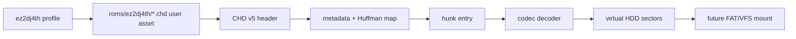

# ez2dj4th CHD HDD 입력 설계

## 한국어

### 목적

`ez2dj4th` 타깃 프로파일은 추출된 디렉터리 대신 MAME CHD 하드디스크 이미지를 입력으로 사용합니다. 프로파일 shortcut의 기본 경로는 저장소 루트 기준 `roms/ez2dj4th`이며, 실제 원본 자산은 저장소에 포함하지 않고 사용자가 제공한 경로에서만 읽습니다.

이번 단위의 목표는 다음 세 경계를 분리해 구현하는 것입니다.

1. 프로파일이 CHD 입력과 `roms/ez2dj4th` 경로를 선언한다.
2. 공용 코어가 `libchdr`를 통해 MAME CHD v1-v5의 헤더·메타데이터·맵을 읽고 가상 블록 장치로 노출한다.
3. 실제 CHD의 첫 hunk를 복호화하여 HDD sector를 읽는 검증 도구를 제공한다.

실행 파일을 FAT 파일 시스템으로 탐색하고 기존 `HddRoot`에 연결하는 것은 이번 단위에서 CHD 블록 읽기 이후의 별도 작업으로 남깁니다. 따라서 이번 구현은 “CHD 파일을 열어 실제 디스크 바이트를 읽을 수 있음”을 보장하지만 아직 `re2dj --run ez2dj4th`가 CHD 안의 PE를 자동 실행한다는 의미는 아닙니다.

### 입력 모델

프로파일은 기존 디렉터리 경로와 구분되는 `default_hdd_image_relative_path`와 `HddInputKind::kMameChd`를 가집니다. `roms/ez2dj4th`는 사용자가 제공한 이미지 파일이 놓일 디렉터리이며, 실제 CHD 파일 이름은 원본 자산 확인 전까지 고정하지 않습니다. 사용자가 `--hdd`로 지정한 경로는 향후 이미지 또는 디렉터리 입력을 판별하는 확장 지점으로 남깁니다.

### CHD v5 판독 범위

직접 CHD 포맷과 codec을 복제하지 않고 `libchdr`의 public API를 adapter 뒤에 둡니다. `libchdr`는 MAME CHD v1-v5와 codec 전체를 읽기 전용으로 처리하므로, 공용 코어는 파일 경계·hunk 경계·sector 경계만 관리합니다. 판독기는 다음을 수행합니다.

* `chd_open`으로 signature/version/map/codec 검증을 위임합니다.
* `chd_get_metadata` wildcard 조회로 연결된 metadata의 tag·flags·payload를 보존합니다.
* `chd_read`로 codec과 map entry 처리를 위임하고, adapter가 요청 범위를 hunk 단위로 복사합니다.
* 부모 CHD가 필요한 경우 libchdr 오류를 그대로 명시해 추정된 바이트를 반환하지 않습니다.

### 데이터 흐름

### 라이선스와 자산 경계

MAME CHD 형식은 MAME 계열 BSD-3-Clause 코드를 기반으로 한 `libchdr`에 위임합니다. API와 원본 license는 [libchdr upstream](https://github.com/rtissera/libchdr) 및 [libchdr license](https://github.com/rtissera/libchdr/blob/master/LICENSE.txt)에서 확인했으며, `libchdr`와 codec dependency의 라이선스 고지는 `THIRD_PARTY_NOTICES.md`에 기록합니다. 원본 CHD는 커밋하지 않으며, 검증에 사용한 `roms/ez2d2m/ez2d2m.chd`는 로컬 작업 자산으로만 사용합니다.

### 검증 전략

* 잘못된 범위에 대한 adapter 단위 테스트
* 실제 CHD를 지정했을 때 metadata geometry가 `CYLS/HEADS/SECS/BPS`로 읽히는지 확인
* 실제 CHD의 LBA 0 sector가 성공적으로 복호화되고 부트 섹터 서명이 관찰되는지 확인
* `git diff --check`, 공용 unit test, 가능한 호스트 build 실행

## English

### Purpose

The `ez2dj4th` target profile uses a MAME CHD hard-disk image instead of an extracted directory. The profile shortcut path is `roms/ez2dj4th` relative to the repository root; original assets remain user-supplied and are never committed.

This task separates three boundaries: declaring CHD input in the profile, reading MAME CHD v5 metadata/map through a platform-neutral virtual block device, and proving that a real CHD hunk can be decoded into HDD sectors. FAT file-system enumeration and integration with the existing `HddRoot` remain a later task, so this does not yet claim that `re2dj --run ez2dj4th` executes a PE stored inside the CHD.

The adapter delegates CHD v1-v5 headers, metadata, map entries, and every codec to [libchdr](https://github.com/rtissera/libchdr), whose API and [BSD-3-Clause license](https://github.com/rtissera/libchdr/blob/master/LICENSE.txt) were checked. It then owns only bounded logical-range and sector reads. Parent-image errors are surfaced explicitly. libchdr and its permissively licensed codec dependencies are recorded in `THIRD_PARTY_NOTICES.md`; no original CHD is added to the repository.
