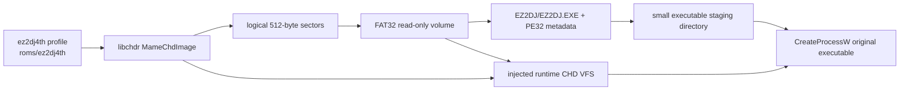

# ez2dj4th FAT32/CHD 실행 경계 설계

## 한국어

### 목적

실제 사용자가 제공한 `roms/ez2dj4th/4thTrax.chd`를 `libchdr`로 블록 단위 판독하고, 그 안의 FAT32 볼륨에서 `EZ2DJ/EZ2DJ.EXE`를 확인한 뒤 원본 Win32 실행 경계까지 연결한다. 원본 HDD와 CHD는 저장소에 추가하지 않으며, 모든 판독은 사용자가 지정한 경로에서 수행한다.

이번 단계는 CHD 전체를 다른 이미지 형식으로 재구현하지 않는다. CHD 압축·hunk 해석은 기존 `libchdr` adapter가 소유하고, 새 FAT32 계층은 512-byte 논리 sector를 읽어 MBR, BPB, FAT chain, 8.3/LFN directory entry와 read-only file range만 해석한다.

### 실제 이미지에서 확인된 사실

다음 값은 사용자가 제공한 `4thTrax.chd`를 `libchdr`로 읽고, 동일 이미지의 추출된 `4thTrax.img`와 교차 확인한 결과다.

* CHD v5 logical size는 20,060,135,424 bytes이며 unit size는 512 bytes다.
* CHD metadata의 GDDD geometry는 `CYLS:38869,HEADS:16,SECS:63,BPS:512`다.
* MBR partition 0은 FAT32 LBA(`0x0c`), start LBA 63, length 39,166,407 sectors다.
* FAT32 BPB는 512 bytes/sector, 32 sectors/cluster, reserved 32 sectors, FAT 2개, 9,558 sectors/FAT, root cluster 2를 선언한다.
* root directory 아래 `EZ2DJ` directory가 있고, 그 안의 `EZ2DJ.EXE`는 1,372,160 bytes이며 first cluster는 232,139다.
* `EZ2DJ.INI`, `FONTKR.DAT`, `FONTEN.DAT`, `BG`, `SOUND`, `SYSTEM`도 `EZ2DJ` directory에 존재한다.
* `WINDOWS/SYSTEM.INI`의 shell은 `Explorer.exe`다. 따라서 4th dump에 대해서는 cabinet shell의 `D:\ez2dj\ez2dj.exe` 경로를 확정하지 않고, 파일 위치 사실과 실행 프로파일 경로를 분리해 기록한다.

확인되지 않은 것은 원본 cabinet의 실제 boot launcher 설정과 모든 런타임 API 사용 순서다. FAT reader가 읽은 파일 경로와 PE header는 확인된 사실이며, 실행 중 추가로 요청되는 파일은 VFS trace로 관찰한다.

### 계층과 실행 흐름

### 설계 결정

1. `Fat32Volume`은 MBR partition 0과 FAT32 BPB를 검증하고, overflow·잘못된 cluster·cycle을 거부한다. FAT copy 0을 읽기 기준으로 삼으며, 원본에 쓰지 않는다.
2. Directory lookup은 short name과 유효한 LFN을 모두 지원하고 ASCII 대소문자를 무시한다. 경로 traversal은 `.`과 `..`를 허용하지 않으며 volume label과 삭제 entry는 제외한다.
3. `ReadFileRange`는 필요한 cluster만 CHD에서 읽는다. 전체 20 GB logical image나 4.17 GB allocated payload를 자동으로 추출하지 않는다.
4. Windows launcher가 `CreateProcessW`에 넘길 PE는 FAT reader가 임시 staging directory에 materialize한다. 런타임의 `D:\ez2dj` read path는 새 CHD VFS handle table을 통해 FAT/CHD에서 직접 읽는다. 따라서 실행 파일만 staging하고 원본 자산 전체를 복사하지 않는다.
5. 쓰기는 계속 별도 overlay로 보낸다. CHD-backed read handle에는 `WriteFile`을 허용하지 않으며, `LoadImageA`처럼 host path를 요구하는 API는 bounded cache에 해당 파일만 materialize한다. 게스트 `D:\\ez2dj\\...` 요청은 실제 CHD의 `EZ2DJ/...` 디렉터리로 매핑한다.
6. Linux/Web에서는 공용 FAT/CHD 계층과 probe를 빌드하지만, 이번 단계의 실제 Win32 `CreateProcessW` 연결은 Windows x86 launcher에 한정한다.

### 실패 및 안전 경계

* CHD header, unit size, partition range, BPB, cluster chain 중 하나라도 검증에 실패하면 실행 전 오류로 종료한다.
* CHD 파일에서 읽은 executable은 PE32/i386/non-DLL이어야 한다.
* pseudo handle 수가 고갈되거나 offset이 32-bit Win32 API 범위를 벗어나면 명시적으로 실패한다.
* 원본 CHD와 원본 추출 image는 테스트 fixture로 커밋하지 않는다.

## English

### Purpose

Read the user-supplied `roms/ez2dj4th/4thTrax.chd` through `libchdr`, validate its FAT32 volume, locate `EZ2DJ/EZ2DJ.EXE`, and connect that original PE32 image to the existing Win32 execution boundary. Original CHD/HDD assets remain outside the repository.

This is not a second CHD implementation. `libchdr` remains responsible for CHD compression and hunk decoding; the new FAT32 layer only interprets 512-byte logical sectors, the MBR/BPB, FAT chains, directory entries, and bounded read-only file ranges.

### Confirmed image facts

The confirmed values above come from the real `4thTrax.chd`, cross-checked against its extracted `4thTrax.img`: CHD v5, 20,060,135,424 logical bytes, 512-byte units, GDDD geometry `CYLS:38869,HEADS:16,SECS:63,BPS:512`, FAT32-LBA partition at LBA 63, 512-byte sectors, 32 sectors/cluster, two FATs, 9,558 sectors/FAT, root cluster 2, and `EZ2DJ/EZ2DJ.EXE` (1,372,160 bytes, first cluster 232,139).

The original cabinet boot launcher and complete runtime API sequence remain unresolved. The file location and PE header are confirmed; later VFS trace evidence may identify additional runtime accesses.

### Execution boundary

`Fat32Volume` validates and reads the volume without writes. The launcher materializes only the executable into a temporary staging directory so `CreateProcessW` can load it. The injected runtime reads guest `D:\\ez2dj\\...` assets directly through CHD-backed pseudo handles mapped to the image's `EZ2DJ/...` directory, while writes stay in the existing overlay. Host-path-only `LoadImageA` requests use a bounded per-file cache.

The portable FAT/CHD reader and probes build on Linux, Windows, and Web. The actual Win32 process connection is implemented only in the Windows x86 launcher during this task.
