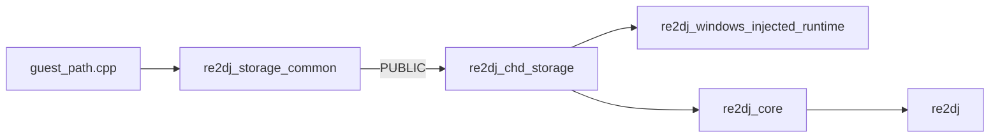

# injected runtime의 CHD 저장소 링크 경계

## 한국어

### 목적

실제 `ez2dj4th` 실행에서 확인된 `cannot find bundled injected runtime`의 원인을 제거합니다. 오류 자체는 런타임 탐색 단계에서 보이지만, Debug `re2dj_windows_injected_runtime.dll`이 생성되지 않은 직접 원인은 FAT32 CHD 저장소의 링크 실패입니다.

### 확인된 원인

Debug x86에서 `re2dj_windows_injected_runtime`를 직접 빌드하면 `re2dj_chd_storage.lib(fat32_chd.obj)`가 `re2dj::storage::EqualsIgnoreAsciiCase`를 참조하지만 정의를 찾지 못하고 `LNK2019`가 발생합니다. 정의는 `src/storage/guest_path.cpp`에 있으나 해당 파일은 `re2dj_core`에만 포함되어 있습니다. injected runtime은 원본 process 경계에서 `re2dj_core`를 링크하지 않고 `re2dj_chd_storage`를 직접 링크하므로 이 심볼을 받을 수 없습니다.

### 설계 결정

1. `src/storage/guest_path.cpp`를 `re2dj_storage_common` 정적 라이브러리로 분리합니다. 이 라이브러리는 Win32 게스트 경로 파싱·정규화·ASCII 대소문자 절첩을 소유합니다.
2. `re2dj_chd_storage`가 `re2dj_storage_common`을 PUBLIC 의존성으로 링크하도록 합니다. 따라서 CHD/FAT32를 직접 사용하는 injected runtime도 동일한 구현을 받습니다.
3. `re2dj_core`의 직접 소스 목록에서는 `guest_path.cpp`를 제거하고 기존처럼 `re2dj_chd_storage`를 PUBLIC 링크합니다. 심볼을 두 정적 라이브러리에 복제하지 않아 ODR/링크 순서 문제를 피합니다.
4. `re2dj_core`를 injected runtime에 추가 링크하는 우회나 FAT32 파일 안에 별도 case-folding 구현을 복제하는 방식은 사용하지 않습니다. 전자는 core↔CHD 저장소 의존성 순환을 만들고, 후자는 플랫폼 공용 경로 의미를 분기시킵니다.

### 링크 흐름

### 추가 회귀 점검

4th 프로파일은 CHD 입력 전용이므로 디렉터리 HDD scan fingerprint 대상에서 제외합니다. 그렇지 않으면 3rd와 같은 추출 디렉터리 모양을 4th로 잘못 중복 매칭할 수 있습니다. CHD shortcut은 `HddInputKind::kMameChd` 분기에서 계속 선택됩니다.

### 검증 전략

Debug x86에서 `re2dj_windows_injected_runtime` DLL target을 직접 빌드해 링크 성공과 DLL 생성 여부를 확인합니다. 이어서 `re2dj` executable 및 단위 테스트를 빌드할 수 있는 범위에서 확인하고, 사용자 명령의 런타임 탐색 오류가 더 이상 DLL 부재로 발생하지 않는지 파일 경로를 점검합니다. 원본 CHD와 빌드 산출물은 커밋하지 않습니다.

## English

### Purpose

Remove the `cannot find bundled injected runtime` failure observed while running the real `ez2dj4th` target. The message appears during runtime discovery, but the direct cause is that the Debug `re2dj_windows_injected_runtime.dll` was never produced because its link failed.

### Confirmed cause

Building `re2dj_windows_injected_runtime` for Debug x86 fails with `LNK2019`: `fat32_chd.obj` from `re2dj_chd_storage.lib` references `re2dj::storage::EqualsIgnoreAsciiCase`, whose definition is in `src/storage/guest_path.cpp`. That source belongs only to `re2dj_core`. The injected runtime links `re2dj_chd_storage` directly across the original-process boundary and therefore cannot obtain a symbol that exists only in `re2dj_core`.

### Design decisions

1. Move `src/storage/guest_path.cpp` into a dedicated `re2dj_storage_common` static library that owns Win32 guest-path parsing, normalization, and ASCII case folding.
2. Link `re2dj_storage_common` PUBLIC from `re2dj_chd_storage`, so the injected runtime receives the same implementation when it directly consumes CHD/FAT32 storage.
3. Remove `guest_path.cpp` from the direct `re2dj_core` source list while keeping its existing PUBLIC dependency on `re2dj_chd_storage`. This avoids duplicate symbols and static-link ordering surprises.
4. Do not link `re2dj_core` into the injected runtime as a workaround and do not duplicate case-folding logic inside FAT32. The former creates a core↔CHD storage cycle; the latter would split portable path semantics.

### Link flow

The shared path source is compiled once into `re2dj_storage_common`, consumed by `re2dj_chd_storage`, and then available to both the injected runtime and the product core through the existing target dependency graph.

### Additional regression guard

The 4th profile is CHD-input-only, so directory HDD scan fingerprint matching skips it. Otherwise an extracted directory with the same sibling names as 3rd could be incorrectly claimed by both profiles. The CHD shortcut continues to select it through the `HddInputKind::kMameChd` branch.

### Verification strategy

Build the Debug x86 `re2dj_windows_injected_runtime` DLL target directly and verify both link success and DLL creation. Then build the product executable and unit tests as far as the environment permits, and check that the user's runtime discovery error is no longer caused by a missing DLL. Original CHD files and build artifacts remain uncommitted.
