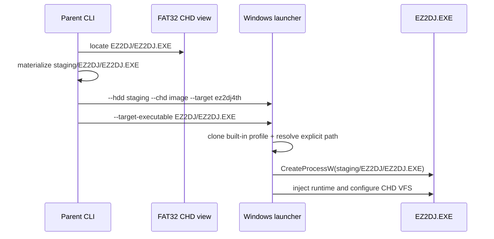

# CHD staging과 Windows launcher 프로파일 handoff

## 한국어

### 목적

CHD DLL 링크 수정 후 실제 `ez2dj4th --run`에서 노출된 `cannot resolve valid bring-up target`을 해결합니다. 부모 CLI는 CHD FAT32에서 `EZ2DJ/EZ2DJ.EXE`와 `ez2dj4th` 프로파일을 이미 확정하지만, 기존 launcher는 staging 디렉터리를 다시 스캔하여 CHD 전용 프로파일을 찾으려 했습니다.

### 확인된 흐름

1. 부모 CLI가 CHD에서 executable을 찾고 임시 staging root에 `EZ2DJ/EZ2DJ.EXE`와 fingerprint 파일을 materialize합니다.
2. 부모 CLI가 launcher에 `--hdd <staging>`와 `--chd <image>`를 넘깁니다.
3. launcher는 staging을 `BuildTargetProfiles`로 다시 스캔합니다.
4. 4th profile은 CHD 전용이므로 directory-HDD fingerprint 매칭에서 제외됩니다.
5. 따라서 launcher 내부에는 `ez2dj4th` target이 없어 process 생성 전에 실패합니다.

### 설계 결정

1. `OriginalProcessOptions`에 CHD staging 내부의 executable 상대 경로를 추가합니다.
2. 부모 CLI는 CHD 실행 시 선택한 `profile.executable_relative_path`를 `--target-executable` 인자로 launcher에 전달합니다.
3. launcher가 이 인자를 받으면 staging scan 결과를 억지로 profile로 해석하지 않고, `target_id`에 해당하는 built-in profile을 복사한 뒤 executable 경로와 그 부모 working directory만 채웁니다.
4. launcher는 여전히 `HddRoot::ResolveFile`과 PE32 검사를 수행하므로 경로는 staging root 아래의 실제 파일이어야 합니다. 절대 경로와 `..`를 통한 탈출은 기존 root resolver가 거부합니다.
5. 인자가 없는 일반 디렉터리 실행은 기존 scan/match 경로를 그대로 사용합니다. CHD shortcut 선택과 injected runtime의 FAT32 VFS mapping은 변경하지 않습니다.

### 실행 흐름

### 검증 전략

Windows x86 product-loader probe에서 CHD image와 explicit executable 인자가 함께 전달되는지 확인합니다. Debug launcher와 product executable을 빌드하고, 실제 `ez2dj4th --run`을 짧게 실행하여 DLL 부재와 target 재탐색 오류가 사라지고 다음 실행 경계가 노출되는지 확인합니다.

## English

### Purpose

Resolve `cannot resolve valid bring-up target`, which became visible after fixing the CHD DLL link. The parent CLI has already identified `EZ2DJ/EZ2DJ.EXE` and the `ez2dj4th` profile from the FAT32 image, but the existing launcher rescans the staging directory and tries to rediscover a CHD-only profile.

### Confirmed flow

The parent materializes the executable and small fingerprint files under a temporary staging root, then passes `--hdd <staging>` and `--chd <image>`. The launcher rebuilds profiles from that directory. Because the 4th profile intentionally does not participate in directory-HDD fingerprint matching, the launcher has no `ez2dj4th` target and fails before process creation.

### Design decisions

1. Add the executable path relative to the CHD staging root to `OriginalProcessOptions`.
2. Pass the parent CLI's selected `profile.executable_relative_path` as `--target-executable` for CHD runs.
3. When present, the launcher clones the built-in profile identified by `target_id`, then fills its executable path and parent working directory instead of forcing the staging scan to identify it.
4. The launcher still resolves the path through `HddRoot::ResolveFile` and validates the PE32 image, so the path must be a real file under the staging root; absolute paths and `..` escapes remain rejected by the existing resolver.
5. Normal directory execution without this option keeps the existing scan/match path. CHD shortcut selection and injected-runtime FAT32 VFS mapping remain unchanged.

### Verification strategy

The Windows x86 product-loader probe checks that the CHD image and explicit executable arguments are forwarded together. Build the Debug launcher and product executable, then run the real `ez2dj4th --run` briefly to verify that DLL discovery and target rediscovery errors are gone and the next execution boundary is exposed.
