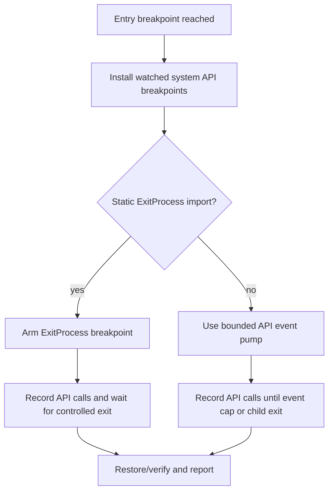

# ez2dj4th 보호 stub bounded API trace 설계

## 한국어

### 목적

2026-09-01 실제 `ez2dj4th --run`에서 원본 PE32가 entry breakpoint까지 도달하고
CHD VFS와 `LoadImageA` hook도 준비되었지만 첫 `CreateFileA` handoff는 관찰되지
않았다. `EZ2DJ.EXE`의 정적 import에는 `ExitProcess`가 없어서 현재
`--api-trace`가 ExitProcess breakpoint 준비 단계에서 중단되는 것도 확인됐다.
이 작업은 보호 응답이나 게임 로직을 추가하지 않고, ExitProcess 정적 import가 없는
원본 실행 파일의 entry 이후 Win32 API 호출을 제한된 범위에서 관찰할 수 있게 한다.

### 설계

API trace는 실행 종료 조건을 두 가지로 분리한다.

1. `ExitProcess` 정적 import와 실제 breakpoint를 찾을 수 있으면 기존 exit-bound
   trace를 유지한다.
2. `--api-trace`가 요청되었고 `ExitProcess` 정적 import가 없으면 exit breakpoint를
   성공으로 가장하지 않고 bounded API trace 모드로 전환한다. 이 모드는 child
   system-module export에 설치한 API breakpoint를 처리하면서 최대 debug event
   수에 도달하거나 child가 종료될 때 관찰 경계를 기록한다.

bounded mode의 event cap은 진단 도구 내부 상수로 제한한다. 각 API hit는 기존
caller, 인자, ANSI 문자열 기록과 원래 byte 복원·single-step 재무장 경로를
그대로 사용한다. event cap 또는 child exit은 `api_trace_boundary` event로
기록하며, 이 경계는 실행 성공이나 HLE 응답 성공을 의미하지 않는다.

### 안전성 및 범위

* 원본 PE 바이트와 import slot은 HLE 응답으로 바꾸지 않는다. 진단 breakpoint는
  hit 처리 뒤 원래 byte를 복원한다.
* 원본 HDD와 CHD는 읽기 전용으로 취급한다. probe가 만드는 로그와 기존 overlay만
  저장소 바깥에 기록한다.
* `--api-trace`의 기존 exit-bound 동작과 1st/3rd의 기존 HLE 경계는 변경하지 않는다.
* bounded trace는 4th의 첫 API 순서를 관찰하기 위한 도구이며, 관찰 결과만으로
  Hardlock response나 보호 해제 정책을 확정하지 않는다.

### 최소 검증

* `re2dj_windows_product_loader_probe.exe`와 Windows x86 launcher를 Debug로 빌드한다.
* 실제 `4thTrax.chd`에서 staging executable을 대상으로 `--api-trace --trace`를
  실행하고 `api_watch`, `api_call`, `api_trace_boundary` JSONL event를 확인한다.
* `git diff --check`와 기존 product-loader probe를 통과시킨다.

## English

### Purpose

In the real 2026-09-01 `ez2dj4th --run`, the original PE32 reached the entry
breakpoint and the CHD VFS plus `LoadImageA` hook were prepared, but the first
`CreateFileA` handoff was not observed. The `EZ2DJ.EXE` static imports also have
no `ExitProcess`, so the current `--api-trace` stops while preparing the
ExitProcess breakpoint. This work adds observation only: it does not add a
protection response or rewrite game logic, and allows post-entry Win32 calls to
be observed within a bound when the exit import is absent.

### Design

API tracing has two separate completion policies:

1. If a static `ExitProcess` import and a real breakpoint can be found, retain
   the existing exit-bound trace.
2. If `--api-trace` is requested but the static `ExitProcess` import is absent,
   switch to bounded API-trace mode without pretending an exit breakpoint was
   armed. The mode services watched API breakpoints until a debug-event cap or
   child exit, then records the observation boundary.

The event cap is an internal diagnostic bound. Each API hit retains the existing
caller, argument, ANSI-string, original-byte restoration, and single-step rearm
behavior. Reaching the cap or child exit emits `api_trace_boundary`; it does not
mean that execution or HLE responses succeeded.

### Safety and scope

* Original PE bytes and import slots are not changed into HLE responses. A
  diagnostic breakpoint restores the original byte after handling a hit.
* The original HDD and CHD remain read-only. Only diagnostic logs and the
  existing overlay are written outside the repository assets.
* Existing exit-bound `--api-trace` behavior and 1st/3rd HLE boundaries remain
  unchanged.
* Bounded tracing is an observation tool for 4th's first API order; its output
  must not be used alone to identify a Hardlock response or protection policy.

### Minimum verification

* Build the Debug Windows x86 product-loader probe and launcher.
* Run `--api-trace --trace` against the staged executable from the real
  `4thTrax.chd` and inspect JSONL `api_watch`, `api_call`, and
  `api_trace_boundary` events.
* Pass `git diff --check` and the existing product-loader probe.
