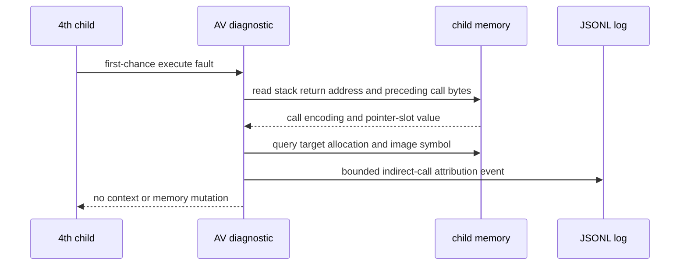

# ez2dj4th EIP=0 fault 호출 대상 귀속 설계

## 상태

설계 및 구현이 완료되었습니다.

## 목적

작업 122에서 `CreateFileA` 동적 resolver 반환값이 protected stack-local에 저장되는 경계까지 확인했습니다. 실제 CHD 실행의 다음 fault는 `EIP=0` execute access violation이며, 현재 로그는 fault 당시 stack의 return address와 주변 바이트만 기록합니다. 이번 작업은 fault 직전 호출 명령과 그 호출 대상 슬롯의 현재 값을 함께 기록하여, zero-pointer indirect call인지 다른 실행 경계인지 귀속하는 것을 목적으로 합니다.

이번 작업은 HLE 응답을 추정하거나 원본 코드의 실행을 수정하지 않습니다. fault가 이미 발생한 first-chance 시점에 child memory를 읽어 진단 정보만 남깁니다.

## 확인된 근거

* 실제 `ez2dj4th` CHD bounded trace에서 fault는 `EIP=0x00000000`, execute access violation으로 기록되었습니다.
* fault stack의 첫 return address는 `0x00aef7fe`입니다.
* 해당 return address 직전 runtime bytes는 `FF 15 F4 0C AF 00 83 C4 04` 형태이며, 이는 `CALL DWORD PTR [0x00AF0CF4]` 뒤의 return address와 일치하는 관찰 후보입니다.
* `0x00AF0CF4` 슬롯의 현재 값은 아직 별도 이벤트로 기록하지 않았으므로, 실제 zero target 여부와 슬롯 소유 section은 미확정입니다.

## 설계 결정

1. `RecordAccessViolationContext`가 first-chance execute fault를 처리할 때, 저장된 guest stack return address마다 fault 직전 최대 8바이트를 읽습니다.
2. 다음 x86 호출 형태만 관찰·해석합니다.
   * `E8 rel32`: relative direct call
   * `FF 15 addr32`: absolute memory-indirect call
   * `FF /2`의 register-indirect call: opcode와 ModR/M만 기록하고 대상 레지스터 값을 함께 기록
3. `FF 15 addr32`가 확인되면 포인터 슬롯 주소, 현재 32비트 값, target의 `VirtualQueryEx` allocation/type/protection, PE image section 및 nearest export(가능한 경우)를 기록합니다.
4. direct/register call은 대상 계산에 필요한 값만 기록하며, register-indirect call의 메모리 dereference는 수행하지 않습니다. fault 시점의 원본 상태를 과도하게 해석하지 않기 위한 제한입니다.
5. stack return address별 이벤트 수는 8개로 제한하고, 각 이벤트의 bytes는 최대 8바이트로 제한합니다. 읽기 실패도 `readable=false`로 기록합니다.
6. 진단 함수는 `ReadProcessMemory`와 `VirtualQueryEx`만 사용하며 breakpoint, thread context, code bytes, pointer slot을 변경하지 않습니다.
7. `EIP=0` fault에서 zero target indirect call이 확인되어도 HLE ABI 호환이나 보호 응답 성공으로 판정하지 않습니다. 이는 호출 대상 귀속 결과일 뿐입니다.

## 검증 전략

* Windows x86 Debug launcher를 빌드합니다.
* 단위 테스트와 product-loader probe를 실행합니다.
* 실제 사용자가 제공한 `4thTrax.chd`로 bounded trace를 실행합니다.
* `.jsonl`에서 `av_indirect_call` 이벤트와 `EIP=0` fault의 stack return address가 연결되는지 확인합니다.
* 대상 슬롯이 0이면 zero-pointer indirect call로만 기록하고, 실제 보호 성공이나 정상 게임 진입으로 해석하지 않습니다.

## English

### Status

Design and implementation are complete.

### Purpose

Task 122 confirmed that the dynamic `CreateFileA` resolver result reaches a protected stack-local store. The next fault in the real CHD run is an `EIP=0` execute access violation, while the current log records only the fault stack and a code window around each image address. This task records the call instruction immediately before each saved return address and the current value of any pointer slot it references, so the fault can be attributed to a zero-pointer indirect call or another execution boundary.

This task does not guess an HLE response or modify original execution. It reads child memory only at the already occurring first-chance fault.

### Confirmed evidence

* The real `ez2dj4th` CHD bounded trace records an execute access violation at `EIP=0x00000000`.
* The first fault-stack return address is `0x00aef7fe`.
* Runtime bytes immediately before that return address have the observed form `FF 15 F4 0C AF 00 83 C4 04`, consistent with `CALL DWORD PTR [0x00AF0CF4]` followed by the return address.
* The current value of slot `0x00AF0CF4` and its owning section have not yet been recorded as a separate event, so whether it is actually zero remains unresolved.

### Design decisions

1. When `RecordAccessViolationContext` handles a first-chance execute fault, read up to eight bytes before every saved guest stack return address.
2. Observe and decode only these x86 call forms:
   * `E8 rel32`: relative direct call
   * `FF 15 addr32`: absolute memory-indirect call
   * register-indirect `FF /2`: record the opcode and ModR/M and include the register value without dereferencing memory.
3. For `FF 15 addr32`, record the pointer-slot address, current 32-bit value, target allocation/type/protection from `VirtualQueryEx`, and the PE section and nearest export when available.
4. For direct and register calls, record only the values needed to identify the target. Do not dereference register-indirect memory, keeping interpretation bounded at the fault.
5. Cap events at eight stack return addresses and call bytes at eight bytes per event. Read failures are recorded as `readable=false`.
6. The diagnostic uses only `ReadProcessMemory` and `VirtualQueryEx`; it does not change breakpoints, thread context, code bytes, or pointer slots.
7. Even a confirmed zero-target indirect call is not evidence of HLE ABI compatibility, a protection response, or successful game entry. It is only call-target attribution.

### Verification strategy

* Build the Windows x86 Debug launcher.
* Run unit tests and the product-loader probe.
* Run a bounded trace with the user-supplied `4thTrax.chd`.
* Confirm that `.jsonl` contains an `av_indirect_call` event connected to the `EIP=0` fault's stack return address.
* If the slot is zero, record only a zero-pointer indirect call and do not claim protection success or normal game entry.
