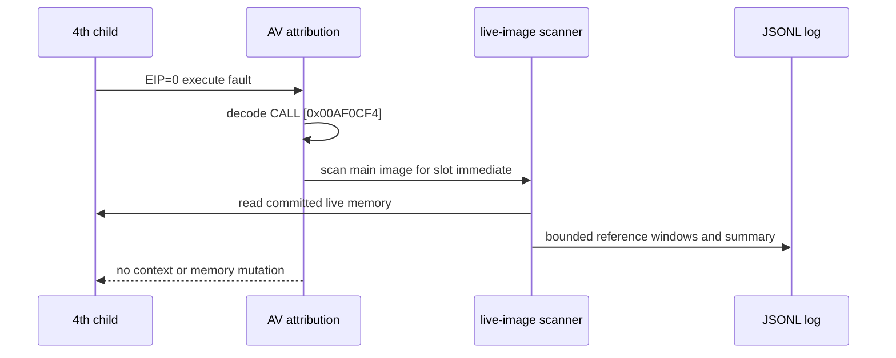

# ez2dj4th zero pointer-slot reference scan 설계

## 상태

설계 및 구현 완료입니다.

## 목적

작업 123은 `CALL DWORD PTR [0x00AF0CF4]`가 값 0인 pointer slot을 읽은 뒤
`EIP=0` execute fault로 이어지는 경계를 확인했습니다. 이번 작업은 해당
slot이 정식 PE IAT인지 보호 코드 내부 테이블인지 구분하고, 실행 중 복호화된
main image에서 slot 주소를 직접 참조하는 code/data 위치를 찾아 초기화 경로
후보를 좁힙니다.

원본 보호 section은 on-disk bytes와 runtime bytes가 다르므로, 정적 파일의
무작위처럼 보이는 bytes를 disassembly 근거로 사용하지 않습니다. first-chance
fault에서 중지된 child의 live main-image memory만 읽습니다.

## 확인된 근거

* `dumpbin /imports`에서 4th의 정식 import address table은
  `0x00B16A60`, `0x00AE0F90`, `0x00B193D0` 등으로 확인되며,
  `0x00AF0CF4`는 정식 PE IAT slot이 아닙니다.
* CHD/VFS와 injected runtime 없이 staged EXE를 실행한 baseline log
  `20260901-113000-720.jsonl`에서도 native `CreateFileA` 주소
  `0x774533A0`가 반환됐지만 `0x00AF0CF4`는 0이었고 동일한 `EIP=0`
  fault가 발생했습니다.
* 따라서 zero slot은 현재 4th dynamic VFS HLE가 직접 만든 결과가 아니라
  보호 코드 내부 continuation/초기화 경계입니다.
* on-disk `.protect`의 대응 raw bytes는 runtime code와 일치하지 않으므로
  live-memory reference scan이 필요합니다.

## 설계 결정

1. `RecordAccessViolationCallAttribution`은 absolute memory-indirect call에서
   확인한 slot 주소를 호출자에게 반환합니다.
2. execute fault의 stack return address에서 처음 확인한 nonzero slot마다
   main image 범위만 bounded scan합니다.
3. committed이고 guard/no-access가 아닌 memory region만
   `ReadProcessMemory`로 읽으며, 64 KiB block 경계의 4-byte match가 누락되지
   않도록 3-byte overlap을 적용합니다.
4. little-endian slot 주소와 일치하는 위치를 최대 64개 기록합니다.
5. 각 match event에는 reference 위치, main-image section, runtime 24-byte
   window(앞 8바이트·뒤 16바이트)를 기록합니다.
6. scan summary에는 image base, slot, scanned bytes, match 수, cap 도달 여부를
   기록합니다.
7. scan은 code를 disassemble하거나 writer로 자동 확정하지 않습니다. 각
   reference의 load/store/call 의미는 runtime bytes를 별도로 검토해
   **확인됨 / 추정 / 미확정**으로 분류합니다.
8. child context, code, pointer slot은 변경하지 않습니다.

## 검증 전략

* Windows x86 Debug launcher를 빌드합니다.
* 단위 테스트와 product-loader probe를 실행합니다.
* 실제 `4thTrax.chd` bounded trace에서 `av_slot_reference`와
  `av_slot_reference_summary` event를 확인합니다.
* reference window를 검토하여 확정 가능한 write/read/call 위치와 미확정
  위치를 구분합니다.
* 원본 EXE·CHD·HDD bytes는 저장소에 추가하지 않습니다.

## English

### Status

Design and implementation complete.

### Purpose

Task 123 confirmed that `CALL DWORD PTR [0x00AF0CF4]` reads a zero pointer slot
before the `EIP=0` execute fault. This task distinguishes that slot from the
formal PE IAT and searches the live decrypted main image for code or data
locations that directly reference the slot address, narrowing the candidate
initialization path.

The protected section differs between its on-disk and runtime forms. Random-
looking on-disk bytes are therefore not used as disassembly evidence. Only live
main-image memory from the child stopped at the first-chance fault is read.

### Confirmed evidence

* `dumpbin /imports` reports formal 4th IAT locations such as `0x00B16A60`,
  `0x00AE0F90`, and `0x00B193D0`; `0x00AF0CF4` is not a formal PE IAT slot.
* Baseline log `20260901-113000-720.jsonl`, produced without CHD/VFS or the
  injected runtime, returned native `CreateFileA` at `0x774533A0` but still
  observed a zero `0x00AF0CF4` slot and the same `EIP=0` fault.
* The zero slot is therefore not directly caused by the current 4th dynamic-VFS
  HLE; it is a protected-code continuation or initialization boundary.
* The corresponding on-disk `.protect` bytes do not match runtime code, so a
  live-memory reference scan is required.

### Design decisions

1. Have `RecordAccessViolationCallAttribution` return the slot address found in
   an absolute memory-indirect call.
2. For each first nonzero slot identified from execute-fault stack return
   addresses, scan only the main-image range.
3. Read committed, non-guard, non-no-access regions through
   `ReadProcessMemory`, using a three-byte overlap across 64 KiB blocks so a
   four-byte match cannot cross unnoticed.
4. Record at most 64 locations containing the little-endian slot address.
5. Each match includes its location, main-image section, and a 24-byte runtime
   window with eight preceding and sixteen following bytes.
6. The summary records image base, slot, scanned bytes, match count, and whether
   the cap was reached.
7. Do not automatically classify a reference as a writer or disassemble it.
   Review runtime bytes separately and mark meanings as confirmed, inferred, or
   unresolved.
8. Do not modify child context, code, or the pointer slot.

### Verification strategy

* Build the Windows x86 Debug launcher.
* Run unit tests and the product-loader probe.
* Confirm `av_slot_reference` and `av_slot_reference_summary` events in a real
  `4thTrax.chd` bounded trace.
* Review reference windows and separate confirmed write/read/call sites from
  unresolved candidates.
* Do not add original EXE, CHD, or HDD bytes to the repository.
