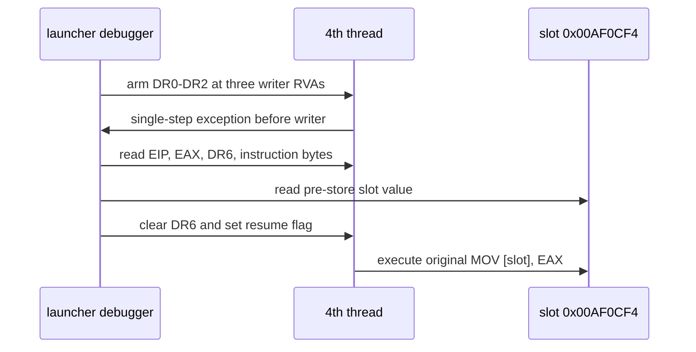

# ez2dj4th pointer-slot writer 실행 추적 설계

## 상태

설계 및 구현 완료입니다.

## 목적

작업 124는 private pointer slot <code>0x00AF0CF4</code>를 기록하는
<code>MOV [slot], EAX</code> 명령 세 곳을 live runtime code에서
확인했습니다. 이번 작업은 원본 code나 slot을 변경하지 않고 세 writer의
실제 실행 여부, 실행 직전 EAX, 실행 직전 slot 값을 bounded trace로
관찰합니다.

## 확인된 근거와 미확정 범위

* writer 명령 RVA는 <code>0x006EF5F0</code>, <code>0x006EFE62</code>,
  <code>0x006F061A</code>입니다.
* slot RVA는 <code>0x006F0CF4</code>입니다.
* fault 시점 runtime bytes에서 writer 명령의 존재는 **확인됨**입니다.
* 어느 writer가 실행됐는지, 실행 당시 EAX가 0인지, dynamic
  <code>CreateFileA</code> 반환값과 동일한지는 **미확정**입니다.

## 설계 결정

1. <code>--slot-writer-trace</code>는 <code>ez2dj4th</code> 전용 bounded
   diagnostic option으로 둡니다.
2. 원본 memory를 수정하는 software breakpoint 대신 x86 DR0–DR2 local
   execution breakpoint를 사용합니다.
3. breakpoint 주소는 preferred absolute address가 아니라 runtime image
   base와 RVA의 합으로 계산합니다.
4. entry에서 정지된 primary thread에 먼저 적용하고, 이후
   <code>CREATE_THREAD_DEBUG_EVENT</code>로 생성된 thread에도 적용합니다.
5. writer hit는 instruction 실행 직전 발생하므로 EAX를 곧 저장될 값으로,
   slot read 결과를 저장 전 값으로 기록합니다.
6. hit event에는 thread, writer index/address/RVA, EAX, slot 주소와 저장 전
   값, instruction bytes, DR6를 기록합니다.
7. DR6 status를 지우고 EFLAGS resume flag를 설정한 뒤 원본 instruction을
   계속 실행합니다. general register, code, slot 값은 변경하지 않습니다.
8. hit 기록은 최대 64회로 제한하며, trace 전체도 기존 bounded debug event
   cap 안에서 종료합니다.
9. hit이 없다는 결과는 해당 실행에서 세 writer를 관찰하지 못했다는 뜻일
   뿐, 다른 초기화 경로가 없다는 증거로 해석하지 않습니다.

## 검증 전략

* Windows x86 Debug launcher를 빌드합니다.
* 단위 테스트와 product-loader probe를 실행합니다.
* 실제 <code>4thTrax.chd</code>에서 <code>--slot-writer-trace</code>를 실행해
  ready, hit, boundary event를 확인합니다.
* hit의 EAX와 pre-store slot을 fault 시점 zero slot 결과와 비교합니다.
* 원본 EXE·CHD·HDD bytes와 runtime log는 저장소에 추가하지 않습니다.

## English

### Status

Design and implementation complete.

### Purpose

Task 124 identified three live runtime instructions that execute
<code>MOV [slot], EAX</code> against private pointer slot
<code>0x00AF0CF4</code>. This task observes whether those writers execute and
records pre-instruction EAX and the pre-store slot value without changing the
original code or slot.

### Confirmed evidence and unresolved scope

* Writer RVAs are <code>0x006EF5F0</code>, <code>0x006EFE62</code>, and
  <code>0x006F061A</code>.
* The slot RVA is <code>0x006F0CF4</code>.
* The writer instructions are **confirmed to exist** in runtime bytes at fault
  time.
* Which writer executes, whether EAX is zero, and whether it equals the dynamic
  <code>CreateFileA</code> result remain **unresolved**.

### Design decisions

1. Add <code>--slot-writer-trace</code> as an <code>ez2dj4th</code>-specific
   bounded diagnostic option.
2. Use x86 DR0–DR2 local execution breakpoints instead of software breakpoints
   that modify original memory.
3. Compute addresses from the runtime image base plus RVAs rather than fixed
   preferred addresses.
4. Arm the primary thread stopped at entry and every later thread reported by
   <code>CREATE_THREAD_DEBUG_EVENT</code>.
5. Since a writer hit occurs before instruction execution, record EAX as the
   value about to be stored and the slot read as the pre-store value.
6. Record thread, writer index/address/RVA, EAX, slot address and pre-store
   value, instruction bytes, and DR6.
7. Clear DR6 status and set the EFLAGS resume flag before continuing the
   original instruction. Do not change general registers, code, or slot data.
8. Cap writer-hit records at 64 and keep the overall trace within the existing
   bounded debug-event cap.
9. No hit only means the three writers were not observed in that run; it does
   not prove that no other initialization path exists.

### Verification strategy

* Build the Windows x86 Debug launcher.
* Run unit tests and the product-loader probe.
* Run a real <code>4thTrax.chd</code> trace with
  <code>--slot-writer-trace</code> and inspect ready, hit, and boundary events.
* Compare hit EAX and the pre-store slot with the zero slot seen at fault time.
* Do not add the original EXE, CHD, HDD bytes, or runtime logs to the repository.
