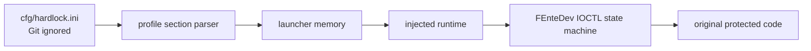

# ez2dj4th Hardlock runtime 설계

## 목적

ez2dj4th의 프로파일별 Hardlock 키를 Git에서 제외된 `cfg/hardlock.ini`에서 자동으로 읽고, 원본 실행의 `\\.\FEnteDev` Hardlock 요청을 HLE runtime에서 처리합니다. 키값은 추적 파일, 문서, 로그와 명령행에 기록하지 않습니다.

*Automatically read per-profile ez2dj4th Hardlock keys from Git-ignored `cfg/hardlock.ini` and handle the original executable's `\\.\FEnteDev` Hardlock requests in the HLE runtime. Key values never enter tracked files, documentation, logs, or command-line arguments.*

## 설정 정책

명시적인 `--hardlock-config`가 없으면 저장소 실행 기준 경로 `cfg/hardlock.ini`를 사용합니다. 저장소 내부 설정은 `cfg/` 아래에서만 허용하며 루트 `.gitignore`의 `/cfg/` 규칙으로 전체 directory를 제외합니다. 명시적 외부 경로도 계속 허용합니다. parser는 선택 profile section만 읽고 값 비노출 오류 정책을 유지합니다.

*Without an explicit `--hardlock-config`, use `cfg/hardlock.ini` relative to the repository execution root. A configuration inside the repository is allowed only below `cfg/`, which is excluded by the root `.gitignore` `/cfg/` rule. Explicit external paths remain supported. The parser reads only the selected profile section and preserves value-free errors.*

## Hardlock 처리 단계

1. 기존 bounded trace로 4th의 실제 `CreateFileA`와 IOCTL sequence를 다시 확보합니다.
2. `0x468`, `0x450`, `0x44c`, `0x458` 각각의 exact buffer shape와 반환 후 소비를 구분합니다.
3. 공식 vendor binary 또는 원본 실행에서 독립적으로 확인한 동작만 플랫폼 중립 함수로 구현합니다.
4. Function `0x0e`의 8-byte transform은 세 seed를 memory argument로 받으며 global profile 상수에 의존하지 않습니다.
5. 공개 GPL 구현은 복사·번역·링크하지 않습니다. 허용 가능한 근거가 없으면 protocol state와 검증 oracle까지만 구현하고 변환을 확정하지 않습니다.

*Reacquire the actual 4th `CreateFileA` and IOCTL sequence with bounded tracing; separate the exact shapes and post-return consumers of `0x468`, `0x450`, `0x44c`, and `0x458`; implement only behavior independently confirmed from an official vendor binary or the original execution; keep Function `0x0e` as an eight-byte transform receiving three seeds as memory arguments rather than profile constants; and do not copy, translate, or link public GPL implementations. If a policy-compatible basis remains unavailable, implement only the protocol state and validation oracle without claiming the transform.*

## 비밀값 취급

- 실제 `cfg/hardlock.ini`는 ignored 상태를 확인한 뒤 생성합니다.
- unit test는 실제 값과 다른 runtime-generated synthetic 값만 사용합니다.
- launcher는 key export를 enable flag보다 먼저 쓰며 로그에는 loaded boolean만 남깁니다.
- descriptor, transform input/output 및 seed는 기본 제품 로그에 기록하지 않습니다.

*Create the real `cfg/hardlock.ini` only after confirming it is ignored. Unit tests use runtime-generated synthetic values unrelated to real keys. The launcher writes key exports before the enable flag and logs only a loaded Boolean. Product logs omit descriptor secrets, transform input/output, and seeds.*

## 검증

- `git check-ignore cfg/hardlock.ini`와 clean status로 설정 비추적을 확인합니다.
- 옵션 없는 `re2dj ez2dj4th --run`이 기본 설정을 적재하는지 확인합니다.
- parser, default argument, profile isolation 및 runtime redaction 단위·probe를 검증합니다.
- 실제 CHD의 다음 보호 경계를 기준으로 protocol/transform 성공 여부를 판정합니다.

*Verify non-tracking with `git check-ignore cfg/hardlock.ini` and clean status; confirm that option-free `re2dj ez2dj4th --run` loads the default configuration; test parsing, default arguments, profile isolation, and runtime redaction; and judge protocol or transform success only by the original CHD's next protection boundary.*

## 구현 상태

기본 `cfg/hardlock.ini` 적재와 플랫폼 중립 protocol tracker를 구현했습니다. 실제 4th는 `0x468`과 active-console 조건의 `0x450`을 재확인했고, 기존 synthetic replay/tail 분기 실험에서는 matching descriptor를 사용하는 `0x44c/0x458`까지 도달했습니다. 유효한 6-byte `0x450` 응답과 허용 가능한 Function `0x0e` transform 근거가 없으므로 transform은 구현하지 않았으며, 다음 증거가 확보될 때까지 tracker는 응답을 생성하지 않습니다.

*Default `cfg/hardlock.ini` loading and the platform-neutral protocol tracker are implemented. The real 4th executable was reconfirmed through `0x468` and active-console `0x450`, and the existing synthetic replay/tail branch experiment reaches `0x44c/0x458` with matching descriptors. Because neither a valid six-byte `0x450` response nor a policy-compatible Function `0x0e` basis is available, the transform is not implemented and the tracker does not generate responses.*
