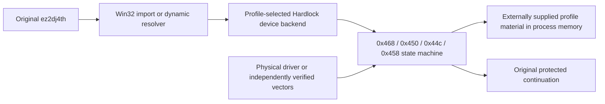

# ez2dj4th Hardlock HLE 호환 경로 조사 설계

## 목적

사용자가 합법적으로 보유한 ez2dj4th 실행 환경에서 원본 실행 파일의 Hardlock 의존성을 충족할 수 있는 경로를 조사합니다. 여기서 우회 경로는 원본 실행 파일의 보호 분기를 패치하거나 보호 기능을 제거하는 방법이 아니라, 원본 코드가 호출하는 `CreateFileA`/`DeviceIoControl` 장치 경계를 HLE backend로 제공하는 방법으로 한정합니다.

*Investigate a path that can satisfy the Hardlock dependency for a legally owned ez2dj4th runtime. “Bypass path” is limited to providing an HLE backend at the `CreateFileA`/`DeviceIoControl` device boundary used by the original code; it does not patch the original executable or remove its protection branch.*

## 현재 근거

- **확인됨 — 원본 장치 경계.** ez2dj4th는 `\\.\NTICE`와 `\\.\FEnteDev`를 열고, `FEnteDev`에 `0x9c402468`, `0x9c402450`, `0x9c40244c`, `0x9c402458` 요청을 보냅니다. 4th의 bounded 실행에서 이 요청의 순서와 buffer shape가 확인되었습니다.
- **확인됨 — 기존 re2DJ 경계.** Windows injected runtime은 동적 `GetProcAddress` 결과를 `CreateFileA`와 `DeviceIoControl` HLE thunk로 연결할 수 있고, 외부 profile 설정값은 명령행·로그를 거치지 않고 runtime memory에 주입됩니다. 현재 Hardlock tracker는 응답을 합성하지 않습니다.
- **확인됨 — vendor framing.** 정적 검토한 공식 vendor driver는 네 IOCTL의 framing과 내부 transport 경계를 확인해 주지만, host에서 세 seed를 받아 Function `0x0e` 결과를 계산하는 API는 제공하지 않습니다.
- **확인됨 — 참고 프로젝트의 라이선스.** [2EZConfig-V2 Hardlock directory](https://github.com/ben-rnd/2EZConfig-V2/tree/master/src/libs/hardlock)는 `API_CRYPT`/Function `0x0e`의 high-level 계약을 대조하는 참고 자료가 될 수 있지만, 저장소의 [GPL-3.0-or-later license](https://github.com/ben-rnd/2EZConfig-V2/blob/master/LICENSE) 때문에 소스 복사·번역·링크의 근거로 사용할 수 없습니다.

* **Confirmed — original device boundary.** ez2dj4th opens `\\.\NTICE` and `\\.\FEnteDev`, then sends `0x9c402468`, `0x9c402450`, `0x9c40244c`, and `0x9c402458` requests to `FEnteDev`. Their order and buffer shapes were observed in bounded 4th runs.
* **Confirmed — existing re2DJ boundary.** The Windows injected runtime can route dynamically resolved `CreateFileA` and `DeviceIoControl` through HLE thunks, while external profile configuration is injected into runtime memory without passing through command lines or logs. The current Hardlock tracker does not synthesize responses.
* **Confirmed — vendor framing.** Static review of the official vendor driver confirms the four IOCTL framing contracts and an internal transport boundary, but exposes no host API that consumes three seeds and computes the Function `0x0e` result.
* **Confirmed — reference-project license.** The [2EZConfig-V2 Hardlock directory](https://github.com/ben-rnd/2EZConfig-V2/tree/master/src/libs/hardlock) is useful for comparing the high-level `API_CRYPT`/Function `0x0e` contract, but its [GPL-3.0-or-later license](https://github.com/ben-rnd/2EZConfig-V2/blob/master/LICENSE) prevents using its source as a copy, translation, or link basis.

## 후보 경로

1. **허용 가능한 목표 경계:** `CreateFileA`에서 profile이 허용한 `FEnteDev` 장치만 synthetic handle로 매핑하고, `DeviceIoControl`에서 exact-size IOCTL을 별도 `HardlockDeviceBackend`로 전달합니다. `NTICE`는 역할이 확정되지 않았으므로 무조건 성공시키지 않습니다.
2. **상태 보존:** backend는 초기화, handshake, descriptor, transform 단계를 profile별 instance로 보유합니다. module address와 seed는 외부 config에서 읽은 뒤 process memory에만 두며 trace에는 success/shape/match 같은 boolean만 남깁니다.
3. **응답 출처:** `0x450`의 6바이트 응답과 Function `0x0e`의 8바이트 block 결과는 물리 동글 관찰, 독립적으로 확인된 input/output vector, 또는 허용 가능한 clean-room 복원 중 하나가 있을 때만 구현합니다. 기존 replay와 tail 값은 branch 도달성 시험값으로만 유지합니다.
4. **참고 코드의 사용 한계:** 2EZConfig의 `API_CRYPT 14`, payload offset `0x100`, `Bcnt × 8` 계약은 조사 메모로만 사용합니다. GPL 구현의 primitive, seed 초기화, outer protocol bit operation은 re2DJ에 옮기지 않습니다.
5. **현재 결론:** 장치 backend HLE 자체는 프로젝트 구조와 일치하는 실행 경로이지만, 현재 증거만으로는 유효한 Hardlock 인증 응답을 만들 수 없습니다. 따라서 이번 조사에서 추측 응답이나 보호 분기 패치를 추가하지 않습니다.

*1. **Allowed target boundary:** map only the profile-authorized `FEnteDev` path from `CreateFileA` to a synthetic handle and forward exact-size IOCTLs from `DeviceIoControl` to a separate `HardlockDeviceBackend`. Do not force `NTICE` success while its role remains unconfirmed.
2. **State retention:** keep initialization, handshake, descriptor, and transform as a profile-scoped backend instance. Read module address and seeds from external configuration into process memory only, and record only booleans such as success, shape, and match in traces.
3. **Response provenance:** implement the six-byte `0x450` response and eight-byte Function `0x0e` block result only after observing a physical dongle, obtaining independently verified input/output vectors, or completing an allowed clean-room reconstruction. Keep existing replay and tail values as branch-reachability experiments only.
4. **Reference-code limit:** use 2EZConfig's `API_CRYPT 14`, payload offset `0x100`, and `Bcnt × 8` contract only as research notes. Do not transfer its GPL primitive, seed initialization, or outer-protocol bit operations into re2DJ.
5. **Current conclusion:** an HLE device backend is structurally consistent with the project, but current evidence is insufficient to produce a valid Hardlock authentication response. This investigation therefore adds no guessed response and no protection-branch patch.

## 후속 증거와 검증

- 합법적으로 보유한 실제 Hardlock을 vendor driver가 설치된 별도 환경에서 관찰할 수 있다면, 원본 실행의 입력·출력 buffer를 값 비노출 메타데이터와 별도 보호된 실험 산출물로 수집합니다. 이 저장소에는 raw key, transform block, dump를 넣지 않습니다.
- 물리 장치가 없으면 독립적으로 검증된 최소 한 개 이상의 Function `0x0e` input/output vector와 seed 의미가 필요합니다. vector 없이 2EZConfig 구현을 재작성하는 것은 허용하지 않습니다.
- 증거가 확보되기 전까지 검증 대상은 `0x468`/`0x450`/`0x44c`/`0x458`의 shape·sequence·profile match와 비밀값 비추적뿐입니다.

*If a legally owned physical Hardlock can be observed in a separate environment with the vendor driver, collect original input/output buffers as protected experimental evidence with value-free metadata; never place raw keys, transform blocks, or dumps in this repository. Without hardware, at least one independently verified Function `0x0e` input/output vector and the seed semantics are required. Rewriting the 2EZConfig implementation without such a vector is not allowed. Until that evidence exists, verification is limited to the four IOCTL shape/sequence/profile-match checks and secret non-tracking.*
