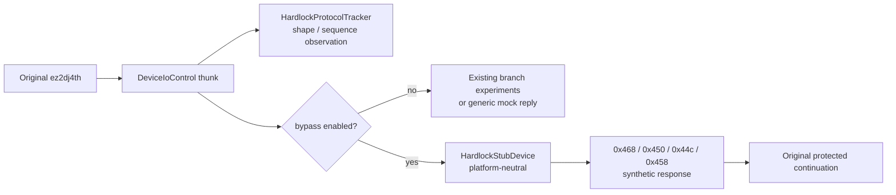

# Hardlock 우회 스텁 설계

> **갱신 — Task 134.** 이 문서의 "우회" 명칭은 폐기되었습니다. [Task 133](../work-logs/20260902-133-ez2dj4th-protection-shape.md)이 보호를 건너뛴 진입점 직행이 불가능함을 확인했기 때문입니다. 제품 CLI의 `--hardlock-bypass`는 제거되었고, 이 구성요소는 launcher 전용 `--hardlock-stub` 진단 하네스로 유지됩니다. 현재 성격은 [Task 134 작업 지시](../work-orders/20260902-134-hardlock-stub-rescope.md)를 따릅니다.
>
> **Update — Task 134.** The "bypass" name in this document is retired: [Task 133](../work-logs/20260902-133-ez2dj4th-protection-shape.md) confirmed that jumping past the protection to the entry point is impossible. `--hardlock-bypass` is removed from the product CLI and the component is kept as the launcher-only `--hardlock-stub` diagnostic harness, per the [Task 134 work order](../work-orders/20260902-134-hardlock-stub-rescope.md).

## 목적

Hardlock HLE는 유효한 응답을 만들 근거가 없어 보류합니다. 대신 원본 실행이 Hardlock 장치 경계에서 멈추지 않고 이후 코드로 진행할 수 있도록, 명시적으로 선택했을 때만 동작하는 **임시 우회 스텁**을 추가합니다. 이 스텁은 동글 에뮬레이션이 아니며, 어떤 응답도 실제 Hardlock에서 관찰한 값이 아닙니다.

*Hardlock HLE stays deferred because there is no basis for producing a valid response. Instead, add an explicitly opt-in **temporary bypass stub** so the original executable can move past the Hardlock device boundary into later code. The stub is not a dongle emulation, and none of its responses were observed from a real Hardlock.*

## 배경

[ez2dj4th Hardlock HLE 호환 경로 조사](20260901-130-ez2dj4th-hardlock-bypass-path.md)는 장치 backend HLE가 구조적으로 맞는 경로이지만 현재 증거로는 유효한 인증 응답을 만들 수 없다고 결론지었습니다. [ez2dj4th Hardlock runtime 분석](../analysis/ez2dj4th-hardlock-runtime.md)의 미확정 항목도 같습니다. 세 seed를 사용하는 Function `0x0e` 변환의 허용 가능한 독립 근거가 없습니다.

그동안 4th bring-up은 `--device-mock-hardlock-450-response`와 `--device-mock-hardlock-44c-tail` 두 개의 개별 실험 옵션으로만 보호 경계 뒤를 관찰해 왔습니다. 두 옵션은 목적이 "분기 도달성 확인"이고 서로 독립적이며, injected runtime 안에 직접 작성된 분기라 플랫폼 중립 test 대상이 아닙니다.

*[The ez2dj4th Hardlock HLE compatibility investigation](20260901-130-ez2dj4th-hardlock-bypass-path.md) concluded that a device-backend HLE is structurally correct but that current evidence cannot produce a valid authentication response, and the unresolved items in [the ez2dj4th Hardlock runtime analysis](../analysis/ez2dj4th-hardlock-runtime.md) say the same: there is no policy-compatible independent basis for the three-seed Function `0x0e` transform. Meanwhile 4th bring-up has observed the far side of the protection boundary only through two separate branch-reachability options, `--device-mock-hardlock-450-response` and `--device-mock-hardlock-44c-tail`, which are independent of each other and are written directly inside the injected runtime, so they are not platform-neutral testable units.*

## 범위 결정

사용자 확인에 따라 우회는 두 단계로 나눕니다.

| 단계 | 내용 | 이번 작업 |
| --- | --- | --- |
| 1 | `CreateFileA`/`DeviceIoControl` 장치 경계에서만 결정적 합성 응답을 만든다. 원본 코드와 메모리는 건드리지 않는다. | 구현 |
| 2 | 1단계로도 진행이 막히는 지점이 특정되면, 별도의 명시적 플래그로 게스트 보호 분기 결과를 강제한다. | 미구현. 막히는 지점을 계측으로 특정한 뒤 별도 작업 |

2단계는 `AGENTS.md`의 "가능하면 원본 실행 파일 코드를 수정하지 않는다" 원칙의 명시적 예외이므로, 막히는 분기를 실제로 특정하기 전에는 코드에 넣지 않습니다.

*Per user confirmation the bypass is staged. Stage 1, implemented here, synthesizes deterministic responses only at the `CreateFileA`/`DeviceIoControl` device boundary and never touches original code or memory. Stage 2 — forcing the guest protection branch behind its own explicit flag — is deliberately not implemented: it is an explicit exception to the `AGENTS.md` rule against modifying original executable code, so it waits until instrumentation identifies the specific blocking branch.*

### 2단계 재평가

실제 실행 증거로 2단계 전제가 성립하지 않음을 확인했습니다. 4th의 `.text`는 파일에서 이미 암호화되어 있고, 실행 중에 다시 쓰입니다. 그리고 Function `0x0e` 출력 8바이트만 바꾼 대조 실행은 downstream 실행 경로 자체를 바꿉니다. 즉 뒤집을 보호 분기 하나가 막고 있는 구조가 아니라, transform 결과가 이후 실행 내용을 결정하는 구조입니다. 따라서 **분기 강제로는 올바른 transform을 대체할 수 없으며, 이 설계는 2단계를 진행하지 않습니다.** 근거는 [작업 로그](../work-logs/20260901-131-hardlock-bypass-stub.md)의 인과 실험과 [분석 문서](../analysis/ez2dj4th-hardlock-runtime.md)에 있습니다.

이 재평가를 위해 스텁에 진단용 `transform_payload_xor` probe를 두었습니다. 이는 알고리즘 추측이 아니라 의도적으로 틀린 출력을 만들어 게스트가 결과를 소비하는지 확인하는 인과 검사 수단이며, 기본값은 비활성입니다.

*Stage-2 reassessment. Real-run evidence shows the stage-2 premise does not hold. 4th's `.text` is already encrypted in the file and is rewritten at runtime, and a controlled run that changes only the eight Function `0x0e` output bytes changes the downstream execution path itself. The blocker is therefore not one protection branch to flip but a structure in which the transform result determines what later executes. **Branch forcing cannot substitute for a correct transform, so this design does not proceed to stage 2.** The evidence is the causality experiment in the [work log](../work-logs/20260901-131-hardlock-bypass-stub.md) and the [analysis document](../analysis/ez2dj4th-hardlock-runtime.md). To reach that conclusion the stub carries a diagnostic `transform_payload_xor` probe: not a guessed algorithm but deliberately wrong output used to test whether the guest consumes the result, disabled by default.*

## 구조

`HardlockStubDevice`는 `src/device/`의 플랫폼 중립 구성요소입니다. 호스트 API를 부르지 않고 입력 span과 출력 span만 다루므로 unit test로 계약을 고정할 수 있고, Linux/Web 호스트가 같은 경계를 쓸 때 재사용됩니다. injected runtime에는 orchestration과 로그만 남깁니다.

*`HardlockStubDevice` is a platform-neutral component under `src/device/`. It calls no host API and works only on input and output spans, so unit tests can pin its contract and Linux/Web hosts can reuse the same boundary later. The injected runtime keeps only orchestration and logging.*

## 응답 정책

정적으로 확인한 vendor driver framing을 그대로 강제하고, 그 안에서 **가장 적은 것을 지어내는** 응답을 씁니다.

| IOCTL | 요청 계약 (확인됨) | 스텁 응답 |
| --- | --- | --- |
| `0x9c402468` initialize | input `0`, output `0` | 성공만 반환. 쓰는 바이트 없음 |
| `0x9c402450` handshake | input `6`, output `6` | 설정된 replay가 있으면 그 값, 없으면 요청 buffer 보존 |
| `0x9c40244c` descriptor | input `256`, output `256` | 요청을 그대로 두고 status word(`0x1a`)만 `0`. 설정된 tail이 있으면 `0xfe`에 기록 |
| `0x9c402458` transform | input ≥ `256`, input/output 동일 크기, `256 + block_count × 8` | 요청을 그대로 두고 status word만 `0`. `0x100` 뒤 block payload는 항등 |

Function `0x0e` block payload를 항등으로 두는 것은 "정답을 모른다"를 코드에 그대로 남기는 선택입니다. 추측한 변환을 넣지 않습니다. 계약에 맞지 않는 요청은 성공시키지 않고 거절 결과를 돌려줍니다. `\\.\NTICE`는 역할이 확정되지 않았으므로 1단계에서도 무조건 성공시키지 않습니다.

*The stub enforces the statically confirmed vendor framing and, inside it, invents as little as possible: initialize returns success only; handshake writes the configured replay or preserves the request buffer; descriptor and transform preserve the request and clear only the status word at `0x1a`, with the optional tail word at `0xfe`. Leaving the Function `0x0e` payload identical is a deliberate way of keeping "the answer is unknown" visible in the code rather than inserting a guessed transform. Requests that do not match the contract are rejected rather than forced to succeed, and `\\.\NTICE` is still not forced to open, because its role remains unconfirmed.*

## 증거 오염 방지

우회가 켜진 실행에서 관찰한 게스트 동작은 원본 동작이 아닙니다. 이를 문서 규칙으로만 두지 않고 산출물에 남깁니다.

- runtime trace에 `hardlock-bypass` 줄을 남기고, 요청 종류·결과·바이트 수만 기록합니다. 비밀값과 buffer 내용은 기록하지 않습니다.
- launcher는 우회 활성화를 JSONL 이벤트로 한 번 보고합니다.
- 기본값은 항상 비활성입니다. profile 기본값으로 켜지 않으며, 명시적 옵션이 있어야만 켜집니다.
- `docs/analysis/`에는 우회 실행에서 얻은 관찰을 **추정** 이상으로 올리지 않습니다.

*Guest behavior observed while the bypass is active is not original behavior, and that is recorded in the artifacts rather than only in the rules: the runtime trace carries a `hardlock-bypass` line with request kind, outcome, and byte count but no secrets or buffer contents; the launcher reports activation once as a JSONL event; the default is always off and never enabled by a profile default; and observations from bypassed runs are never promoted above **inferred** in `docs/analysis/`.*

## 검증

- unit test로 네 IOCTL의 성공 계약, 크기 위반 거절, in-place와 분리 buffer 처리, 부분 겹침 거절, block count 산술 overflow 거절을 고정합니다.
- Windows x86 build로 injected runtime과 launcher, 제품 CLI를 함께 빌드합니다.
- 실제 CHD 실행 검증은 원본 자산이 필요하므로 사용자 환경에서 수행하며, 절차는 작업 로그에 남깁니다.

*Unit tests pin the success contract for all four IOCTLs plus size-violation rejection, in-place and separate-buffer handling, partial-overlap rejection, and block-count overflow rejection. A Windows x86 build covers the injected runtime, launcher, and product CLI together. Real-CHD verification needs original assets, so it runs in the user's environment and its procedure is recorded in the work log.*
