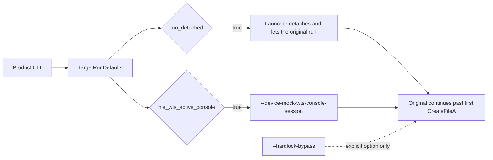

# ez2dj4th 제품 실행 경로 정책 설계

## 목적

`ez2dj4th`의 제품 실행 경로가 launcher 진단 실행과 같은 지점까지 도달하도록 profile 정책 두 가지를 정리합니다. Hardlock 우회 자체는 명시적 옵션으로 남기고, profile 기본값으로 올리지 않습니다.

*Bring the `ez2dj4th` product execution path to the same point the diagnostic launcher run reaches, by settling two profile policies. The Hardlock bypass itself stays an explicit option and is never promoted to a profile default.*

## 배경

[Task 131 작업 로그](../work-logs/20260901-131-hardlock-bypass-stub.md)에서 두 가지가 확인되었습니다.

1. 제품 CLI 실행은 우회를 무장만 하고 실행하지 못합니다. `--hle-vfs`의 handoff 기대 메시지가 `re2dj:vfs:CreateFileA`이고, launcher는 그 메시지를 처음 받으면 handoff 성공으로 보아 `run_detached`가 아닌 경우 원본을 종료합니다. `ez2dj4th` profile에는 `run_detached`가 없습니다.
2. [분석 문서](../analysis/ez2dj4th-hardlock-runtime.md)의 확인된 사실대로, host WTS 상태를 그대로 전달하면 실행은 `0x468` 뒤로 진행하지 않습니다. 성공한 `WTS_CURRENT_SESSION` class-4 결과만 active 상태 `0`으로 바꾸면 `0x450`까지 진행합니다.

두 조건은 모두 profile 정책이 아니라 launcher 진단 옵션으로만 존재해 왔습니다.

*Task 131 confirmed two things. First, a product CLI run only arms the bypass: with `--hle-vfs` the launcher's handoff message is `re2dj:vfs:CreateFileA`, and on the first such message a non-detached run is treated as handed off and the original is terminated, while `ez2dj4th` carries no `run_detached`. Second, as the analysis records, forwarding the host WTS state stops execution after `0x468`, whereas changing only a successful `WTS_CURRENT_SESSION` class-4 result to active state `0` reaches `0x450`. Both conditions existed only as launcher diagnostic options rather than profile policy.*

## 결정

1. **`run_detached`를 `ez2dj4th` profile 기본값으로 둡니다.** 3rd와 같은 이유입니다. 원본은 cabinet에서 계속 실행되는 프로그램이며, 첫 파일 open에서 종료하는 것은 진단 handoff 동작이지 제품 동작이 아닙니다.
2. **`hle_wts_active_console`을 `TargetRunDefaults`에 추가하고 `ez2dj4th`에서 켭니다.** cabinet의 원본은 console session의 shell로 실행되었으므로 active console 상태를 제공하는 것은 운영체제 경계 HLE에 해당합니다. 구현은 기존 진단 경로와 동일하게, 성공한 `WTS_CURRENT_SESSION` class-4 결과만 active 상태 `0`으로 바꾸고 다른 query와 실패 결과는 보존합니다.
3. **Hardlock 우회는 profile 기본값으로 올리지 않습니다.** `--hardlock-bypass`는 계속 명시적 옵션입니다. 합성 응답을 기본 동작으로 만들면 우회 실행과 원본 동작의 구분이 사라집니다.

*Decisions: put `run_detached` in the `ez2dj4th` profile for the same reason 3rd has it — the original is a program the cabinet keeps running, and exiting at the first file open is diagnostic handoff behavior rather than product behavior. Add `hle_wts_active_console` to `TargetRunDefaults` and enable it for `ez2dj4th`, since the cabinet's original ran as the shell of a console session, which makes supplying active-console state an operating-system boundary HLE; the implementation stays identical to the existing diagnostic path, changing only a successful `WTS_CURRENT_SESSION` class-4 result to active state `0` while preserving other queries and failures. Do not promote the Hardlock bypass to a profile default: `--hardlock-bypass` stays explicit, because making synthetic responses the default would erase the distinction between a bypassed run and original behavior.*

## 비범위

- Hardlock 우회의 기본 활성화.
- 다른 profile의 `run_detached`나 WTS 정책 변경.
- Function `0x0e` 관련 작업. [Task 131](20260901-131-hardlock-bypass-stub.md)의 결론대로 별도 증거가 필요합니다.

*Out of scope: enabling the bypass by default, changing `run_detached` or WTS policy for other profiles, and any Function `0x0e` work, which per Task 131 needs separate evidence.*

## 검증

- unit test로 `ez2dj4th` profile이 두 정책을 갖고 다른 profile은 WTS 정책을 갖지 않음을 고정합니다.
- 인자 생성기 계약은 Windows backend를 link하는 `re2dj_windows_product_loader_probe`로 고정합니다. 정책이 켜졌을 때만 `--device-mock-wts-console-session`이 붙어야 하고, active console 정책이 device 정책 없이 오면 거절되어야 하며, `--hardlock-bypass`는 명시적 요청이 있을 때만 붙어야 합니다.
- 실제 CHD 제품 실행으로 첫 `CreateFileA` 이후까지 진행하는지, 그리고 우회를 주지 않은 실행이 그대로 종료되는지 확인합니다.

*Verification: unit tests pin that the `ez2dj4th` profile carries both policies and that other profiles carry no WTS policy. The argument-builder contract is pinned by `re2dj_windows_product_loader_probe`, which links the Windows backend: `--device-mock-wts-console-session` must appear only when the policy is set, an active-console policy without a device policy must be rejected, and `--hardlock-bypass` must appear only on explicit request. A real-CHD product run then confirms execution continues past the first `CreateFileA` and that a run without the bypass still terminates on its own.*
