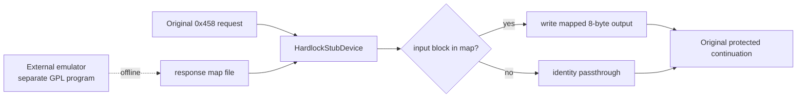

# Hardlock transform 응답 매핑 설계

## 목적

Function `0x0e` 응답을 외부에서 계산해 원본 실행에 주입하고, 그 결과로 후보 seed를 판별할 수 있는 경계를 만듭니다. 이번 작업은 주입 경계와 입력 수집만 다루며, 변환 알고리즘은 구현하지 않습니다.

*Create a boundary that injects externally computed Function `0x0e` responses into the original execution so candidate seeds can be judged by the result. This task covers only the injection boundary and input collection; it does not implement the transform algorithm.*

## 배경

[Task 131](20260901-131-hardlock-bypass-stub.md)의 인과 실험은 게스트가 transform 출력을 소비하고 그 값이 이후 실행 경로를 결정함을 확인했습니다. [Task 133](../work-logs/20260902-133-ez2dj4th-protection-shape.md)은 `.text`가 전 구간 암호문임을 확인했고, [Task 134](../work-logs/20260902-134-hardlock-stub-rescope.md)는 4th의 `ID_Ref`/`ID_Verify`를 확보했습니다.

[Task 107](20260831-107-ez2dj3rd-hardlock-seed-smt.md)은 단일 ID pair로 seed를 유일 식별할 수 없고 후보를 판별할 oracle이 필요하다고 남겼습니다. 이번 설계가 그 oracle의 주입 측입니다.

*Task 131's causality experiment confirmed that the guest consumes the transform output and that the value determines the downstream execution path. Task 133 confirmed `.text` is ciphertext throughout, and Task 134 obtained 4th's `ID_Ref` and `ID_Verify`. Task 107 recorded that one ID pair cannot uniquely identify the seeds and that an oracle distinguishing candidates is required; this design is the injection side of that oracle.*

## 결정 — 순서가 아니라 값으로 매핑한다

주입 방식으로 두 가지가 가능합니다.

| 방식 | 장점 | 단점 |
| --- | --- | --- |
| 호출 순서 목록 | 파일이 단순함 | 호출 순서가 달라지면 어긋남. 같은 입력이 두 번 오면 별도 항목 필요 |
| 입력 → 출력 매핑 | 순서와 무관. 중복 입력이 자연스럽게 같은 출력을 받음 | 파일에 입력도 적어야 함 |

**매핑을 선택합니다.** 3rd에서 18개 호출 중 같은 입력이 두 번 나온 사례가 이미 확인되었으므로, 순서 기반은 그 경우를 잘못 처리할 위험이 있습니다. 순서 독립성은 실행 간 재현성 검증에도 유리합니다.

*Two injection shapes are possible: a call-ordered list, which keeps the file simple but breaks if call order changes and needs separate entries for a repeated input; or an input-to-output map, which is order-independent and naturally gives a repeated input the same output at the cost of recording inputs in the file. **The map is chosen.** 3rd already showed one input appearing twice among eighteen calls, so an order-based scheme risks mishandling that case, and order independence also helps when comparing runs for reproducibility.*

## 구조

- 플랫폼 중립 parser `hardlock_transform_responses`가 매핑 파일을 읽습니다. 한 줄에 입력 16 hex와 출력 16 hex를 둡니다. `#` 주석과 빈 줄을 허용합니다.
- `HardlockStubDevice`는 매핑을 옵션으로 받고, `0x458`의 각 8바이트 block을 조회해 맞으면 출력에 씁니다. 없으면 기존 항등 통과를 유지합니다.
- launcher가 파일을 읽어 injected runtime의 export buffer로 전달합니다. re2DJ는 매핑을 계산하지 않고 읽어 쓰기만 합니다.

*A platform-neutral `hardlock_transform_responses` parser reads the map file, one line per entry with sixteen hex digits of input and sixteen of output, allowing `#` comments and blank lines. `HardlockStubDevice` takes the map as an option, looks up each eight-byte block of a `0x458` request, and writes the mapped output when found, keeping the existing identity passthrough otherwise. The launcher reads the file and transfers it to an injected-runtime export buffer. re2DJ never computes the mapping; it only reads and applies it.*

## 입력 수집

매핑을 만들려면 원본이 보내는 입력 block을 알아야 합니다. 명시적 진단 옵션으로 `0x458`의 block payload를 trace에 기록합니다. 기본값에서는 기록하지 않습니다.

3rd에서는 18개 입력이 `.text`의 32 KiB 구간 시작 8바이트와 정확히 일치했습니다. 4th도 같은 성질인지 이번 수집으로 확인합니다. 같다면 입력은 파일에서 결정되는 값이므로 실행마다 동일하고, 매핑 파일을 오프라인에서 한 번 만들어 재사용할 수 있습니다.

*Building the map requires knowing the input blocks the original sends, so an explicit diagnostic records `0x458` block payloads in the trace, disabled by default. In 3rd the eighteen inputs matched the first eight bytes of each 32 KiB `.text` chunk exactly; this collection checks whether 4th behaves the same way. If it does, the inputs are file-determined and identical across runs, so the map file can be built offline once and reused.*

## 경계와 라이선스

- 응답을 계산하는 프로그램은 이 저장소 밖의 별도 프로젝트입니다. re2DJ는 그 프로그램과 링크하지 않고, 헤더를 포함하지 않으며, 실행 중 통신하지도 않습니다. 사람이 만든 데이터 파일만 읽습니다.
- 매핑 파일 형식은 이 저장소가 확인한 vendor framing을 기준으로 re2DJ가 정의합니다. 외부 프로젝트의 자료구조를 계약에 넣지 않습니다.
- 매핑 파일은 저장소에 커밋하지 않습니다. `.gitignore`가 제외하는 경로에 둡니다.

*The program that computes responses is a separate project outside this repository. re2DJ does not link it, include its headers, or communicate with it at run time; it reads only a data file a person produced. The map file format is defined by re2DJ from the vendor framing this repository confirmed, and no external project's data structures enter the contract. Map files are never committed and live under a Git-ignored path.*

## 검증

- unit test로 매핑 parser의 형식 검사와 스텁의 조회·항등 fallback을 고정합니다.
- 4th 실제 실행 두 번으로 입력 block 목록이 동일한지 확인합니다.
- 수집한 입력이 `.text` 구간 시작과 일치하는지 대조합니다.
- 합성 매핑을 주입한 실행이 항등 실행과 다른 결과를 내는지 확인해 주입 경로가 살아 있음을 확인합니다.

*Unit tests pin the parser's format checks and the stub's lookup with identity fallback. Two real 4th runs confirm the input block list is identical, the collected inputs are compared against `.text` chunk starts, and a run with a synthetic map is checked to differ from an identity run, proving the injection path is live.*
