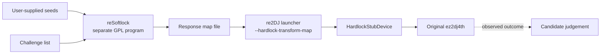

# reSoftlock 인터페이스 계약

## 목적

re2DJ가 Hardlock 응답 생성기에게 요구하는 입출력을 정의합니다. 생성기는 별도 저장소의 독립 프로그램(reSoftlock)이며, re2DJ는 그 프로그램과 링크하지 않고 실행 중 통신하지도 않습니다. 사람이 생성기를 실행해 만든 데이터 파일만 읽습니다.

이 문서는 두 저장소가 공유하는 계약이므로 reSoftlock 쪽에도 같은 내용을 두어도 됩니다. 계약은 re2DJ가 확인한 vendor framing을 기준으로 re2DJ가 정의합니다.

*This document defines the input and output re2DJ requires from a Hardlock response generator. The generator is a standalone program in a separate repository (reSoftlock); re2DJ neither links it nor communicates with it at run time, reading only a data file a person produced by running it. The contract is shared by both repositories and may be mirrored in reSoftlock. re2DJ defines it from the vendor framing re2DJ confirmed.*

## 경계



* 두 프로그램은 **파일 하나**로만 접촉합니다. 파이프, 소켓, 공유 메모리, 링크를 쓰지 않습니다.
* 주고받는 것은 **불투명한 16진 바이트 열**뿐입니다. 내부 자료구조나 콜백을 계약에 넣지 않습니다.
* re2DJ는 응답을 계산하지 않고 변환 알고리즘을 구현하지 않습니다. reSoftlock은 re2DJ의 헤더나 소스를 참조하지 않습니다.

*The two programs meet through **a single file** — no pipes, sockets, shared memory, or linking — and exchange only **opaque hexadecimal byte strings**, with no internal data structures or callbacks in the contract. re2DJ computes no responses and implements no transform, and reSoftlock references none of re2DJ's headers or source.*

---

## 1. 응답 매핑 파일 — 필수 산출물

re2DJ의 `--hardlock-transform-map <path>`가 읽는 형식입니다. re2DJ의 parser가 강제하는 규칙을 그대로 적습니다.

*The format read by re2DJ's `--hardlock-transform-map <path>`, stated exactly as re2DJ's parser enforces it.*

```
# challenge          response
62eaaf2b89f004aa     3f1c88d0a4e5b201
f11007c2771cc1ff     0a9d43ce77b1e6f8
```

| 규칙 | 내용 |
| --- | --- |
| 줄 구분 | `\n`. 마지막 줄에 개행이 없어도 됩니다 |
| 토큰 구분 | 공백, 탭, 캐리지 리턴 |
| 주석 | 첫 토큰이 `#`으로 시작하면 그 줄 무시. 응답 뒤 세 번째 토큰도 `#`으로 시작해야 허용 |
| 빈 줄 | 무시 |
| challenge | 정확히 16개 hex 문자. 대소문자 무관 |
| response | 정확히 16개 hex 문자. 대소문자 무관 |
| 중복 challenge | **오류**. 한 challenge에 두 응답이 있으면 결과가 호출 순서에 의존하게 됩니다 |
| 항목 0개 | **오류**. 항등 실행과 구분되지 않습니다 |
| 그 외 토큰 | 오류 |

매핑에 없는 challenge는 re2DJ가 항등으로 통과시키고 trace에 `unmapped` 개수를 남깁니다. 따라서 부분 매핑도 조용히 넘어가지 않습니다.

*A challenge missing from the map passes through unchanged in re2DJ and increments an `unmapped` count in the trace, so a partial map never passes silently.*

---

## 2. Challenge 목록 파일 — 생성기 입력

reSoftlock이 어떤 challenge에 응답해야 하는지 알려주는 파일입니다.

*The file telling reSoftlock which challenges it must answer.*

```
# ez2dj4th, 36 challenges
62eaaf2b89f004aa
f11007c2771cc1ff
```

* 한 줄에 16개 hex 문자 하나. `#` 주석과 빈 줄 허용.
* 중복 허용. 원본이 같은 challenge를 여러 번 보내기 때문입니다. 생성기는 중복을 하나로 접어 매핑에 한 번만 넣습니다.
* re2DJ는 `--hardlock-transform-inputs` 진단으로 이 목록을 수집합니다. trace 줄에서 뽑아내는 형태입니다.

```bash
grep -o "hardlock-transform-input:index=[0-9]*:block=[0-9a-f]*" run.vfs.log \
  | sed 's/.*block=//' | sort -u > challenges.txt
```

*One sixteen-hex-digit block per line, with `#` comments and blank lines allowed. Duplicates are permitted because the original sends some challenges more than once; the generator folds them and emits each once in the map. re2DJ collects the list through the `--hardlock-transform-inputs` diagnostic, extracted from the trace as shown.*

### Challenge를 독립적으로 유도하는 규칙

re2DJ 없이도 원본 실행 파일에서 같은 목록을 만들 수 있습니다. 4th에서 확인한 규칙입니다.

* 각 PE section에 대해 raw 시작 offset에서 `0x8000` 간격으로 걷고, 각 지점의 8바이트를 challenge로 삼습니다.
* 다음 지점이 그 section의 raw 범위를 벗어나면 그 section을 끝냅니다.
* `.idata`와 `.protect`는 제외합니다.

4th `EZ2DJ.EXE`에서 이 규칙은 `.text` 28개, `.rdata` 2개, `.data` 4개, `.reloc` 2개로 정확히 36개를 만들며, 실제 관찰 목록과 일치합니다. 이 규칙 자체는 4th에서만 확인했으므로 다른 제품에 적용할 때는 관찰로 재확인해야 합니다.

*The same list can be derived from the original executable without re2DJ, by the rule confirmed for 4th: for each PE section, walk from its raw start at `0x8000` intervals taking eight bytes at each point, stopping when the next point leaves that section's raw range, and skip `.idata` and `.protect`. For 4th's `EZ2DJ.EXE` this yields 28, 2, 4, and 2 chunks in `.text`, `.rdata`, `.data`, and `.reloc` — exactly the 36 observed. The rule is confirmed only for 4th and must be re-verified by observation for other products.*

---

## 3. Seed 후보 목록 파일

seed는 아직 알려져 있지 않습니다. 생성기가 `ID_Ref`와 `ID_Verify`에서 후보를 복구하면 그 목록을 내보내고, 후보마다 매핑 파일을 하나씩 만듭니다.

*The seeds are not yet known. When the generator recovers candidates from `ID_Ref` and `ID_Verify`, it emits the candidate list and one map file per candidate.*

```
# index  seed1   seed2   seed3
0        0x1234  0x5678  0x9abc
1        0x2345  0x6789  0xabcd
```

* 한 줄에 index와 세 개의 16비트 값. `0x` 접두 hex 또는 10진.
* 단일 `ID_Ref`/`ID_Verify` 쌍으로는 후보가 유일하지 않습니다. 3rd에서 SMT로 11개를 얻었고, 공개 보고로는 55개 사례가 있습니다. 따라서 **후보가 여럿인 것이 정상**이며 생성기는 그것을 오류로 취급하지 않습니다.
* 후보 판별은 re2DJ 쪽에서 실행 결과로 수행합니다.

*Each line carries an index and three 16-bit values in `0x`-prefixed hex or decimal. A single `ID_Ref`/`ID_Verify` pair does not identify the seeds uniquely — SMT produced eleven candidates for 3rd and a public report mentions 55 — so **multiple candidates are normal** and the generator must not treat that as an error. Judging candidates happens on the re2DJ side, from run results.*

### 3.1 복구가 reSoftlock에 있는 이유

seed 복구는 `ID_Verify = F(ID_Ref, seed1, seed2, seed3)` 관계를 역으로 푸는 일입니다. 풀려면 `F`를 계산할 수 있어야 하고, `F`가 곧 생성기가 보유한 알고리즘입니다. re2DJ에는 `F`가 없으며 없는 것이 저장소를 분리한 이유입니다. 따라서 복구는 생성기 안에서만 가능합니다.

두 ID는 re2DJ가 원본 실행에서 확보해 전달합니다. 게스트가 만든 descriptor에서 mock 응답을 쓰기 전에 읽은 값이므로 원본이 보유한 값이며, 두 번의 독립 실행에서 동일했습니다.

*Seed recovery inverts the relation `ID_Verify = F(ID_Ref, seed1, seed2, seed3)`, which requires computing `F` — the algorithm the generator holds. re2DJ does not have `F`, and not having it is why the repositories are separate, so recovery is possible only inside the generator. re2DJ supplies both IDs, read from the guest-built descriptor before any mock response was written, so they are values the original holds, and they agreed across two independent runs.*

### 3.2 탐색 전략

**전체 공간 블랙박스 열거는 권장하지 않습니다.** 후보마다 seed 적재와 descriptor 요청을 완전한 IOCTL 경로로 도는 방식은 이해하기 쉽지만, 16비트 세 개는 2⁴⁸ 조합이라 현실적인 시간에 끝나지 않습니다.

권장하는 방식은 2단계입니다.

1. **중간 값 확정.** 두 ID 사이의 중간 control 값을 먼저 제약 풀이로 확정합니다. 3rd에서는 이 단계가 유일 해를 주었고 배제 제약이 `unsat`이었습니다.
2. **좁아진 공간 탐색.** 1단계 결과를 만족하는 seed만 훑습니다. 이때 전체 IOCTL 경로가 아니라 ID 계산만 도는 조밀한 내부 루프를 씁니다.

공개 보고가 말하는 "2 GHz에서 20–30시간"도 전체 dispatch가 아니라 이런 내부 루프 기준으로 보는 것이 타당합니다. 벡터화한 평가기를 쓸 경우 스칼라 평가기와 교차 검증한 뒤에만 탐색에 사용합니다.

*Full-space black-box enumeration is not recommended: running seed loading and a descriptor request through the complete IOCTL path per candidate is easy to reason about, but three 16-bit values give 2⁴⁸ combinations and will not finish in practical time. The recommended shape is two stages — first fix the intermediate control value between the two IDs by constraint solving, which for 3rd yielded a unique solution with an `unsat` exclusion query, then scan only the seeds satisfying that result using a tight inner loop over the ID computation rather than the full dispatch path. The publicly reported "20–30 hours on a 2 GHz CPU" is best read against such an inner loop rather than full dispatch. If a vectorized evaluator is used, cross-check it against a scalar evaluator before trusting it for search.*

### 3.3 3rd 회귀 픽스처

4th는 정답을 모르므로 구현을 자기 검증할 수 없습니다. 3rd는 가능합니다. 이미 확인된 입력과 기대 결과가 있기 때문입니다.

| 항목 | 값 |
| --- | --- |
| module address | `0x4c51` |
| `ID_Ref` | `478c8b793f201f8a` |
| `ID_Verify` | `cc22ae2da344b2a2` |
| 기대 중간 control 값 | `74 6c 2c 1c f0` (유일, 배제 제약 `unsat`) |
| 기대 후보 수 | 11개 이상. 전수 열거 전 중단된 값이므로 하한입니다 |

`seeds` 모드가 3rd 입력에서 같은 control 값을 재현하고 그 11개를 후보 집합에 포함하면, 4th에 적용하기 전에 구현이 검증됩니다. 재현되지 않으면 4th 결과를 신뢰하지 않습니다.

이 값들은 [Task 107 작업 로그](../work-logs/20260831-107-ez2dj3rd-hardlock-seed-smt.md)와 [3rd Function `0x0e` 분석](../analysis/ez2dj3rd-hardlock-function-0e.md)에 기록되어 있습니다.

*4th cannot self-verify because its answer is unknown; 3rd can, because its inputs and expected results are already confirmed. If the `seeds` mode reproduces the same control value for 3rd's input and includes those eleven candidates in its result, the implementation is validated before being applied to 4th; if it does not reproduce them, the 4th result is not trusted. The expected candidate count is a lower bound, since enumeration was stopped early. These values are recorded in the [Task 107 work log](../work-logs/20260831-107-ez2dj3rd-hardlock-seed-smt.md) and the [3rd Function `0x0e` analysis](../analysis/ez2dj3rd-hardlock-function-0e.md).*

### 3.4 출력 요구사항

* 후보 목록은 **결정적**이어야 합니다. 같은 입력은 같은 목록을 같은 순서로 냅니다. 병렬 탐색을 쓰면 출력 전에 정렬합니다.
* 탐색이 중간에 중단되면 그 사실을 목록에 주석으로 남깁니다. 하한임을 알 수 있어야 합니다.
* 진행 로그에 seed 값을 출력하지 않습니다. 검사한 조합 수와 발견 개수 같은 스칼라만 남깁니다.
* 후보가 0개면 종료 코드로 구분합니다. 성공적으로 0개를 찾은 것과 입력 오류는 다릅니다.

*Output requirements: the candidate list must be **deterministic**, producing the same list in the same order for the same input, sorting before output if the search is parallel; an interrupted search records that fact as a comment so the list is known to be a lower bound; progress logs print no seed values, only scalars such as combinations examined and candidates found; and a zero-candidate result is distinguished by exit code, since successfully finding none differs from an input error.*

---

## 4. 요구하는 실행 모드

명령 이름은 제안이며 reSoftlock이 정합니다. 기능이 계약입니다.

*Command names are suggestions that reSoftlock decides; the capabilities are the contract.*

| 모드 | 입력 | 출력 |
| --- | --- | --- |
| `map` | module address, seed 3개, challenge 목록 | 응답 매핑 파일 1개 |
| `map-batch` | module address, seed 후보 목록, challenge 목록 | 후보별 매핑 파일 N개. 파일명에 후보 index 포함 |
| `seeds` | module address, `ID_Ref`, `ID_Verify` | seed 후보 목록. 전략과 검증은 3.2·3.3 참고 |
| `challenges` (선택) | 원본 PE 경로 | challenge 목록 |

`map-batch`가 실질적으로 가장 중요합니다. 후보가 수십 개일 때 re2DJ가 하나씩 주입해 판별하려면 파일이 후보별로 미리 나와 있어야 합니다.

*`map-batch` matters most in practice: with dozens of candidates, re2DJ injects them one at a time, so the files must already exist per candidate.*

---

## 5. 비밀값 취급

* seed와 module address를 **명령행 기본 경로로 삼지 않습니다.** 프로세스 목록에 노출됩니다. 기본은 저장소 밖 설정 파일입니다.
* 로그와 오류 메시지에 seed와 응답 바이트를 출력하지 않습니다. 개수, 성공 여부, 크기 같은 스칼라만 남깁니다.
* 산출한 매핑 파일과 후보 목록은 어느 저장소에도 커밋하지 않습니다. re2DJ 쪽에서는 `/cfg/` 같은 ignore 경로에 둡니다.

*Do not make the command line the default path for seeds and the module address, since they appear in process listings; the default is a configuration file outside the repository. Never print seeds or response bytes in logs or errors, keeping only scalars such as counts, success, and sizes. Never commit produced map files or candidate lists to either repository; on the re2DJ side they live under an ignored path such as `/cfg/`.*

---

## 6. 동작 요구사항

* **결정성.** 같은 seed와 같은 challenge 목록은 항상 같은 매핑 파일을 만듭니다. 판별의 전제입니다.
* **중복 접기.** challenge 목록에 같은 값이 여러 번 있어도 매핑에는 한 번만 넣습니다. 중복 항목은 re2DJ가 거절합니다.
* **순서 무관.** 매핑은 값으로 조회되므로 파일 내 순서는 의미가 없습니다.
* **종료 코드.** 성공 `0`, 사용법 오류 `1`, 입력 파일 오류 `2`를 권장합니다. 부분 실패 시 불완전한 출력 파일을 남기지 않습니다.
* **자체 검증.** seed 없이도 빌드되고 test가 통과해야 합니다. 합성 값으로 결정성과 형식을 검사합니다.

*Requirements: **determinism**, so the same seeds and challenge list always produce the same map, which judgement depends on; **duplicate folding**, emitting each challenge once because re2DJ rejects duplicate entries; **order independence**, since the map is looked up by value; **exit codes**, suggested as `0` for success, `1` for usage errors, and `2` for input-file errors, never leaving a partial output file behind; and **self-verification**, building and passing tests without any seed, checking determinism and format with synthetic values.*

---

## 7. 확인된 ez2dj4th 파라미터

두 번의 독립 실행에서 일치한 값입니다.

*Values that agreed across two independent runs.*

| 항목 | 값 |
| --- | --- |
| module address | `0x4c53` |
| `ID_Ref` | `a755931881fd81ea` |
| `ID_Verify` | `ceed1a5e4f27078f` |
| API version | `0347` |
| port | `0x0378` |
| challenge 수 | 36 (고유 32) |
| seed 3개 | **미확정** |

참고로 3rd는 module address `0x4c51`, `ID_Ref=478c8b793f201f8a`, `ID_Verify=cc22ae2da344b2a2`로 별개 module입니다.

*For reference, 3rd is a separate module with address `0x4c51`, `ID_Ref=478c8b793f201f8a`, and `ID_Verify=cc22ae2da344b2a2`.*

---

## 8. 판별 루프

계약이 성립하면 re2DJ 쪽 절차는 이렇습니다.

1. reSoftlock이 후보별 매핑 파일을 만듭니다.
2. re2DJ가 매핑을 하나씩 주입해 bounded 실행합니다.
3. 결과로 후보를 판별합니다.

**판별 기준에서 fault 주소를 쓰지 않습니다.** 실행마다 달라지는 할당 주소이기 때문입니다. 이미지 안인지 밖인지 같은 질적 구분과 복호화된 영역의 통계를 씁니다. 올바른 후보라면 암호문이던 영역의 엔트로피가 내려가고 x86 prologue가 나타나야 합니다.

*Once the contract holds, the re2DJ-side procedure is: reSoftlock produces a map file per candidate, re2DJ injects them one at a time in bounded runs, and the results judge the candidates. **The fault address is not used as a criterion**, because it is a per-run allocation address; use qualitative distinctions such as inside-image versus outside-image and statistics of the decrypted region — a correct candidate should lower the entropy of a previously ciphertext region and make x86 prologues appear.*

---

## 9. 계약 변경

* 이 계약을 깨는 변경은 양쪽 저장소의 문서를 함께 갱신하고 reSoftlock의 major 버전을 올립니다.
* re2DJ는 매핑 파일 형식을 확장할 때 기존 파일을 계속 읽을 수 있게 유지합니다.

*Breaking this contract updates the documents in both repositories together and raises reSoftlock's major version. When re2DJ extends the map file format, it keeps reading existing files.*
