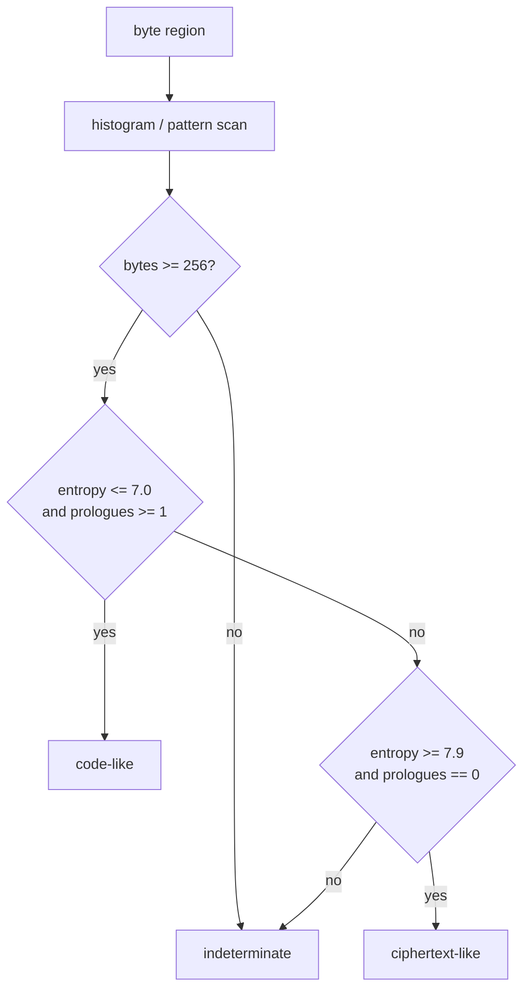
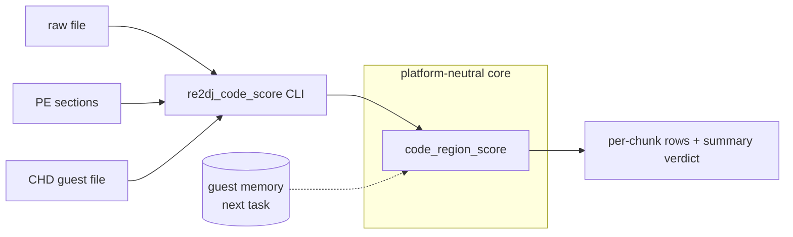

# 복호화 영역 판별기 설계

## 목적

Hardlock transform 응답 후보를 주입한 뒤, 그 결과가 코드 평문인지 암호문인지를 **사람이 눈으로 보지 않고** 판정할 수 있는 측정기를 만듭니다. 이번 작업은 플랫폼 중립 점수 계산과 오프라인 CLI까지만 다룹니다.

*Build a measurement tool that decides whether a byte region is code plaintext or ciphertext **without a human reading it**, so injected Hardlock transform response candidates can be judged mechanically. This task covers only the platform-neutral scoring core and an offline CLI.*

## 배경

[Task 135](20260902-135-hardlock-transform-response-map.md)가 응답 주입 경계를 만들었고, [Task 136](20260902-136-resoftlock-interface-contract.md)이 응답을 계산하는 외부 생성기와의 계약을 정의했습니다. [seed 복구 워크스루](../guides/hardlock-seed-recovery-walkthrough.md)의 Stage 5와 Stage 7은 후보를 **엔트로피와 `55 8b ec` prologue 빈도**로 채점하라고 규정하지만, 그 채점을 수행하는 코드는 저장소에 없습니다. 워크스루는 이 사실을 "현재 re2DJ에는 엔트로피·prologue 자동 판별기가 아직 없습니다"로 남겼습니다.

후보가 수십 개일 수 있으므로 판정은 반복 가능하고 기계적이어야 합니다. 지금까지 문서에 기록된 엔트로피 값들은 일회성 임시 계산으로 얻은 것이며, 재현할 수 있는 도구가 없습니다.

*Task 135 built the response injection boundary and Task 136 defined the contract with the external generator that computes responses. Stages 5 and 7 of the seed recovery walkthrough require scoring candidates by **entropy and `55 8b ec` prologue frequency**, but no code in the repository performs that scoring; the walkthrough records this as "re2DJ does not yet have an automated entropy/prologue judge." With candidates possibly numbering in the dozens, judgement must be repeatable and mechanical, and the entropy figures recorded in the documents so far came from one-off ad hoc calculations that no committed tool can reproduce.*

## 확인된 기준값

판정 임계값의 근거는 [ez2dj4th Hardlock 런타임 분석](../analysis/ez2dj4th-hardlock-runtime.md)에 기록된 **확인된** 측정치입니다.

| 대상 | 엔트로피 (bits/byte) | `55 8b ec` | `cc` padding |
| --- | --- | --- | --- |
| 4th `.text` (901,120 B) | `7.9967` | 0회 | 0회 |
| 4th `.rdata` | `7.896` | — | — |
| 4th `.data` | `7.998` | — | — |
| 4th `.protect` | `7.969` | — | — |

즉 **틀린 후보의 관측값은 이미 확보되어 있습니다.** 판별기가 해야 할 일은 이 상태에서 벗어나는 후보를 찾아내는 것입니다.

*The threshold basis is the **confirmed** measurements recorded in the ez2dj4th Hardlock runtime analysis: 4th's `.text` reads `7.9967` bits/byte with zero `55 8b ec` prologues and zero `cc` padding, and `.rdata`, `.data`, and `.protect` read `7.896`, `7.998`, and `7.969`. The observed values for a wrong candidate are therefore already in hand, and the judge's task is to detect a candidate that departs from that state.*

## 지표

| 지표 | 정의 | 고르는 이유 |
| --- | --- | --- |
| Shannon 엔트로피 | 바이트 히스토그램 기준 `-Σ p log2 p`, bits/byte | 암호문은 8에 근접하고 x86 코드는 통상 6점대 |
| prologue 수 | `55 8b ec` 출현 횟수 | 이 시대 MSVC 함수 진입 관용구. 균등 난수에서 기대값은 32 KiB당 약 0.002회 |
| padding run 수 | 길이 4 이상인 `cc` 연속 구간 수 | 함수 사이 정렬 padding. 균등 난수에서 32 KiB당 기대값이 사실상 0 |
| zero byte 비율 | `0x00` 바이트 비율 | 코드·데이터에는 흔하고 암호문에서는 `1/256`에 수렴 |

`cc` 지표를 **바이트 수가 아니라 run 수**로 정의하는 것이 중요합니다. 균등 난수 901,120바이트에는 `0xcc` 바이트가 약 3,520개 나타나므로 바이트 수로는 분석 문서의 "0회"를 재현할 수 없습니다. 길이 4 이상 연속은 균등 난수에서 위치당 확률이 `2^-32`이므로 기대값이 0에 가깝고, 이것이 분석 문서가 관측한 값과 일치합니다.

*Defining the `cc` metric as **run count rather than byte count** matters: uniform random data of 901,120 bytes contains roughly 3,520 `0xcc` bytes, so a byte count cannot reproduce the analysis document's "zero". A run of four or more has probability `2^-32` per position in uniform random data, giving an expectation near zero, which matches what the analysis observed.*

## 판정

3상태로 보고합니다. 이분법은 관측하지 않은 중간 상태를 사실처럼 말하게 만듭니다.

| 판정 | 조건 | 의미 |
| --- | --- | --- |
| `ciphertext-like` | 엔트로피 `>= 7.9`이고 prologue 0 | 후보가 틀렸거나 복호화가 일어나지 않음. 4th 원본의 현재 상태 |
| `code-like` | 엔트로피 `<= 7.0`이고 prologue `>= 1` | 복호화가 일어났을 가능성. **확정이 아니라 사람이 확인할 후보 표시** |
| `indeterminate` | 그 외, 또는 256바이트 미만 | 어느 쪽으로도 말하지 않음 |

임계값 `7.0`과 `7.9`는 확인된 측정치 사이의 넓은 빈 구간에 둔 **휴리스틱**입니다. 관측된 암호문은 `7.896` 이상이고 워크스루가 기대하는 평문은 6점대이므로, 두 임계값 사이 구간은 어느 쪽 관측과도 겹치지 않습니다. 임계값 자체는 원본에서 확인된 사실이 아니며 코드와 문서에 그렇게 표시합니다.

*Report three states, because a binary verdict forces unobserved middle ground to be stated as fact. `ciphertext-like` means entropy at or above `7.9` with zero prologues — a wrong candidate or no decryption at all, which is 4th's current state; `code-like` means entropy at or below `7.0` with at least one prologue, marking a candidate for human confirmation rather than declaring an answer; anything else, including regions under 256 bytes, is `indeterminate`. The `7.0` and `7.9` thresholds are a **heuristic** placed in the wide empty band between confirmed measurements: observed ciphertext sits at `7.896` and above while the walkthrough expects plaintext in the sixes, so the band overlaps neither observation. The thresholds themselves are not facts confirmed from the original binary, and the code and documents mark them as such.*

## 구조

- `re2dj::analysis::ScoreCodeRegion`은 `std::span<const std::uint8_t>` 하나만 받습니다. 파일도, 프로세스도, 플랫폼도 모릅니다. 다음 작업에서 게스트 메모리 dump를 같은 함수에 넣기 위해서입니다.
- CLI는 입력 경로를 바이트 열로 바꾸는 껍데기입니다. 원본 실행 파일을 CHD에서 직접 읽을 수 있어야 검증 시 자산을 추출하지 않아도 됩니다.
- 청크 단위 기본값은 `0x8000`입니다. transform challenge가 32 KiB 청크 단위이므로 후보 하나가 청크 하나만 복호화해도 그 청크만 판정이 달라집니다.

*`re2dj::analysis::ScoreCodeRegion` takes only a `std::span<const std::uint8_t>` and knows nothing of files, processes, or platforms, so the next task can feed a guest memory dump to the same function. The CLI is a shell that turns an input path into bytes, and reading the original executable directly from the CHD keeps verification from extracting assets. The default chunk is `0x8000`, matching the transform challenge granularity, so a candidate that decrypts a single 32 KiB chunk changes that chunk's verdict alone.*

## 비범위

- launcher probe 실행 중 게스트 메모리 판정. 다음 작업입니다.
- Function `0x0e` 변환 구현과 seed 탐색. 이 저장소에서 하지 않습니다.
- 역어셈블 기반 판정. prologue와 엔트로피로 후보를 좁히는 것이 목적이며, 명령어 유효성 검사는 도입 비용이 큽니다.

*Out of scope: judging guest memory during a launcher probe run, which is the next task; implementing the Function `0x0e` transform or searching for seeds, which this repository does not do; and disassembly-based judgement, since the goal is narrowing candidates and instruction validation carries a large adoption cost.*

## 검증

원본 4th `EZ2DJ.EXE`의 각 섹션 점수가 분석 문서의 기록값을 재현해야 합니다. 재현되면 측정기와 분석 문서 양쪽이 서로를 검증합니다.

*Each section score for the original 4th `EZ2DJ.EXE` must reproduce the figures in the analysis document; agreement validates the measurement tool and the analysis record against each other.*
