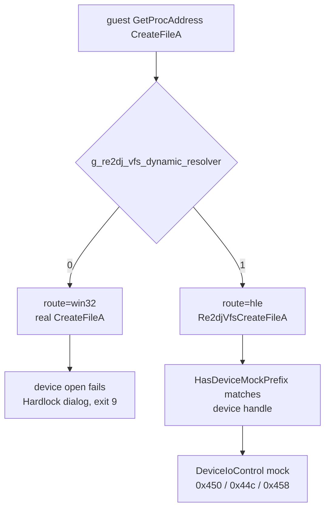

# ez2dj3rd transform challenge 관찰 설계

## 목적

3rd가 Function `0x0e`에 보내는 challenge 목록을 실제 실행에서 다시 관찰해, 기록된 18개가 3rd 고유 규칙인지 아니면 잘린 관찰의 하한인지 확정합니다.

*Re-observe the challenge list 3rd sends to Function `0x0e` in a real run, to settle whether the recorded 18 is a rule specific to 3rd or the lower bound of a truncated observation.*

## 배경

[Task 135](20260902-135-hardlock-transform-response-map.md)는 4th의 36개 challenge가 `.idata`와 `.protect`를 제외한 **전 section**의 32 KiB 청크 시작 8바이트임을 확정했고, [Task 136](20260902-136-resoftlock-interface-contract.md)은 그 규칙을 계약에 넣었습니다.

반면 3rd 기록은 18개이며, [Task 105 분석](../analysis/ez2dj3rd-hardlock-function-0e.md)이 이를 `.text` 청크 시작으로만 설명합니다. 두 제품이 다른 규칙을 쓰는 것인지, 아니면 3rd 관찰이 중간에 끊겼던 것인지 구분되지 않은 상태입니다. 이 차이는 생성기가 만들 매핑 파일의 크기를 좌우합니다.

*Task 135 established that 4th's 36 challenges are the first eight bytes of each 32 KiB chunk across **every section** except `.idata` and `.protect`, and Task 136 wrote that rule into the contract. The 3rd record, by contrast, holds 18, which the Task 105 analysis explains using `.text` chunk starts alone. Whether the two products use different rules or the 3rd observation was cut short is unresolved, and the difference decides how large a map file the generator must produce.*

## 판별 방법

Task 135가 추가한 `--hardlock-transform-inputs`는 `0x458` 요청의 block payload를 trace에 기록합니다. 3rd에 대해 한 번도 실행된 적이 없습니다. 한 번 실행하면 답이 나옵니다.

| 관찰 결과 | 결론 |
| --- | --- |
| 32개 부근 | 4th와 같은 전 section 규칙. 기록된 18은 하한 |
| 정확히 18개 | 3rd는 `.text` 전용 규칙 |

관찰 목록은 원본 실행 파일에서 유도한 목록과 값·순서까지 대조합니다. 대조가 성립하면 규칙이 확정되고, 생성기는 3rd에 대해서도 re2DJ 실행 없이 목록을 만들 수 있습니다.

*The `--hardlock-transform-inputs` diagnostic added by Task 135 records `0x458` block payloads in the trace and has never been run against 3rd; one run answers the question. Roughly 32 means the same all-section rule as 4th with the recorded 18 as a lower bound, while exactly 18 means a `.text`-only rule for 3rd. The observed list is then compared value-by-value and in order against a list derived from the original executable; if they agree, the rule is settled and the generator can build 3rd's list without running re2DJ.*

## 실행 경로 문제 — 3rd의 dynamic resolver

3rd는 보호 장치를 `GetProcAddress`로 해석한 `CreateFileA`로 엽니다. 따라서 device mock이 그 open을 보려면 resolver가 `CreateFileA`를 HLE wrapper로 돌려줘야 합니다.

현재 이 flag는 `hle_dynamic_vfs` profile 기본값으로만 켜지고, 그 기본값은 ez2dj4th에만 있습니다. 2026-08-31 3rd 실행에서는 `CreateFileA`가 `route=hle`였으므로, 이 gate가 도입되기 전에는 3rd도 HLE 경로를 받았습니다.

*3rd opens the protection device through a `CreateFileA` resolved by `GetProcAddress`, so the device mock sees that open only if the resolver returns the HLE wrapper. That routing is gated on the `hle_dynamic_vfs` profile default, which only ez2dj4th carries; 3rd runs from 2026-08-31 show `CreateFileA` on `route=hle`, so 3rd received the HLE route before the gate existed.*

## 결정 — profile 기본값이 아니라 launcher 진단 flag

두 가지가 가능합니다.

| 방식 | 장점 | 단점 |
| --- | --- | --- |
| 3rd profile에 `hle_dynamic_vfs = true` | 이전 동작을 그대로 복구 | 제품 실행 경로의 기본값 변경. 3rd 제품 정책 재검토가 필요 |
| launcher 전용 `--hle-dynamic-vfs` | 제품 기본값을 건드리지 않고 관찰만 가능 | 3rd 제품 실행은 여전히 device를 열지 못함 |

**이번 작업은 launcher flag를 선택합니다.** 목적이 관찰이고, 3rd 제품 정책 변경은 근거를 따로 정리해야 하는 별개 판단이기 때문입니다. profile 기본값 결정은 후속 작업으로 남깁니다.

*Two options exist: setting `hle_dynamic_vfs = true` on the 3rd profile restores the earlier behavior but changes a product-path default and requires revisiting 3rd's product policy; a launcher-only `--hle-dynamic-vfs` leaves product defaults untouched but leaves 3rd's product run unable to open the device. **This task chooses the launcher flag**, because the goal is observation and changing 3rd's product policy is a separate judgement needing its own rationale; the profile-default decision is deferred.*

## 비범위

- 3rd profile 기본값 변경.
- 응답 주입과 후보 판별. Stage 6·7은 별도 작업입니다.
- Function `0x0e` 변환 구현.

*Out of scope: changing the 3rd profile default; injecting responses and judging candidates, which are Stages 6 and 7 as separate tasks; and implementing the Function `0x0e` transform.*
