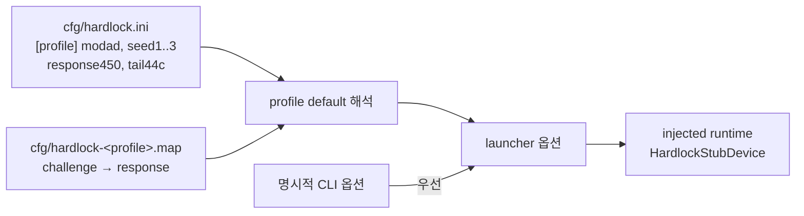

# Hardlock cfg 재료 기본값 설계

## 목적

[Task 139](20260902-139-hardlock-candidate-judgement.md)에서 판별된 응답 집합을 제품 실행 경로가 쓸 수 있게 합니다. 사용자가 `cfg/`에 재료를 두면 profile 기본값으로 자동으로 읽고, 없으면 지금 동작 그대로 둡니다.

*Make the response set identified in Task 139 usable by the product execution path: when the user places the material under `cfg/`, a profile default picks it up automatically, and when it is absent, behavior stays as it is today.*

## 배경

Task 139는 3rd와 4th 각각 보호를 통과하는 응답 매핑을 확정했습니다. 그러나 그 실행은 launcher 진단 옵션 세 개를 직접 준 것이었습니다.

| 재료 | 지금까지의 전달 방법 | 성격 |
| --- | --- | --- |
| 응답 매핑 (challenge→response) | `--hardlock-transform-map <path>` | 외부에서 계산한 비밀 재료 |
| `0x450` 6바이트 응답 | `--device-mock-hardlock-450-response` | 합성 진단값. 실제 driver 응답이라는 근거 없음 |
| `0x44c` tail word | `--device-mock-hardlock-44c-tail` | 합성 진단값 |

셋 중 하나라도 빠지면 게스트는 transform loop에 도달하지 못합니다. 즉 매핑만 자동으로 읽어도 제품 경로는 통과하지 못합니다.

*Task 139 confirmed a passing response map for both 3rd and 4th, but those runs supplied three launcher diagnostics by hand: the response map, the six-byte `0x450` response, and the `0x44c` tail word. The latter two are synthetic diagnostics with no evidence of being real driver responses, and without any one of the three the guest never reaches the transform loop — so auto-loading the map alone would not make the product path pass.*

## 결정 — 값은 코드가 아니라 `cfg/`에 둔다

합성값을 profile 상수로 코드에 넣으면 "확인되지 않은 값을 제품 기본값으로 올리지 않는다"는 기존 정책을 깨뜨립니다. 대신 **세 재료 모두 사용자가 `cfg/`에 두는 파일에서 옵니다.** 저장소에는 경로 규칙과 읽는 코드만 있습니다.

| 항목 | 규칙 |
| --- | --- |
| 매핑 파일 경로 | `cfg/hardlock-<profile-id>.map` |
| `0x450` 응답 | `cfg/hardlock.ini`의 profile section, `response450` 키 (12 hex) |
| `0x44c` tail | 같은 section, `tail44c` 키 (4 hex) |
| 없을 때 | 오류가 아니라 미적용. 기존 동작 유지 |
| 명시적 CLI 옵션 | profile 기본값보다 우선 |
| Git | `/cfg/`는 이미 ignore. 값은 저장소에 들어가지 않음 |

*The decision — the values live in `cfg/`, not in code. Putting synthetic values into profile constants would break the standing policy against promoting unverified values to product defaults, so **all three materials come from files the user places under `cfg/`**, and the repository carries only the path convention and the code that reads them. The map is `cfg/hardlock-<profile-id>.map`; the `0x450` response and `0x44c` tail are optional `response450` and `tail44c` keys in the profile's section of `cfg/hardlock.ini`. A missing file or key is not an error but simply unapplied, an explicit CLI option outranks the profile default, and `/cfg/` is already Git-ignored so no value enters the repository.*

## 구조

- `HardlockSecretMaterial`에 선택 항목 두 개를 추가합니다. `response450`과 `tail44c`입니다. 기존 module address와 seed 세 개의 필수 여부는 그대로 둡니다.
- profile은 `TargetLptdiPolicy::hardlock_cfg_material_default`로 이 기본값 해석을 켭니다. 3rd와 4th가 대상입니다.
- 해석은 launcher 진입점 한 곳에서 합니다. 제품 CLI가 같은 진입점을 호출하므로 두 경로가 같은 규칙을 공유합니다.
- 적용 여부는 진단 이벤트로 남깁니다. 값 자체는 로그에 남기지 않고 적용 사실과 항목 수만 남깁니다.

*Structure: `HardlockSecretMaterial` gains the two optional entries while the existing module address and three seeds keep their current requirement; the profile turns the resolution on through `TargetLptdiPolicy::hardlock_cfg_material_default` for 3rd and 4th; resolution happens in the single launcher entry point, which the product CLI also calls, so both paths share one rule; and application is recorded as a diagnostic event carrying only the fact and the entry count, never the values.*

## 3rd profile의 dynamic resolver

3rd 제품 경로가 보호 장치에 도달하려면 [Task 138](20260902-138-ez2dj3rd-transform-challenge-observation.md)이 유보한 결정이 필요합니다. 3rd는 `GetProcAddress`로 해석한 `CreateFileA`로 장치를 열기 때문에, `hle_dynamic_vfs`가 꺼져 있으면 device mock이 그 open을 보지 못합니다.

이번 작업의 목적이 "제품 경로가 재료를 쓰게 하는 것"이므로 **3rd profile의 `hle_dynamic_vfs`를 켭니다.** 이는 2026-08-31까지의 3rd 동작을 복구하는 것이기도 합니다.

*The 3rd profile's dynamic resolver: reaching the protection device on 3rd's product path needs the decision Task 138 deferred, because 3rd opens its device through a `CreateFileA` resolved by `GetProcAddress` and the device mock cannot see that open while `hle_dynamic_vfs` is off. Since this task exists to let the product path use the material, **`hle_dynamic_vfs` is enabled on the 3rd profile**, which also restores 3rd's behavior as it stood until 2026-08-31.*

## 비범위

- Function `0x0e` 변환 구현. 여전히 하지 않습니다. re2DJ는 응답을 계산하지 않고 파일에서 읽습니다.
- 보호 통과 이후의 HLE 공백. 두 제품 모두 `EZ2DJ.ini` 절대 경로 이중 결합에서 막혀 있으며 별도 작업입니다.
- 합성 `0x450`/`0x44c` 값의 진위 확인.

*Out of scope: implementing the Function `0x0e` transform, which re2DJ still does not do — it reads responses from a file rather than computing them; the HLE gaps after the protection, since both products stop at the `EZ2DJ.ini` absolute-path double join, which is a separate task; and verifying whether the synthetic `0x450` and `0x44c` values are genuine.*

## 검증

- 재료가 없으면 두 제품의 제품 경로가 이전과 같은 지점에서 멈춥니다.
- 재료가 있으면 제품 경로가 Task 139가 기록한 통과 지문을 냅니다. handshake 8회, 장치 재오픈, `EZ2DJ.ini` 열기입니다.
- 명시적 CLI 옵션이 주어지면 그 값이 쓰입니다.

*Verification: without the material both product paths stop where they did before; with it the product path reproduces the passing fingerprint Task 139 recorded — eight handshakes, a device reopen, and an `EZ2DJ.ini` open; and an explicit CLI option is used when given.*
