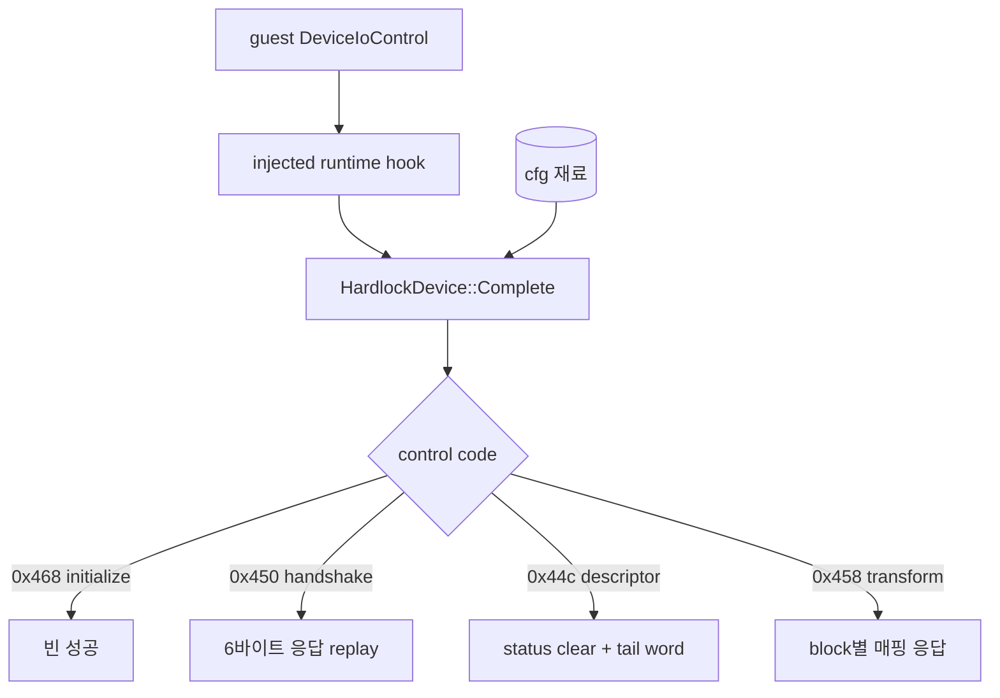

# Hardlock HLE 정리 설계

## 목적

Hardlock 장치를 흉내내는 코드를 HLE 계층으로 옮기고, 계약을 알아내려고 만들었던 진단 코드를 제거합니다. 남기는 기준은 하나입니다. **보호를 통과하는 실행에 필요한가.**

*Move the code that emulates the Hardlock device into the HLE layer and remove the diagnostics built to discover its contract. One criterion decides what stays: **is it needed by a run that passes the protection?***

## 배경

[Task 140](20260902-140-hardlock-cfg-material-defaults.md)까지 오면서 Hardlock 코드는 두 종류가 섞였습니다.

| 종류 | 예 | 지금의 지위 |
| --- | --- | --- |
| 장치 흉내 | 네 IOCTL 응답, 매핑 주입 | 제품 실행 경로가 매 실행 사용 |
| 계약 발견용 진단 | XOR 인과 probe, challenge 기록, descriptor ID 기록, protocol 관찰 tracker | 목적을 달성해 결론이 문서에 남음 |

둘째 종류는 답을 얻기 위한 도구였고 답은 이미 `docs/analysis/`에 있습니다. 코드로 남겨두면 실행 경로를 읽는 사람이 무엇이 제품이고 무엇이 실험인지 매번 판단해야 합니다.

또한 위치가 원칙과 어긋납니다. `ARCHITECTURE.md`의 계층 표에 `src/device/` 항목이 아예 없고, 장치 흉내는 정의상 HLE입니다. AGENTS의 아키텍처 규칙은 "운영체제와 하드웨어 인터페이스만 대체한다"이며 dongle은 하드웨어입니다.

*Background: the Hardlock code now mixes two kinds — device emulation, which the product path uses on every run, and contract-discovery diagnostics, whose answers already live in `docs/analysis/`. Keeping the second kind in code forces every later reader to re-decide which lines are product and which were experiments. The location is also off-principle: the `ARCHITECTURE.md` layer table has no `src/device/` row at all, and emulating a device is by definition HLE, since the architecture rule is to replace operating-system and hardware interfaces.*

## 남기는 것 — 흉내에 필요한 것만

| 구성요소 | 이유 |
| --- | --- |
| `HardlockDevice` (구 `HardlockStubDevice`) | 네 IOCTL에 답하는 본체 |
| IOCTL 상수와 `ClassifyHardlockRequest` | 요청 분기 |
| descriptor 헤더 판독과 tail 오프셋 | status/tail 기록 위치 |
| `0x450` 응답 타입과 hex 파서 | handshake replay |
| transform 매핑 파서와 조회 | `0x458` 응답 |
| cfg 재료 로더 | 세 재료를 읽는 유일한 경로 |
| `hardlock-device` trace 한 줄 | 주입 완전성 확인 수단 |

*What stays — only what the emulation needs: the device that answers the four IOCTLs, the control-code constants and classifier, the descriptor header reader and tail offset, the `0x450` response type and its hex parser, the transform map parser and lookup, the cfg material loader, and the single device trace line that shows whether injection was complete.*

## 지우는 것 — 답을 얻은 도구들

| 제거 | 답이 남은 곳 |
| --- | --- |
| transform payload XOR probe | [Task 131 인과 확인](../work-logs/20260901-131-hardlock-bypass-stub.md): 게스트가 출력을 소비함 |
| `--hardlock-transform-inputs` | [Task 138](../work-logs/20260902-138-ez2dj3rd-transform-challenge-observation.md): 규칙이 PE에서 유도되고 두 제품 확정 |
| `--hardlock-descriptor-ids`와 descriptor trace | [3rd 분석](../analysis/ez2dj3rd-hardlock-function-0e.md), [4th 분석](../analysis/ez2dj4th-hardlock-runtime.md): ID 값 기록됨 |
| `HardlockProtocolTracker`와 protocol/450-packet trace | 계약이 확정됨. 요청 종류와 결과는 device trace가 이미 기록 |
| seed·module address 비밀 경로 전체 | re2DJ는 응답을 계산하지 않음. 어떤 코드도 seed를 소비하지 않음 |
| `windows_hardlock_descriptor_probe` | descriptor 판독은 unit test가 고정 |

**seed 경로 제거가 이번 정리의 핵심입니다.** `g_re2dj_hardlock_seed1..3`과 module address는 export되어 게스트 프로세스까지 전달되지만 이를 읽어 무언가를 계산하는 코드는 존재하지 않습니다. 응답은 매핑 파일에서 오고, 변환은 이 저장소가 구현하지 않는다는 것이 확정된 정책입니다. 따라서 `--hardlock-config`, `hardlock_secret_config_required`, ini의 `modad`/`seed1..3` 키가 함께 사라집니다. re2DJ의 설정에는 **re2DJ가 실제로 쓰는 값만** 남습니다.

*What goes — the tools that already produced their answers, each with its record: the XOR causality probe, the challenge recorder, the descriptor ID recorder and its trace, the protocol tracker with the protocol and `0x450` packet traces, the whole seed and module-address secret path, and the dedicated descriptor probe. **Removing the seed path is the core of this cleanup**: those exports reach the guest process but no code reads them to compute anything, responses come from the map file, and not implementing the transform is settled policy — so `--hardlock-config`, `hardlock_secret_config_required`, and the ini's `modad` and `seed1..3` keys go with them, leaving re2DJ's configuration holding **only values re2DJ actually uses**.*

## 위치

| 지금 | 이후 |
| --- | --- |
| `include/re2dj/device/hardlock_*.h` | `include/re2dj/hle/hardlock/{device,protocol,api_descriptor,handshake_response,transform_responses}.h` |
| `src/device/hardlock_*.cpp` | `src/hle/hardlock/*.cpp` |
| namespace `re2dj::device` | `re2dj::hle::hardlock` |

디렉터리가 한정자를 제공하므로 파일 이름에서 `hardlock_` 접두사를 뗍니다. `include/re2dj/platform/windows/`가 이미 같은 방식입니다. LPTDI는 1st SE의 다른 장치이므로 이번 범위에 넣지 않고 `src/device/`에 남깁니다. 계층 표에 HLE Hardlock 행을 추가하고 `src/device/`의 지위는 후속 판단으로 남깁니다.

*Location: the headers move to `include/re2dj/hle/hardlock/` and the sources to `src/hle/hardlock/`, with the namespace becoming `re2dj::hle::hardlock`. The `hardlock_` file prefix drops because the directory supplies the qualifier, the same way `include/re2dj/platform/windows/` already works. LPTDI stays in `src/device/` as 1st SE's separate device, outside this task, and the layer table gains an HLE Hardlock row while the standing of `src/device/` is left to a later judgement.*

## 이름

"stub"은 이제 사실과 다릅니다. 이 코드는 보호를 통과시키는 응답을 실제로 전달합니다. `HardlockStubDevice`를 `HardlockDevice`로, launcher 옵션 `--hardlock-stub`을 `--hardlock-device`로, trace 접두사 `hardlock-stub`을 `hardlock-device`로 바꿉니다.

*Naming: "stub" is no longer accurate, because this code delivers responses that pass the protection, so `HardlockStubDevice` becomes `HardlockDevice`, the `--hardlock-stub` option becomes `--hardlock-device`, and the trace prefix changes to match.*

## 유지되는 성질

- 이 저장소는 여전히 응답을 계산하지 않습니다. 매핑 파일에서 읽어 전달만 합니다.
- 요청 형태 검증은 그대로입니다. 계약 밖 요청은 강제로 성공시키지 않고 거절합니다.
- 재료가 없으면 이전과 같은 지점에서 멈춥니다.
- 진단 로그에 값이 남지 않습니다.

*Preserved properties: the repository still computes no response and only relays what the map file holds; request-shape validation stays, rejecting anything outside the contract rather than forcing success; without material a run stops where it did before; and no value enters the diagnostic log.*

## 검증

제거가 동작을 바꾸지 않았음은 제품 실행으로 확인합니다. 두 제품이 [Task 139](20260902-139-hardlock-candidate-judgement.md)의 통과 지문을 그대로 재현해야 합니다.

*Verification: that the removals changed no behavior is confirmed by product runs, which must reproduce Task 139's passing fingerprint for both products.*
