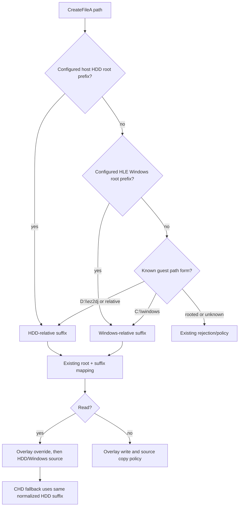

# VFS 호스트 절대 경로 재해석 설계

이번 작업은 Hardlock 보호를 통과한 4th 실행이 `EZ2DJ.ini`를 열 때 발생한
VFS 경로 이중 결합을 수정합니다. 원본은 현재 작업 디렉터리를 기준으로 만든
경로를 Win32에 넘기고, Windows가 이를 staging 디렉터리의 호스트 절대 경로로
해석한 뒤 다시 HLE `CreateFileA` 경계로 전달할 수 있습니다.

*This task fixes the VFS double-join observed when the 4th run, after passing
Hardlock, opens `EZ2DJ.ini`. The original can pass a path based on its current
directory to Win32; Windows resolves it to a host absolute path under the
staging directory, and that path can then return through the HLE `CreateFileA`
boundary.*

## 근거 / Evidence

2026-09-03 4th 실행에서 Hardlock 재료는 모두 적용되었고 handshake와 transform이
정상 처리되었습니다. 그 직후 다음 요청이 실패했습니다.

*In the 2026-09-03 4th run, all Hardlock material was applied and the handshake
and transforms completed. The following request then failed:*

```text
request=C:\...\EZ2DJ\EZ2DJ.ini
mapped=C:\...\EZ2DJ\C:\...\EZ2DJ\EZ2DJ.ini
success=0:error=123
```

근거 로그: [launcher JSONL](../../logs/windows_x86_launcher_probe/ez2dj4th/20260903-000238-901.jsonl),
[VFS trace](../../logs/windows_x86_launcher_probe/ez2dj4th/20260903-000238-901.vfs.log).

*Evidence: [launcher JSONL](../../logs/windows_x86_launcher_probe/ez2dj4th/20260903-000238-901.jsonl)
and [VFS trace](../../logs/windows_x86_launcher_probe/ez2dj4th/20260903-000238-901.vfs.log).*

현재 `MapVfsPath`는 `D:\ez2dj`, `C:\windows`, 또는 상대 경로만 의미 있는
게스트 경로로 인식합니다. 그 밖의 드라이브 경로는 상대 경로처럼 HDD 루트에
붙이므로 staging 루트가 다시 붙습니다.

*`MapVfsPath` currently recognizes only `D:\ez2dj`, `C:\windows`, and relative
paths as meaningful guest paths. Another drive-qualified path is treated like a
relative path and appended to the HDD root, which appends the staging root a
second time.*

## 목표와 비목표 / Goals and non-goals

- 설정된 HDD 루트 아래의 호스트 절대 경로를 HDD 상대 suffix로 되돌립니다.
- 설정된 HLE Windows 루트 아래의 호스트 절대 경로도 같은 방식으로 재해석합니다.
- 읽기, overlay 우선순위, 쓰기 시 원본 보호, CHD fallback은 기존 경로를 그대로
  사용합니다.
- 설정된 루트 밖의 절대 경로는 통과시키지 않고 기존처럼 매핑 실패 또는 기존
  경로 정책을 따릅니다.
- 게스트의 현재 디렉터리 API나 원본 실행 파일은 수정하지 않습니다.

*Goals:*

- Convert a host absolute path under the configured HDD root back to an HDD-relative suffix.
- Apply the same interpretation to a host absolute path under the configured HLE Windows root.
- Preserve the existing read mapping, overlay precedence, copy-on-write behavior, and CHD fallback.
- Do not pass through an absolute path outside a configured root; keep the existing mapping policy there.
- Do not modify the guest current-directory APIs or the original executable.

## 설계 / Design

경로 인식은 다음 우선순위를 갖습니다.



새 `FindPathSuffixUnderRoot` 보조 함수는 다음을 보장합니다.

1. 비교는 Windows 경로 의미에 맞게 ASCII 대소문자를 무시합니다.
2. `\\`와 `/`를 같은 구분자로 취급합니다.
3. root 다음 문자가 경로 구분자 또는 끝이 아니면 prefix로 인정하지 않습니다.
   따라서 `C:\\stage\\EZ2DJ2`가 `C:\\stage\\EZ2DJ`의 하위 경로로 오인되지 않습니다.
4. 반환하는 suffix는 입력 문자열 내부를 가리키며, 기존 `JoinRoot`를 통해서만
   실제 경로를 구성합니다.

*The new `FindPathSuffixUnderRoot` helper will compare ASCII case-insensitively,
treat both Windows separators as equivalent, require a separator or end of
string at the root boundary, and return a suffix into the input string. Actual
host paths will still be constructed only through the existing `JoinRoot` path.*

`GuestHddSuffix`도 HDD root 하위의 host absolute path를 같은 suffix로 변환해야
합니다. 그래야 staging 파일이 아직 materialize되지 않은 경우
`OpenChdReadFile`과 `MaterializeChdFile`이 `EZ2DJ/<suffix>`를 올바르게 조회합니다.
쓰기 요청은 host absolute path를 발견하더라도 절대 경로를 직접 열지 않고,
기존대로 overlay 경로에 기록합니다.

*`GuestHddSuffix` must use the same conversion for host absolute paths under the
HDD root. This keeps `OpenChdReadFile` and `MaterializeChdFile` looking up
`EZ2DJ/<suffix>` when a staged file has not been materialized yet. Even for a
host absolute write request, the code will not open the absolute path directly;
it will continue writing through the overlay policy.*

## 검증 전략 / Verification strategy

- 기존 Windows VFS runtime probe에 HDD root 아래의 host absolute read를 추가합니다.
- 같은 absolute path로 write를 수행하고, HDD 원본은 변하지 않으며 overlay 사본만
  변경되는지 확인합니다.
- 기존 guest 경로, rooted guest path 거부, CHD·overlay 및 전체 runtime probe를
  회귀 검증합니다.
- Windows x86 Debug build와 CTest를 실행합니다.
- 마지막으로 `re2dj.exe ez2dj4th`를 실행하여 `EZ2DJ.ini` 요청이 이중 결합되지
  않고 이후의 다음 경계로 진행하는지 확인합니다.

*Verification: extend the Windows VFS runtime probe with a host-absolute read
under the HDD root; write through the same absolute path and verify that the HDD
source remains unchanged while only the overlay copy changes; retain regression
coverage for guest paths, rooted-path rejection, CHD, and overlay behavior; run
the Windows x86 Debug build and CTest; and finally run `re2dj.exe ez2dj4th` to
verify that `EZ2DJ.ini` no longer receives the doubled path and execution reaches
the next boundary.*

## 범위 밖 / Out of scope

- `EZ2DJ.ini` 이후에 발견될 새로운 Win32/HLE 공백
- 원본 파일 또는 CHD의 변경
- Hardlock 응답 계산 및 보호 로직 수정

*Out of scope: new Win32/HLE gaps discovered after `EZ2DJ.ini`, changes to the
original files or CHD, and Hardlock response computation or protection logic.*
