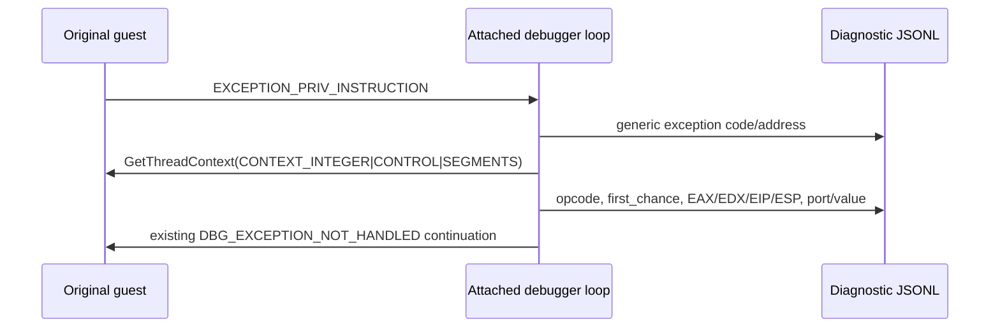

# ez2dj4th privileged-instruction 진단 설계

이번 작업은 VFS 절대 경로 수정 후 `EZ2DJ.ini` 다음에서 발생한
`0xc0000096`의 명령어·레지스터 상태를 debugger 경로에서 기록합니다. 원본
실행 파일이나 guest 코드는 수정하지 않고, 이미 존재하는 attached-debugger
진단 loop에 privileged-instruction 전용 관찰만 추가합니다.

*This task records the instruction and register state for the `0xc0000096` observed
after `EZ2DJ.ini` once the VFS absolute-path fix is applied. It does not modify the
original executable or guest code; it adds only privileged-instruction observation
to the existing attached-debugger diagnostic loop.*

## 근거 / Evidence

2026-09-03 `--slot-writer-trace` 실행에서 Hardlock transform 36회와 `EZ2DJ.ini`
open 성공 뒤 동일한 예외가 두 번 관찰되었습니다.

*In the 2026-09-03 `--slot-writer-trace` run, the same exception was observed twice
after 36 completed Hardlock transforms and a successful `EZ2DJ.ini` open.*

```text
code=0xc0000096
address=0x004c3817
exception_bytes=ecc3668b54240466edc3668b542404ed
```

첫 바이트 `0xec`는 x86 `IN AL,DX`이고 다음 `0xc3`는 `RET`입니다. 현재 generic
exception 기록은 exception address와 stack만 남기므로 EDX의 실제 port와 EAX의
read/write 값은 로그에서 확인할 수 없습니다.

*The first byte `0xec` is x86 `IN AL,DX`, and the following `0xc3` is `RET`. The
current generic exception record stores only the exception address and stack, so
the actual EDX port and EAX read/write value are not available in the log.*

근거 로그: [launcher JSONL](../../logs/windows_x86_launcher_probe/ez2dj4th/20260903-002700-459.jsonl),
[VFS trace](../../logs/windows_x86_launcher_probe/ez2dj4th/20260903-002700-459.vfs.log).

*Evidence: [launcher JSONL](../../logs/windows_x86_launcher_probe/ez2dj4th/20260903-002700-459.jsonl)
and [VFS trace](../../logs/windows_x86_launcher_probe/ez2dj4th/20260903-002700-459.vfs.log).*

## 목표와 비목표 / Goals and non-goals

- `EXCEPTION_PRIV_INSTRUCTION`에 대해 first/second-chance 상태, address, opcode bytes, x86 integer/control registers를 bounded JSONL event로 기록합니다.
- EDX low word를 `port`, EAX low byte를 `value`로 함께 기록하되, opcode가 `IN AL,DX` 또는 `OUT DX,AL`인지 구분합니다.
- 기존 exception continuation과 Hardlock/VFS 동작은 변경하지 않습니다.
- privileged exception을 자동으로 처리하거나 4th raw-I/O HLE를 추측해 활성화하지 않습니다.

*Goals: record first/second-chance state, address, opcode bytes, and x86 integer/control
registers for `EXCEPTION_PRIV_INSTRUCTION` in a bounded JSONL event; expose EDX's low
word as `port` and EAX's low byte as `value` while classifying `IN AL,DX` and `OUT DX,AL`;
preserve existing continuation and Hardlock/VFS behavior; and avoid automatically
handling the exception or enabling guessed 4th raw-I/O HLE.*

## 설계 / Design

예외 loop는 기존 generic exception event를 먼저 유지하고, 같은 event에서
`EXCEPTION_PRIV_INSTRUCTION`인 경우에만 새 helper를 호출합니다.

*The exception loop keeps the existing generic exception event and calls the new
helper only for `EXCEPTION_PRIV_INSTRUCTION` events.*



새 event는 다음 필드를 사용합니다.

```json
{"event":"privileged_instruction","code":"0xc0000096","first_chance":1,"address":"0x004c3817","kind":"in_al_dx","opcode":"ec","bytes":"ecc3...","eax":"0x00000000","edx":"0x00000103","eip":"0x004c3817","esp":"0x001afea4","port":"0x0103","value":"0x00"}
```

`bytes`는 exception address에서 최대 16바이트까지만 기록하고, register 읽기에
실패하면 별도 `privileged_instruction_context_error`를 남깁니다. 이 기록은
진단용이며 입력값을 바꾸거나 `EIP`를 진행하지 않습니다.

*The event records at most 16 bytes from the exception address. If thread-context
capture fails, it emits a separate `privileged_instruction_context_error`. This is
diagnostic only: it changes neither input values nor EIP.*

## 검증 전략 / Verification strategy

- Windows x86 Debug build를 실행합니다.
- unit test와 product-loader probe를 회귀 실행합니다.
- 실제 CHD staging root에 대해 `--slot-writer-trace`를 실행합니다.
- `0xc0000096` event가 `0x004c3817`에서 기록되고, EDX low word가 호출 stack의
  관찰값과 일치하는지 확인합니다.
- Hardlock transform 36회와 `EZ2DJ.ini` 매핑 성공이 변하지 않는지 확인합니다.

*Run the Windows x86 Debug build, unit tests, and the product-loader probe; execute
`--slot-writer-trace` against the real CHD staging root; verify that the
`0xc0000096` event remains at `0x004c3817` and that EDX's low word agrees with the
observed call-stack value; and verify that all 36 Hardlock transforms and the
successful `EZ2DJ.ini` mapping remain unchanged.*

## 범위 밖 / Out of scope

- 4th raw I/O response value의 의미 확정
- 4th profile에 legacy I/O HLE를 기본 활성화
- `0xc0000096` 예외를 자동 처리
- 원본 HDD, CHD, 실행 파일 저장 또는 수정

*Out of scope: determining the meaning of the 4th raw-I/O response value, enabling
legacy-I/O HLE by default for the 4th profile, handling the `0xc0000096` exception
automatically, or storing/modifying the original HDD, CHD, or executable.*
