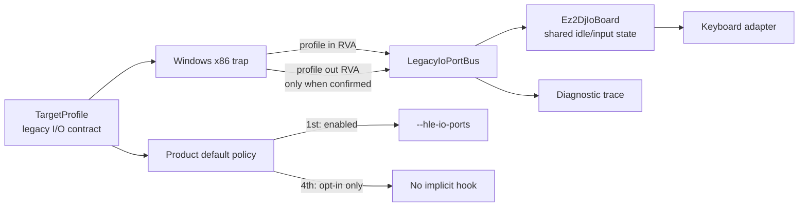

# ez2dj4th 프로파일별 raw I/O 재사용 설계

관련 작업 지시서: [ez2dj4th 프로파일별 raw I/O 재사용 작업 지시서](../work-orders/20260903-144-ez2dj4th-profile-io-reuse.md)

## 상태와 근거

**진행 중.** `ez2dj4th`의 복구 실행은 VFS와 Hardlock material 경계를 통과했지만, `0x004c3817`의 `IN AL,DX`에서 `0xc0000096`으로 중단되었습니다. 이 명령은 main image 기준 RVA `0x000c3817`이며, 관찰된 포트는 `0x0103`입니다. 반환값은 아직 원본 장치 응답으로 확인되지 않았습니다.

`ez2dj1stse`에서 이미 검증한 `LegacyIoPortBus`와 `Ez2DjIoBoard`는 포트 계약, idle 상태, 키보드 어댑터 연결을 공유할 수 있습니다. 다만 raw I/O helper 주소는 실행 파일별로 다르므로, 1st의 고정 RVA를 4th에 재사용하지 않고 target profile이 trap RVA를 소유하도록 합니다.

**확인됨:** 1st의 기존 byte read/write RVA는 각각 `0x00038987`, `0x000389ab`입니다. 4th에서 확인된 RVA는 byte read `0x000c3817` 하나이며, 4th byte write RVA는 아직 확인되지 않았습니다.

**추정/실험:** 4th의 `0x0103` read에 공용 idle 응답 `0x00`을 연결하면 다음 실행 경계로 진행할 수 있는지 확인할 수 있습니다. 이는 물리 IO 보드의 정답 응답을 의미하지 않습니다.

## 설계 결정

`TargetLptdiPolicy`에 프로파일별 byte read/write RVA와 raw I/O 기본 활성화 여부를 추가합니다.

- `legacy_io_ports`: 해당 프로파일에서 명시적 raw I/O HLE 진단을 허용하는 capability입니다.
- `legacy_io_ports_default`: 제품 facade가 프로파일 기본 실행에 `--hle-io-ports`를 추가할지 결정합니다.
- `legacy_io_in_byte_rva`, `legacy_io_out_byte_rva`: main image 기준 helper RVA입니다. 0은 해당 방향의 주소를 아직 확인하지 않았다는 뜻입니다.
- 1st는 기존 두 RVA와 capability/default를 모두 유지합니다.
- 4th는 확인된 read RVA와 capability만 등록하고, write RVA는 0, 기본 활성화는 false로 둡니다.

따라서 4th는 진단 런처에서 명시적으로 `--hle-io-ports`를 사용하면 공용 보드 응답을 시험할 수 있지만, 반환 계약이 확인되기 전까지 일반 `re2dj.exe ez2dj4th` 실행 정책은 바뀌지 않습니다. 알 수 없는 주소·포트·operand width는 계속 처리하지 않습니다.

## 경계와 안전성

런처의 attached/debugger 경로와 injected runtime 경로가 같은 profile RVA를 사용하도록 맞춥니다. 런처는 예외 주소를 `image_base + in/out RVA`와 비교하고, runtime은 주입 전에 동일한 RVA를 export 변수에 기록합니다. 4th처럼 write RVA가 없는 profile은 write 명령을 처리하지 않습니다.

4th 진단에서 read가 처리되더라도 `0xc0000096`이 사라졌다는 사실만 기록하며, 이후 Hardlock, DirectX, 파일 또는 다른 privileged instruction 경계를 별도 증거로 분리합니다. 원본 실행 파일이나 HDD 내용은 저장소에 추가하지 않습니다.

## 검증 기준

1. target profile/product-loader probe가 1st의 기존 인자와 4th의 no-default 정책을 확인합니다.
2. Windows x86 Debug build와 unit test를 통과합니다.
3. 4th에 `--hle-io-ports --slot-writer-trace`를 명시한 진단 실행에서 `0x004c3817`을 공용 bus가 처리하는지 확인합니다.
4. 진단 로그에서 이전 `0xc0000096`과 다음 boundary를 구분하고, 4th의 write RVA를 추측하지 않습니다.

---

# Profile-Specific Raw I/O Reuse for ez2dj4th

Related work order: [ez2dj4th Profile-Specific Raw I/O Reuse Work Order](../work-orders/20260903-144-ez2dj4th-profile-io-reuse.md)

## Status and evidence

**In progress.** The repaired `ez2dj4th` run passes the VFS and Hardlock-material boundaries but stops with `0xc0000096` at `IN AL,DX` address `0x004c3817`. This is main-image RVA `0x000c3817`, and the observed port is `0x0103`. The returned byte has not been confirmed as an original device response.

The already verified `LegacyIoPortBus` and `Ez2DjIoBoard` from `ez2dj1stse` can share the port contract, idle state, and keyboard-adapter connection. The raw-I/O helper address is executable-specific, however, so the 1st fixed RVA must not be reused for 4th; the target profile must own the trap RVAs.

**Confirmed:** 1st keeps byte-read/write RVAs `0x00038987` and `0x000389ab`. 4th currently has only the confirmed byte-read RVA `0x000c3817`; no 4th byte-write RVA is confirmed.

**Inferred/experimental:** Connecting the shared idle response `0x00` to 4th port `0x0103` may let execution reach the next boundary. This does not identify the physical I/O board response.

## Design decisions

Add per-profile byte read/write RVAs and a raw-I/O default switch to `TargetLptdiPolicy`.

- `legacy_io_ports` is the capability allowing explicit raw-I/O HLE diagnostics for the profile.
- `legacy_io_ports_default` controls whether the product facade adds `--hle-io-ports` to the profile's normal execution.
- `legacy_io_in_byte_rva` and `legacy_io_out_byte_rva` are helper RVAs relative to the main image. Zero means that direction has not been confirmed.
- 1st keeps both existing RVAs and both capability/default enabled.
- 4th registers only the confirmed read RVA and capability; its write RVA is zero and its default is disabled.

This lets the diagnostic launcher explicitly test the shared board response with `--hle-io-ports`, while ordinary `re2dj.exe ez2dj4th` behavior remains unchanged until the response contract is confirmed. Unknown addresses, ports, and operand widths remain unhandled.

## Boundary and safety

The attached/debugger launcher path and injected runtime use the same profile RVAs. The launcher compares the exception address with `image_base + in/out RVA`; the runtime receives the same values through exported variables before injection. A profile without a write RVA does not handle writes.

Even if the 4th read is handled, the result is recorded only as removal of that observed privileged-instruction boundary. Later Hardlock, DirectX, file, or privileged-instruction boundaries remain separate evidence. Original executables and HDD contents stay outside the repository.

## Verification criteria

1. The target-profile/product-loader probe verifies the existing 1st arguments and 4th no-default policy.
2. The Windows x86 Debug build and unit tests pass.
3. An explicit 4th diagnostic run with `--hle-io-ports --slot-writer-trace` shows whether the shared bus handles `0x004c3817`.
4. The diagnostic log distinguishes the previous `0xc0000096` from the next boundary without guessing a 4th write RVA.
