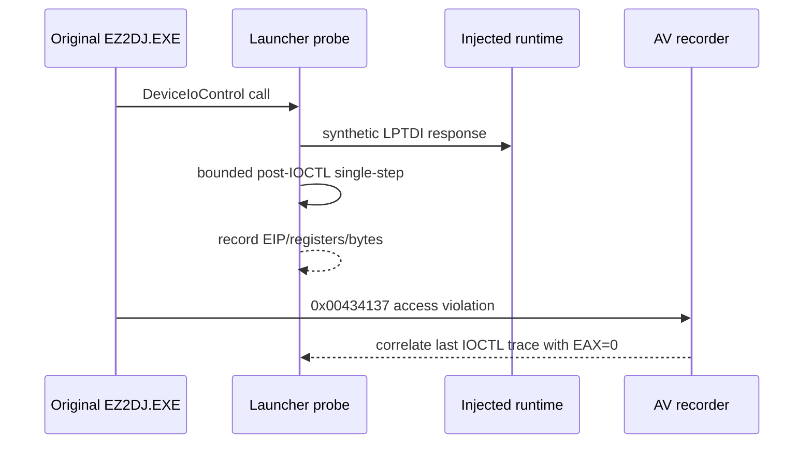

# ez2dj4th AV null-context 원인 분리 설계

관련 작업 지시서: [ez2dj4th AV null-context 원인 분리 작업 지시서](../work-orders/20260903-145-ez2dj4th-av-null-context.md)

## 상태

**완료.** `ez2dj4th`가 프로파일별 raw I/O 연결 뒤 `0x00434137`에서 `0xc0000005`로 중단했습니다. 로그와 runtime code window를 대조한 결과, faulting instruction은 `mov ecx, [eax+0x14]`이고 `EAX=0`이며, 상위 caller가 전달한 객체 필드도 `0`으로 확인됐습니다. 따라서 이번 설계의 범위에서는 null이 직전 Hardlock `DeviceIoControl` 반환값에서 직접 발생한 것이 아니라 상위 객체 초기화·전달 경로에서 발생한 것으로 분류합니다.

## 확인된 사실

- `0x00434137`은 4th main image 기준 `.text` 영역의 실행 주소입니다.
- fault access는 read이며 주소는 `0x00000014`입니다.
- AV 시점 레지스터에서 `EAX=0`, `ECX=0`입니다.
- `0x00417dc2`의 stack return 주변에는 `call 0x00402275`가 보이지만, 이는 stack 기반 후보 호출자일 뿐 null 반환의 원인으로 확정하지 않습니다.
- 기존 런처는 synthetic LPTDI handle에 대한 `DeviceIoControl` 반환 직후 제한된 single-step을 수행하는 `lptdi_post_ioctl_trace`를 제공합니다.

## 결과

- `20260903-012922-258.jsonl`에서 AV thread `18688`의 `EIP=0x00434137`, `EAX=0`, `ECX=0`, read address `0x00000014`를 재현했습니다.
- runtime target chain은 `0x00402275`의 `E9` jump를 거쳐 `0x00434116`으로 이어집니다. 해당 함수는 `ECX`를 local에 저장한 뒤 `[EAX+0x14]`를 읽으므로, 직접적인 fault 원인은 null 객체 수신자입니다.
- caller `0x00417da4`는 `mov [EBP-8], ECX` 후 `mov ECX, [EBP-8]`을 수행하고 `0x00402275`를 호출합니다. `av_caller_frame`에서 이 local은 `0x00000000`으로 확인됐습니다.
- caller의 caller runtime window(`0x0041a684` 기준)는 `mov ECX, [EBP-0x118]`, `mov ECX, [ECX+0x11c]` 후 `call 0x00402298`를 포함합니다. `av_outer_frame`에서 `[outer EBP-0x118] = 0x00acd708`, `[(0x00acd708)+0x11c] = 0x00000000`으로 확인됐습니다.
- 별도 Hardlock 관찰에서는 `0x450` 응답 `0100fafa0010`과 `EAX=1`, `0x44c` 출력 256 bytes와 `EAX=1`을 확인했습니다. 따라서 현재 증거만으로 `DeviceIoControl` 실패 또는 null 반환을 AV의 직접 원인으로 볼 수 없습니다.
- raw I/O 관찰에서는 `0x0103 -> 0x80`, `0x0104 -> 0x80`, `0x0105 -> 0x00`이 반환 직후 원본 객체의 `+0xb3c`, `+0xb40`, `+0xb44`에 저장됩니다. 이 값들이 더 상위 객체 필드의 초기화에 간접적으로 영향을 주는지는 아직 확인하지 않았습니다.

### 판정

이번 실행은 **간접 관련 또는 상위 초기화 경로 문제**로 판정합니다. Hardlock 반환과 raw I/O trap은 관찰 가능한 성공 경계를 통과했지만, 이후 호출 체인에서 상위 객체의 `+0x11c` 필드가 0인 상태로 전달되어 null receiver fault가 발생했습니다. `0x00acd708` 객체 후보의 `+0x11c` writer와 raw I/O 상태의 간접 연관성은 미확정입니다.

후속 작업은 해당 field의 writer/초기화 루틴을 runtime에서 추적해야 합니다. 이번 작업에서는 guest return value, null pointer, branch, IAT 또는 제품 기본 정책을 수정하지 않았습니다.

## 설계

1. Hardlock material replay와 shared raw-I/O 응답은 유지합니다.
2. `0x9c40244c` 및 필요할 경우 `0x9c402450` 호출 직후를 기존 post-IOCTL trace로 최대 48개 명령까지 관찰합니다.
3. 각 sample의 EIP, instruction bytes, registers, output buffer 정보를 AV의 레지스터·stack과 비교합니다.
4. raw I/O trap에서는 `IN` 직전 EAX와 처리 후 EAX, 다음 EIP, stack return address 및 return-site code window를 함께 기록합니다.
5. AV에는 fault thread와 stack에서 식별한 direct-call target의 runtime code window를 함께 기록합니다.
6. AV의 saved EBP를 한 단계 따라가 caller의 `[EBP-8]` 및 인접 local과 caller return address를 기록합니다.
7. stack direct-call 후보의 callsite 전후 runtime code window를 기록해 caller local의 생성 명령을 확인합니다.
8. caller의 caller return-site runtime code window를 기록해 최초 null 전달자를 추가로 추적합니다.
9. 추적만으로 원인이 확정되지 않으면 다음 작업에서 faulting routine의 caller/argument 범위를 별도 계측합니다. 이번 작업에서는 guest return value, null pointer, branch, IAT를 수정하지 않습니다.

## 판정 기준

- **직접 연관:** post-IOCTL sample이 같은 thread에서 반환 직후 `EAX` 또는 output buffer를 null/실패 상태로 만들고, 그 흐름이 `0x00434137`까지 이어지는 경우.
- **간접 연관:** 반환 직후 흐름은 정상적으로 종료되지만 이후 별도 호출에서 null 상태가 만들어지는 경우.
- **미확정:** trace가 다음 API/분기 경계에서 끝나거나, AV 전후의 상태 생성 지점을 관찰하지 못하는 경우.

## 검증 범위

사용자 제공 CHD와 staging HDD 디렉터리를 읽기 전용으로 사용합니다. 진단 실행은 `--hle-io-ports`, mock LPTDI, console-session mock, 기존 Hardlock material을 유지하며, post-IOCTL trace는 bounded API trace 옵션으로만 활성화합니다.

---

# ez2dj4th AV Null-Context Causality Design

Related work order: [ez2dj4th AV Null-Context Causality Work Order](../work-orders/20260903-145-ez2dj4th-av-null-context.md)

## Status

**Completed.** After the profile-specific raw-I/O connection, `ez2dj4th` stops with `0xc0000005` at `0x00434137`. Comparing the log with runtime code windows confirms `mov ecx, [eax+0x14]` with `EAX=0`, and the upper caller supplies a zero object field. Within this design's scope, the null is classified as originating from an upstream object initialization/propagation path rather than directly from the preceding Hardlock `DeviceIoControl` return value.

## Confirmed facts

- `0x00434137` is in the 4th main image `.text` region.
- The fault is a read at `0x00000014`.
- The AV register context has `EAX=0` and `ECX=0`.
- A stack return window near `0x00417dc2` contains `call 0x00402275`, but that is only a stack-based caller candidate and is not proof of a null return cause.
- The existing launcher provides bounded `lptdi_post_ioctl_trace` single-stepping after `DeviceIoControl` returns on a synthetic LPTDI handle.

## Result

- `20260903-012922-258.jsonl` reproduces AV thread `18688` with `EIP=0x00434137`, `EAX=0`, `ECX=0`, and read address `0x00000014`.
- The runtime target chain follows the `E9` jump at `0x00402275` to `0x00434116`. That function stores `ECX` in a local and then reads `[EAX+0x14]`, so the immediate fault cause is a null object receiver.
- Caller `0x00417da4` executes `mov [EBP-8], ECX`, then `mov ECX, [EBP-8]`, and calls `0x00402275`. `av_caller_frame` records that local as `0x00000000`.
- The caller's caller runtime window at `0x0041a684` contains `mov ECX, [EBP-0x118]`, `mov ECX, [ECX+0x11c]`, and `call 0x00402298`. `av_outer_frame` records `[outer EBP-0x118] = 0x00acd708` and `[(0x00acd708)+0x11c] = 0x00000000`.
- Separate Hardlock observations confirm the `0x450` response `0100fafa0010` with `EAX=1`, and the `0x44c` 256-byte output with `EAX=1`. The current evidence therefore does not identify a failed or null `DeviceIoControl` return as the direct AV cause.
- Raw-I/O observation records `0x0103 -> 0x80`, `0x0104 -> 0x80`, and `0x0105 -> 0x00`, stored after return into original-object offsets `+0xb3c`, `+0xb40`, and `+0xb44`. Whether these values indirectly affect the upper object's initialization remains unresolved.

### Classification

This run is classified as an **indirectly related or upstream-initialization failure**. The Hardlock return and raw-I/O trap pass their observable success boundaries, but the later call chain passes an object whose `+0x11c` field is zero, producing the null receiver fault. The writer of `+0x11c` on the `0x00acd708` object candidate, and its indirect relation to raw-I/O state, remain unresolved.

The follow-up should trace the field's runtime writer/initializer. This task did not modify the guest return value, null pointer, branch, IAT, or product default policy.

## Design

1. Keep Hardlock material replay and the shared raw-I/O response unchanged.
2. Observe up to 48 instructions after `0x9c40244c`, and `0x9c402450` if needed, using the existing post-IOCTL trace.
3. Compare each sample's EIP, instruction bytes, registers, and output-buffer metadata with the AV registers and stack.
4. For a raw-I/O trap, also record EAX before `IN`, EAX after handling, the next EIP, the stack return address, and a return-site code window.
5. For the AV, record the fault thread and the runtime code window of any direct-call target identified from the stack.
6. Follow the AV saved EBP by one frame and record caller `[EBP-8]`, adjacent locals, and the caller return address.
7. Record a runtime code window before and after the stack direct-call candidate to identify instructions that construct the caller local.
8. Record the runtime code window at the caller's caller return site to continue tracing the first null producer.
9. If tracing does not establish causality, use a separate follow-up task to instrument the faulting routine's caller and arguments. This task does not modify the guest return value, null pointer, branch, or IAT.

## Decision criteria

- **Directly related:** the same-thread post-IOCTL samples show a null/failure state in `EAX` or the output buffer immediately after return, and that path reaches `0x00434137`.
- **Indirectly related:** the return path completes normally and a later call creates the null state.
- **Unresolved:** tracing ends at another API or branch boundary before the state-creation point.

## Verification scope

The user-supplied CHD and staging HDD directory remain read-only. The diagnostic run keeps `--hle-io-ports`, the LPTDI mock, the console-session mock, and the existing Hardlock material. Post-IOCTL tracing is enabled only through the bounded API-trace option.
