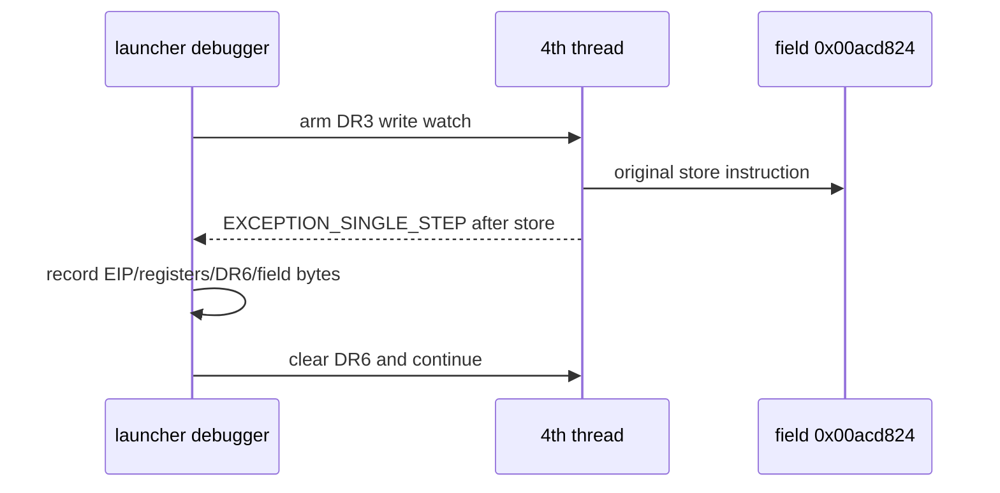

# ez2dj4th null field 최초 writer 추적 설계

관련 작업 지시서: [ez2dj4th null field 최초 writer 추적 작업 지시서](../work-orders/20260903-146-ez2dj4th-null-field-writer-trace.md)

## 상태

**완료.** Task 145는 `0x00434137` AV의 직접 원인을 null receiver로 분리했고, runtime frame에서 `0x00acd708 + 0x11c = 0`을 확인했습니다. 이번 작업의 4-byte write watch는 두 번의 실제 CHD 실행에서 hit가 없었고, field는 watch 설치 시점부터 AV까지 0으로 유지됐습니다. 고정 절대주소 reference scan도 `matches=0`이어서, 이 실행 범위에서는 관찰 가능한 field writer가 확인되지 않았습니다.

## 확인된 근거

- 확인됨: AV는 `0x00434137`에서 `EAX=0`으로 `[EAX+0x14]`를 읽습니다.
- 확인됨: caller의 caller runtime code는 `[EBP-0x118]`을 객체 후보로 사용하고, 그 객체의 `+0x11c`를 `ECX`로 전달합니다.
- 확인됨: 최신 AV run에서 객체 후보는 `0x00acd708`, field 주소는 `0x00acd824`입니다.
- 미확정: `0x00acd824`를 쓰는 instruction, 최초 writer의 값, writer 실행 thread, raw I/O와의 인과관계입니다.

## 결과

- `20260903-014526-938.jsonl`과 `20260903-014716-040.jsonl`에서 `DR3` 4-byte write watch가 `prepared=true`로 설정됐고, ready 시점 field 값은 `0x00000000`이었습니다.
- 두 실행 모두 `null_context_field_writer_hit`는 0회였고, AV는 동일하게 `0x00434137`에서 발생했습니다. 마지막 boundary의 field 값도 0입니다.
- `20260903-014716-040.jsonl`의 읽기 전용 image reference scan은 `0x00acd824`, `matches=0`을 기록했습니다. 따라서 field 접근은 고정 absolute memory store가 아니라 간접 객체 접근일 가능성이 있습니다. 이는 추정이며, writer 부재의 증명은 아닙니다.
- `20260903-014819-394.jsonl`에서 기존 `--slot-writer-trace`와 새 `DR3` watch를 동시에 사용해도 기존 slot writer hit가 정상 기록됐습니다. 두 breakpoint 집합의 register 충돌은 관찰되지 않았습니다.

### 판정

이번 작업의 판정은 **관찰 범위 내 writer 미확정**입니다. field가 실행 초기에 이미 0이었거나 다른 초기화 경계 전에 설정되어 현재 watch보다 앞서 쓰였을 수 있습니다. 다음 작업에서는 동일 field의 read/access watch로 최초 사용 지점과 read 직전의 객체 공급 경로를 추적해야 합니다.

## 설계 결정

1. 진단 옵션 `--null-context-field-writer-trace`를 `ez2dj4th` 전용 bounded option으로 추가합니다.
2. field 주소는 고정 preferred address가 아니라 `image_base + 0x006cd824`로 계산합니다. `image_base=0x00400000`인 관찰에서 `0x00acd824`가 됩니다.
3. x86 debug register `DR3`에 해당 주소의 4-byte write watch를 설치합니다. 기존 `--slot-writer-trace`와 함께 사용할 때는 `DR0`–`DR2` 실행 breakpoint를 보존하고 `DR3`만 사용합니다.
4. primary thread와 `CREATE_THREAD_DEBUG_EVENT`로 생성된 thread에 동일한 watch를 설정합니다.
5. data breakpoint는 store instruction 이후에 발생하므로 hit event에서 `EIP`를 post-store 주소로 기록하고, `EIP` 주변 runtime bytes, `EAX`·`ECX`, field 값 전후, `DR6`, thread를 기록합니다.
6. watch handler는 `DR6` status만 지우고 원본 context와 memory를 수정하지 않은 채 계속합니다. single-step을 강제로 추가하지 않습니다.
7. hit와 전체 debug event에 bounded cap을 적용하며, hit가 없다는 결과를 writer 부재로 해석하지 않습니다.
8. field에 임의의 non-zero 값을 쓰거나 AV branch를 우회하지 않습니다.

## 판정 기준

- **writer 확인:** data breakpoint hit에서 field 주소와 store 직후 runtime EIP/code window가 확인되는 경우.
- **초기화 전 null:** AV 전에 hit가 없고 field가 계속 0인 경우. 이는 이 watch 범위에서 writer가 관찰되지 않았다는 뜻입니다.
- **간접 연관 미확정:** writer hit는 있으나 값의 공급 경로 또는 raw I/O와의 관계가 다음 경계에 남는 경우.

## 검증 범위

사용자 제공 CHD와 staging HDD는 읽기 전용으로 사용합니다. 기존 Hardlock material, shared raw I/O, VFS, console-session mock은 유지합니다. 진단 실행은 원본 code, field 값, guest return value, branch, IAT를 수정하지 않습니다.

---

# ez2dj4th Null-Field First-Writer Trace Design

Related work order: [ez2dj4th Null-Field First-Writer Trace Work Order](../work-orders/20260903-146-ez2dj4th-null-field-writer-trace.md)

## Status

**Completed.** Task 145 separated the direct cause of the `0x00434137` AV as a null receiver and confirmed `0x00acd708 + 0x11c = 0` in the runtime frame. This task's four-byte write watch produced no hit in two real-CHD runs, and the field remained zero from watch installation through the AV. The fixed absolute-address reference scan also reported `matches=0`, so no observable field writer was identified in this execution scope.

## Confirmed basis

- Confirmed: the AV reads `[EAX+0x14]` with `EAX=0` at `0x00434137`.
- Confirmed: the caller's caller uses `[EBP-0x118]` as a candidate object and passes that object's `+0x11c` field in `ECX`.
- Confirmed: the latest AV run reports candidate object `0x00acd708` and field address `0x00acd824`.
- Unresolved: the instruction that writes `0x00acd824`, the first writer's value, its thread, and causality with raw I/O.

## Result

- `20260903-014526-938.jsonl` and `20260903-014716-040.jsonl` set the `DR3` four-byte write watch with `prepared=true`; the field was `0x00000000` when the watch was armed.
- Both runs recorded zero `null_context_field_writer_hit` events and reproduced the AV at `0x00434137`. The field was still zero at the final boundary.
- The read-only image reference scan in `20260903-014716-040.jsonl` reported `slot=0x00acd824`, `matches=0`. Field access may therefore use an indirect object path rather than a fixed absolute memory store. This is an inference and does not prove that no writer exists.
- `20260903-014819-394.jsonl` used the existing `--slot-writer-trace` together with the new `DR3` watch and still recorded the existing slot-writer hit. No debug-register collision was observed between the two breakpoint sets.

### Classification

This task is classified as **writer unresolved within the observed scope**. The field may already have been zero before the watch was installed, or may have been initialized at an earlier boundary. The next task should use a read/access watch on the same field to identify its first use and the object-supply path immediately before the read.

## Design decisions

1. Add `--null-context-field-writer-trace` as an `ez2dj4th`-specific bounded diagnostic option.
2. Compute the field address as `image_base + 0x006cd824` rather than using a fixed preferred address. With the observed `image_base=0x00400000`, this yields `0x00acd824`.
3. Install a four-byte write watch at that address in x86 debug register `DR3`. When combined with existing `--slot-writer-trace`, preserve its `DR0`–`DR2` execution breakpoints and use only `DR3` for this watch.
4. Arm the same watch on the primary thread and every thread reported by `CREATE_THREAD_DEBUG_EVENT`.
5. A data breakpoint occurs after the store instruction, so record the post-store EIP, runtime bytes around EIP, `EAX`/`ECX`, field values, `DR6`, and thread in the hit event.
6. The watch handler only clears the `DR6` status and continues without modifying the original context or memory. It does not force an extra single-step.
7. Bound both hit records and total debug events; no-hit means only that no writer was observed within this run.
8. Do not write an arbitrary non-zero field value or bypass the AV branch.

## Classification criteria

- **Writer confirmed:** a data-breakpoint hit identifies the field address and the post-store runtime EIP/code window.
- **Null before observed initialization:** no hit occurs before the AV and the field remains zero. This means no writer was observed within this watch scope.
- **Indirect relation unresolved:** a writer hit occurs, but its value source or relation to raw I/O remains at a later boundary.

## Verification scope

The user-supplied CHD and staging HDD remain read-only. Existing Hardlock material, shared raw I/O, VFS, and console-session mock behavior remain enabled. The diagnostic run does not modify original code, the field value, guest return values, branches, or IAT entries.
