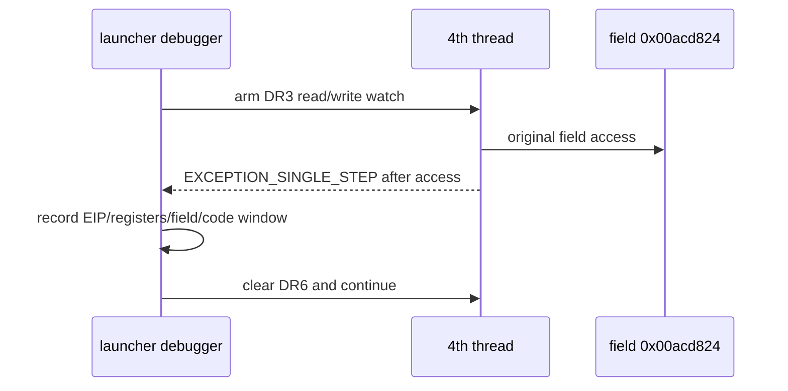

# ez2dj4th null field access 추적 설계

관련 작업 지시서: [ez2dj4th null field access 추적 작업 지시서](../work-orders/20260903-147-ez2dj4th-null-field-access-trace.md)

## 상태

**완료.** Task 146의 `0x00acd824` 4-byte write watch는 실제 CHD 실행에서 hit가 없었고 field는 처음부터 0이었습니다. 이번 작업의 read/write access watch는 `0x0041a69f` 직후 첫 hit를 기록했으며, 이는 runtime의 `mov ECX, [ECX+0x11c]` 실행과 일치합니다. 같은 thread에서 곧바로 `0x00434137` AV가 발생했습니다.

## 확인된 근거와 미확정 범위

- 확인됨: field 주소는 관찰된 image base 기준 `0x00acd824`, RVA `0x006cd824`입니다.
- 확인됨: Task 146에서 write-only `DR3` watch가 정상 준비됐습니다.
- 추정: `0x0041a69f` 부근의 `mov ECX, [ECX+0x11c]`가 field read site일 가능성이 있습니다.
- 미확정: 실제 read 시점, read 직후 EIP와 ECX, 접근 thread, read 이전 field 값의 초기화 경계입니다.

## 결과

- `20260903-015902-887.jsonl`에서 `DR3` access watch가 `prepared=true`로 설정됐습니다.
- 첫 access hit는 thread `4772`, field `0x00acd824`, post-access EIP `0x0041a69f`, `ECX=0`, field before/after `0`으로 기록됐습니다.
- hit의 runtime code window는 `0x0041a699`의 `mov ECX, [ECX+0x11c]`와 다음 `call 0x00402298`를 포함합니다.
- 같은 thread에서 access hit 직후 `0x00434137` read AV가 발생했습니다.
- `20260903-020004-160.jsonl`에서는 기존 slot-writer `DR0–DR2`와 access `DR3`를 함께 사용해 두 hit 모두 정상 기록했습니다.

### 판정

**read site와 null 전달 순서가 확인됨.** field는 `0`으로 읽힌 뒤 `ECX=0`인 상태로 다음 호출에 전달되고, 같은 실행 thread에서 null receiver AV가 발생합니다. 이것은 Hardlock 반환값이 field를 직접 채우지 못했다는 실행 증거이지만, field가 왜 0인지와 어떤 HLE 경계가 해당 객체를 초기화해야 하는지는 아직 미확정입니다.

## 설계 결정

1. `--null-context-field-access-trace`를 `ez2dj4th` 전용 bounded diagnostic option으로 추가합니다.
2. `DR3`에 field 주소의 4-byte read/write watch를 설정합니다. 기존 `--slot-writer-trace`의 `DR0–DR2`와는 공존합니다.
3. Task 146의 writer-only option과 access option은 `DR3` 설정이 충돌하므로 동시에 사용하지 못하게 합니다.
4. data breakpoint hit 뒤의 EIP, EAX·ECX·EBP·ESP, DR6, field 값, 주변 runtime code window, stack return address를 기록합니다.
5. primary 및 생성 thread에 동일한 watch를 설정합니다.
6. handler는 DR6의 field bit만 지우고 원본 context·memory·branch를 수정하지 않습니다.
7. access hit가 많을 수 있으므로 hit event를 bounded cap으로 제한합니다. no-hit 또는 첫 hit는 관찰 범위의 결과로만 해석합니다.

## 판정 기준

- **read site 확인:** access hit의 post-access EIP와 code window가 field read instruction을 식별하는 경우.
- **초기 read 확인:** 첫 access hit의 field value와 caller frame이 AV 시점과 일치하는 경우.
- **미확정:** watch가 실행되지 않거나 read site가 다른 boundary에 있어 상위 공급 경로를 확인하지 못하는 경우.

## 검증 범위

사용자 제공 CHD와 staging HDD는 읽기 전용으로 사용합니다. 기존 Hardlock material, shared raw I/O, VFS, console-session mock은 유지합니다. 이 작업은 guest field 값, return value, branch, IAT와 원본 code를 수정하지 않습니다.

---

# ez2dj4th Null-Field Access Trace Design

Related work order: [ez2dj4th Null-Field Access Trace Work Order](../work-orders/20260903-147-ez2dj4th-null-field-access-trace.md)

## Status

**Completed.** Task 146's `0x00acd824` four-byte write watch produced no hit in a real-CHD run, and the field was zero from the beginning. This task's read/write access watch recorded its first hit immediately after `0x0041a69f`, matching execution of runtime `mov ECX, [ECX+0x11c]`. The same thread then produced the `0x00434137` AV.

## Confirmed basis and unresolved scope

- Confirmed: the field address is `0x00acd824`, RVA `0x006cd824`, at the observed image base.
- Confirmed: Task 146 successfully prepared a write-only `DR3` watch.
- Inferred: `mov ECX, [ECX+0x11c]` near `0x0041a69f` may be the field read site.
- Unresolved: the actual read timing, post-read EIP and ECX, access thread, and the initialization boundary before the read.

## Result

- `20260903-015902-887.jsonl` prepared the `DR3` access watch with `prepared=true`.
- The first access hit recorded thread `4772`, field `0x00acd824`, post-access EIP `0x0041a69f`, `ECX=0`, and field before/after values of `0`.
- The hit's runtime code window includes `mov ECX, [ECX+0x11c]` at `0x0041a699` and the following `call 0x00402298`.
- The same thread produced the `0x00434137` read AV immediately after the access hit.
- `20260903-020004-160.jsonl` used the existing slot-writer `DR0`–`DR2` together with access `DR3` and recorded both hits normally.

### Classification

**The read site and null-propagation order are confirmed.** The field is read as zero, passed onward as `ECX=0`, and the same execution thread reaches the null-receiver AV. This is execution evidence that the Hardlock return path does not directly populate the field, but why the field is zero and which HLE boundary should initialize the object remain unresolved.

## Design decisions

1. Add `--null-context-field-access-trace` as an `ez2dj4th`-specific bounded diagnostic option.
2. Install a four-byte read/write watch for the field in `DR3`, coexisting with the existing `DR0`–`DR2` `--slot-writer-trace`.
3. Reject simultaneous use of the Task 146 writer-only option and this access option because both configure DR3.
4. Record post-access EIP, EAX/ECX/EBP/ESP, DR6, field value, nearby runtime code bytes, and the stack return address.
5. Arm the same watch on the primary and created threads.
6. Clear only the field status bit in DR6 and continue without modifying original context, memory, or branches.
7. Bound access-hit records because the field may be read frequently. Treat no-hit and first-hit results only within the observed scope.

## Classification criteria

- **Read site confirmed:** the post-access EIP and code window identify the field read instruction.
- **Initial read confirmed:** the first access hit's field value and caller frame align with the AV-time state.
- **Unresolved:** the watch does not execute or the read site ends at another boundary before the upper supply path is identified.

## Verification scope

The user-supplied CHD and staging HDD remain read-only. Existing Hardlock material, shared raw I/O, VFS, and console-session mock behavior remain enabled. This task does not modify the guest field value, return values, branches, IAT, or original code.
