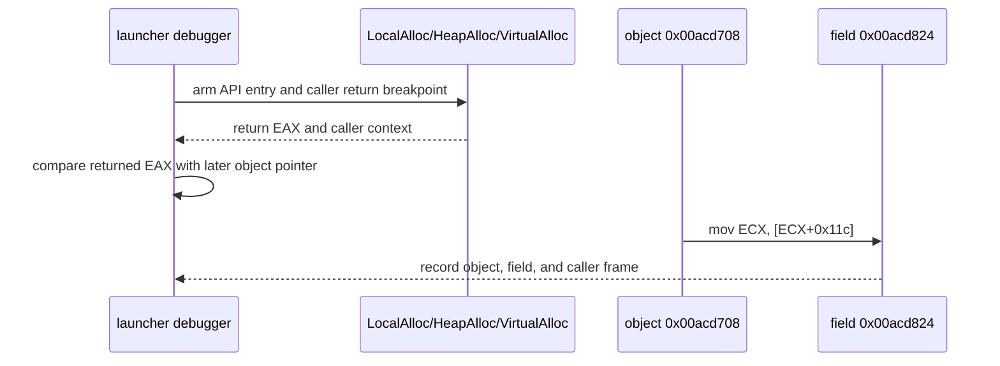

# ez2dj4th 상위 객체 allocation 추적 설계

관련 결과: [Task 147 null field access 작업 로그](../work-logs/20260903-147-ez2dj4th-null-field-access-trace.md)

## 상태

**설계 및 구현 완료.** Task 147은 `0x00acd824`가 `0x0041a699`의
`mov ECX, [ECX+0x11c]`에서 0으로 읽힌 뒤 같은 thread의 `0x00434137` AV로
이어짐을 확인했습니다. 이번 작업은 read 시점의 상위 객체 주소와 allocator
반환값을 같은 실행에서 비교합니다.

## 목표

`0x00acd708` 상위 객체가 어떤 Win32 allocator 경계에서 만들어졌는지, 또는
관찰 시작 전에 이미 존재했는지를 확인합니다. 확인되지 않은 allocator를
추측하거나 field 값을 직접 보정하지 않습니다.

## 확인된 출발점

- `0x00acd824`는 관찰된 image base에서 `image_base + 0x006cd824`입니다.
- read 시점 stack frame의 `[EBP-0x118]`는 `0x00acd708`을 가리켰고,
  `0x00acd708 + 0x11c`는 0이었습니다.
- 4th 실행 파일의 정적 import에는 `LocalAlloc`이 포함되어 있습니다.
- 기존 dynamic resolver 기록에는 `HeapAlloc`과 `VirtualAlloc`도 나타납니다.
- 위 allocator가 실제로 이 객체를 반환했는지는 아직 미확정입니다.

## 설계 결정

1. `--null-context-allocation-trace`를 `ez2dj4th` 전용 bounded diagnostic option으로 추가합니다.
2. 기존 API watch machinery를 사용하되 `LocalAlloc`, `HeapAlloc`, `VirtualAlloc`에 대해서만 caller stack의 return address breakpoint를 추가합니다.
3. allocator return hit에서 API 이름, thread, caller, 최대 4개 인자, 반환 `EAX`, return address와 주변 code window를 기록합니다.
4. 기존 `--null-context-field-access-trace`와 함께 사용할 수 있도록 field access hit에 `[EBP-0x118]` 객체 주소와 객체 `+0x11c` field 값을 기록합니다.
5. 기존 `--slot-writer-trace`의 DR0–DR2 및 field watch의 DR3와 공존시킵니다. allocator trace 자체는 debug-register slot을 사용하지 않습니다.
6. allocator return breakpoint가 다른 진단 breakpoint와 충돌하는 경우 원본 byte를 보존하고 bounded trace를 실패 처리합니다. 원본 guest code와 반환값은 수정하지 않습니다.
7. allocator return event 수는 bounded cap으로 제한하며, no-match는 관찰 범위의 결과로만 해석합니다.
8. `--run-detached`와 함께 사용할 수 없게 해 allocator return breakpoint를 회수·복원할 수 있는 attached debugger 경계를 보장합니다.

## 제외 범위

- `0x00acd824` 또는 `0x00acd708` 메모리에 값을 기록하지 않습니다.
- `0x00434137` branch를 우회하지 않습니다.
- allocator가 반환한 모든 메모리를 객체라고 확정하지 않습니다.
- `ez2dj1stse`의 IO 응답이나 4th Hardlock/raw-I/O 응답을 변경하지 않습니다.
- 원본 HDD·CHD·실행 파일을 저장소에 복사하지 않습니다.

## 판정 기준

- **allocator origin candidate:** allocator return `EAX`가 field access 시점의 객체 주소와 일치합니다.
- **pre-existing/other origin:** 세 allocator return 목록에 객체 주소가 없거나, 관찰 경계 전에 객체가 존재합니다.
- **unresolved:** return breakpoint가 설치되지 않거나 object pointer를 읽지 못합니다.

## 검증 범위

실제 CHD와 staging HDD는 읽기 전용으로 실행합니다. Windows x86 build, 단위 테스트,
access trace와 allocator trace의 결합 실행, child-exit boundary를 확인합니다.

## 실행 결과

실제 CHD에서 field-access와 allocator trace를 결합 실행했습니다. field hit는
객체 `0x00acd708`과 `allocation_return_match=false`를 기록했습니다. 이 객체는
image-resident 주소(`image_base + 0x006cd708`)이며, 관찰된 `LocalAlloc`·
`VirtualAlloc` 반환값 중 일치하는 값이 없었습니다. 사용 가능한 export가
forwarded 상태였기 때문에 `HeapAlloc`은 unresolved로 남았습니다. 따라서 이
관찰 범위에서는 객체가 사전에 존재했거나 다른 경로에서 만들어진 것으로
분류하며, `[EBP-0x118]`를 채운 코드는 아직 식별하지 않았습니다.

근거 로그는
`logs/windows_x86_launcher_probe/ez2dj4th/20260903-023341-871.jsonl`입니다.

---

# ez2dj4th Upper-Object Allocation Trace Design

Related result: [Task 147 Null-Field Access Trace Work Log](../work-logs/20260903-147-ez2dj4th-null-field-access-trace.md)

## Status

**Design and implementation complete.** Task 147 confirmed that
`0x00acd824` is read as zero by `mov ECX, [ECX+0x11c]` at `0x0041a699`, after
which the same thread reaches the AV at `0x00434137`. This task compares the
upper-object address at the read with allocator return values in the same run.

## Objective

Determine whether upper object `0x00acd708` was produced by a Win32 allocator
boundary or already existed before the observation boundary. Do not guess an
allocator or patch the field value.

## Confirmed starting points

- `0x00acd824` is `image_base + 0x006cd824` at the observed image base.
- At the read-time stack frame, `[EBP-0x118]` points to `0x00acd708`, and
  `0x00acd708 + 0x11c` is zero.
- The 4th executable's static imports include `LocalAlloc`.
- Existing dynamic-resolver records also show `HeapAlloc` and `VirtualAlloc`.
- Whether any of these allocators returned this object remains unresolved.

## Design decisions

1. Add `--null-context-allocation-trace` as an `ez2dj4th`-specific bounded diagnostic option.
2. Reuse the existing API-watch machinery, adding caller-return breakpoints only for `LocalAlloc`, `HeapAlloc`, and `VirtualAlloc`.
3. Record API name, thread, caller, up to four arguments, return `EAX`, return address, and a nearby code window at allocator return hits.
4. Make it compatible with `--null-context-field-access-trace` by recording the `[EBP-0x118]` object address and the object's `+0x11c` field at each field-access hit.
5. Coexist with the existing `--slot-writer-trace` DR0–DR2 and field watch DR3; the allocation trace uses no debug-register slot.
6. If an allocator return breakpoint collides with another diagnostic breakpoint, preserve the original byte and fail the bounded trace. Do not modify guest code or return values.
7. Bound allocator-return events and interpret no-match only within the observed scope.
8. Reject `--run-detached` so allocator return breakpoints remain recoverable under the attached debugger boundary.

## Exclusions

- Do not write to `0x00acd824` or `0x00acd708`.
- Do not bypass the branch at `0x00434137`.
- Do not classify every allocator return as the object.
- Do not change the `ez2dj1stse` I/O response or the 4th Hardlock/raw-I/O response.
- Do not copy the original HDD, CHD, or executable into the repository.

## Classification criteria

- **Allocator-origin candidate:** an allocator return `EAX` equals the object address at field access.
- **Pre-existing/other origin:** none of the three allocator return lists contains the object address, or the object predates the observation boundary.
- **Unresolved:** a return breakpoint cannot be installed or the object pointer cannot be read.

## Verification scope

Run the real CHD and staging HDD read-only. Verify the Windows x86 build, unit tests,
the combined access/allocation trace, and the child-exit boundary.

## Execution result

The real CHD run completed the combined field-access and allocator trace. The
field hit recorded object `0x00acd708` with
`allocation_return_match=false`. The object is image-resident
(`image_base + 0x006cd708`), and none of the observed `LocalAlloc` or
`VirtualAlloc` returns matched it. `HeapAlloc` remained unresolved because its
available exports were forwarded. Within this observation scope, the object is
therefore classified as pre-existing or produced by another path; the code
that populated `[EBP-0x118]` is not yet identified.

The evidence log is
`logs/windows_x86_launcher_probe/ez2dj4th/20260903-023341-871.jsonl`.
