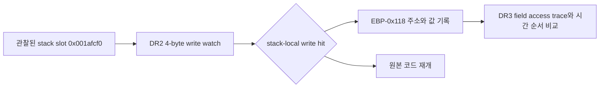

# EZ2DJ 4th 객체 공급 경로 추적 설계

## 목적

Task 148에서 `EZ2DJ.EXE`의 null-context 상위 객체가 관찰된 Win32 allocator의 반환값이 아니라 image-resident 주소임을 확인했습니다. 이번 작업은 해당 객체 `0x00acd708`이 실행 중인 stack-local `[EBP-0x118]`에 공급되는 쓰기 지점을 확인하기 위한 진단 추적을 추가합니다.

이 추적은 원본 실행 파일을 수정하지 않으며, 원본 코드의 실행을 유지한 채 디버거의 x86 하드웨어 데이터 브레이크포인트만 사용합니다.

## 확인된 입력과 제한

- 확인된 객체 주소: image base `0x00400000` 기준 RVA `0x006cd708`.
- 확인된 field 주소: 객체 `+0x11c`, image base 기준 RVA `0x006cd824`.
- 이전 field-access 실행에서 확인된 stack-local 주소: `0x001afcf0`.
- `0x001afcf0`은 실행마다 재계산된 주소가 아니라 이전 관찰에서 얻은 진단용 기준값입니다. 주소가 달라지는 실행에서는 hit가 없을 수 있으며, 이를 객체 공급 성공으로 해석하지 않습니다.
- x86 debug register 배정은 `DR2`를 새 stack-local write watch에 사용하고 `DR3`는 기존 field watch에 보존합니다. 기존 세 개의 slot-writer 실행 watch(`DR0–DR2`)와의 충돌을 피하기 위해 두 옵션의 동시 사용은 거부합니다.

## 동작 설계

새 옵션 `--null-context-object-source-trace`를 추가합니다. 옵션이 켜지면 다음을 수행합니다.

1. main thread와 이후 생성되는 thread의 `DR2`에 관찰된 stack-local 주소를 설정합니다.
2. `DR2`를 4-byte write-only watch로 설정하고, hit마다 context의 `EIP`, `EBP`, `ESP`, stack slot 값, 계산된 `[EBP-0x118]` 주소와 값, target object 일치 여부, 실행 코드 window를 JSON 진단 로그에 기록합니다.
3. hit 이후 `DR6` 상태를 지우고 동일한 data breakpoint를 유지한 채 원본 실행을 재개합니다.
4. 기존 `--null-context-field-access-trace` 또는 `--null-context-field-writer-trace`와 함께 사용할 수 있어 공급 시점과 소비 시점을 같은 실행에서 비교할 수 있습니다.
5. 실행 종료·event cap·idle timeout에 hit 수와 configured slot을 boundary 로그로 남깁니다.

## 성공 판정과 미확정 사항

이번 추적의 성공은 `DR2` hit가 발생하고, hit context에서 target object `0x00acd708`이 stack-local 또는 계산된 frame slot에 관찰되는 것으로 정의합니다. 단순히 breakpoint가 준비되었다는 사실은 성공이 아닙니다.

stack slot 주소가 실행마다 바뀌거나 해당 대입이 다른 경로를 사용하면 이번 옵션은 unresolved 결과를 남길 수 있습니다. 그 경우 다음 단계에서 동적 frame 식별 또는 대입 caller 경계 추적으로 확장하며, 이 작업에서 field 값을 직접 주입하거나 Hardlock 응답을 변경하지 않습니다.

## 검증 전략

- Windows x86 Debug 빌드.
- 단위 테스트 전체 실행.
- 실제 `ez2dj4th` CHD와 기존 `--hle-io-ports --device-mock-lptdi --device-mock-wts-console-session` 경로를 유지한 진단 실행.
- `--null-context-object-source-trace --null-context-field-access-trace` 조합으로 source hit와 기존 null field read/AV 순서를 비교.
- 원본 HDD와 CHD는 저장소에 추가하지 않음.

## Task 149 실행 결과

고정 기준 주소로 실행한 `20260903-025152-528.jsonl`에서 source breakpoint 준비는 성공했고 `null_context_object_source_hit` 61건이 기록되었습니다. 그러나 준비 시점의 `0x001afcf0` 값은 `0x001afd24`였고, 61건 모두 `stack_slot_matches_target=false`, `frame_slot_matches_target=false`, `target_matches=0`이었습니다. hit의 다수는 해당 주소가 다른 OS/runtime stack frame 또는 `ESP`로 사용되는 쓰기였습니다.

같은 CHD와 IO mock 조건에서 source trace 없이 실행한 `20260903-025218-345.jsonl`은 기존 field-access 결과를 재현했습니다. field read 1건에서 `EBP=0x001afe08`, `[EBP-0x118]=0x001afcf0`, object `0x00acd708`, field `0x00000000`이 기록되었고 이후 `0x00434137` read AV가 발생했습니다.

따라서 고정 stack 주소를 이용한 source trace는 감시 기능과 주소 불일치를 확인하는 데는 유효하지만, 객체 공급 지점을 확인하는 방법으로는 unresolved입니다. 다음 단계에서는 알려진 field-access 함수의 runtime 진입 경계에서 `EBP-0x118`을 계산하여 동적으로 data watch를 설치해야 합니다.

---

## Task 149 Execution Result

In `20260903-025152-528.jsonl`, the fixed-reference source breakpoint prepared successfully and recorded 61 `null_context_object_source_hit` events. However, the configured `0x001afcf0` contained `0x001afd24` when armed, and all 61 hits reported `stack_slot_matches_target=false`, `frame_slot_matches_target=false`, and `target_matches=0`. Most hits were writes using the address as another OS/runtime stack frame or as `ESP`.

With the same CHD and IO-mock conditions but without the source trace, `20260903-025218-345.jsonl` reproduced the existing field-access result. One field read recorded `EBP=0x001afe08`, `[EBP-0x118]=0x001afcf0`, object `0x00acd708`, and field value `0x00000000`, followed by the `0x00434137` read AV.

The fixed stack address is therefore useful for validating the watch mechanism and exposing address drift, but it remains unresolved as an object-supply method. The next step should install the data watch dynamically from `EBP-0x118` at the runtime entry boundary of the known field-access function.

---

# EZ2DJ 4th Object Supply-Path Trace Design

## Purpose

Task 148 established that the null-context upper object observed in `EZ2DJ.EXE` is image-resident and was not returned by the observed Win32 allocators. This task adds a diagnostic trace to identify the write that supplies object `0x00acd708` to the running stack-local `[EBP-0x118]`.

The trace does not modify the original executable. It keeps original-code execution as the subject and uses only x86 hardware data breakpoints supplied by the debugger.

## Confirmed Inputs and Limits

- Confirmed object address: RVA `0x006cd708` at image base `0x00400000`.
- Confirmed field address: object `+0x11c`, RVA `0x006cd824` from the image base.
- Stack-local address observed in the previous field-access run: `0x001afcf0`.
- `0x001afcf0` is a diagnostic reference from a previous observation, not a per-run recomputed address. A run with a different address may produce no hit and must not be classified as a successful object-supply trace.
- The x86 debug-register allocation uses `DR2` for the new stack-local write watch and preserves `DR3` for the existing field watch. Concurrent use with the existing three slot-writer execution watches (`DR0–DR2`) is rejected to avoid a conflict.

## Behavior

Add `--null-context-object-source-trace`. When enabled:

1. Configure `DR2` with the observed stack-local address on the main thread and subsequently created threads.
2. Configure a four-byte write-only watch. For every hit, record `EIP`, `EBP`, `ESP`, the configured stack-slot value, the calculated `[EBP-0x118]` address and value, whether the target object matches, and a runtime code window in the JSON diagnostic log.
3. Clear the `DR6` status after each hit and resume original execution with the data breakpoint still installed.
4. Allow the option with the existing `--null-context-field-access-trace` or `--null-context-field-writer-trace`, so source and consumer timing can be compared in one run.
5. Record hit counts and the configured slot in child-exit, event-cap, and idle-timeout boundary records.

## Success and unresolved cases

The trace succeeds only when a `DR2` hit occurs and the hit context observes target object `0x00acd708` in the stack-local or calculated frame slot. Breakpoint preparation alone is not success.

If the stack slot changes between runs or the assignment uses another path, this option may produce an unresolved result. The next step can then move to dynamic frame identification or caller-boundary tracing. This task does not inject the field value or change Hardlock responses.

## Verification

- Build the Windows x86 Debug target.
- Run the full unit-test suite.
- Run the real `ez2dj4th` CHD path while preserving the existing `--hle-io-ports --device-mock-lptdi --device-mock-wts-console-session` setup.
- Compare source hits with the existing null-field read/AV ordering using `--null-context-object-source-trace --null-context-field-access-trace`.
- Do not add the original HDD or CHD to the repository.
