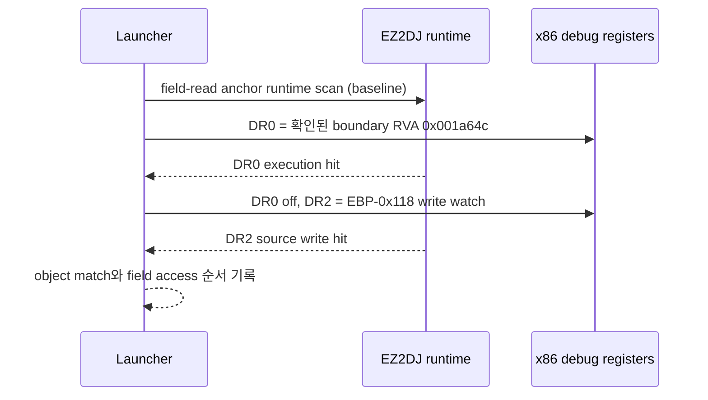

# EZ2DJ 4th 동적 객체 공급 경계 추적 설계

## 목적

Task 149에서 이전 실행의 absolute stack slot을 재사용하면 OS/runtime stack 쓰기만 다수 잡히고 target object 공급을 확인할 수 없음을 확인했습니다. 이번 작업은 runtime에서 확인한 `0x00acd824` field-read 함수의 prologue 직후 boundary를 사용하고, 그 지점의 실제 `EBP`를 이용해 `[EBP-0x118]` write watch를 동적으로 설치합니다.

## 설계

- field-read RVA `0x001a699`를 target-specific runtime anchor로 사용합니다.
- 보호 stub 실행 전에는 runtime code가 아직 복호화되지 않으므로 시작 시점의 prologue scan을 실행 breakpoint 준비 조건으로 사용하지 않습니다. field-access baseline hit 시점에 anchor 앞쪽 runtime bytes를 읽어 `55 8b ec` prologue `0x0041a649`와 직후 boundary `0x0041a64c`를 확인했습니다.
- 확인된 target-specific runtime boundary RVA `0x001a64c`에 `DR0` one-shot execution breakpoint를 설정합니다. 이 위치에서는 `EBP`가 frame base로 설정된 상태를 기대합니다.
- `DR0` hit에서 `EBP-0x118`을 계산해 해당 thread의 `DR2` 4-byte write-only watch로 설정하고 `DR0`는 비활성화합니다.
- 기존 field access/write watch의 `DR3`는 유지합니다. 기존 slot-writer `DR0–DR2`와는 충돌하므로 두 옵션은 함께 사용할 수 없습니다.
- source hit에서는 동적으로 설정한 slot과 frame slot, target object `image_base + 0x006cd708`, EIP와 runtime code window를 기록합니다.

## 미확정 처리

runtime baseline scan이 실패하면 boundary를 확인할 수 없으므로 `prepared=false`로 남깁니다. 현재 구현은 확인된 target-specific boundary RVA를 사용하며, field-access hit에서 scan 결과를 다시 기록해 교차검증합니다. boundary가 실제 함수 진입점이 아니거나 source hit가 0건이면 unresolved로 남깁니다. 이는 직접 field 주입이나 Hardlock 응답 추정을 하지 않는 의도적인 처리입니다.

## 검증 전략

- Windows x86 Debug build와 전체 unit test.
- 실제 `ez2dj4th` CHD, 기존 `--hle-io-ports --device-mock-lptdi --device-mock-wts-console-session` 경로.
- `--null-context-object-source-trace --null-context-field-access-trace`로 boundary hit, 동적 source hit, field read, AV 순서를 비교.
- source hit가 target object와 일치하는지 확인하고, 불일치하면 공급 경로를 확정하지 않음.

## Task 150 실행 결과

`20260903-030421-317.jsonl`에서 boundary `0x0041a64c`가 hit했고 `EBP=0x001afe08`에서 동적 frame slot `0x001afcf0`이 계산되었습니다. 이후 source hit 2건 중 두 번째 hit가 `configured_stack_slot_value=0x00acd708` 및 `frame_slot_matches_target=true`를 기록했습니다. 해당 hit의 code window는 `mov [EBP-0x118], ECX` 대입(`0x0041a668` 시작, post-EIP `0x0041a66e`)을 나타냅니다.

같은 thread에서 곧바로 field access hit가 발생했고 field 값은 `0x00000000`이었으며, 이후 `0x00434137` read AV가 재현되었습니다. 따라서 이번 작업은 상위 객체의 stack-local 공급 instruction을 확인했지만, `object + 0x11c` field가 왜 0인지와 실행 실패를 해결하는 초기화 정책은 여전히 미확정입니다.

---

# EZ2DJ 4th Dynamic Object-Supply Boundary Trace Design

## Purpose

Task 149 established that reusing an absolute stack slot from a previous run captures many OS/runtime stack writes and does not identify the target-object supply. This task uses the runtime-confirmed boundary immediately after the prologue of the `0x00acd824` field-read function and dynamically installs a write watch for the actual `[EBP-0x118]` slot.

## Design

- Use field-read RVA `0x001a699` as a target-specific runtime anchor.
- The protected stub has not decrypted runtime code when entry preparation runs. A field-access baseline later scanned runtime bytes and confirmed prologue `0x0041a649` and boundary `0x0041a64c`.
- Install a one-shot `DR0` execution breakpoint at the confirmed target-specific boundary RVA `0x001a64c`. `EBP` is expected to be established at this point.
- On the `DR0` hit, calculate `EBP-0x118`, configure a four-byte write-only `DR2` watch for that thread, and disable `DR0`.
- Preserve the existing field access/write watch in `DR3`. Reject concurrent use with the existing slot-writer `DR0–DR2` watches.
- On source hits, record the dynamic slot, frame slot, target object `image_base + 0x006cd708`, EIP, and a runtime code window.

## Unresolved Handling

If the baseline runtime scan cannot confirm the boundary, leave `prepared=false`. The current implementation uses the confirmed target-specific boundary and repeats the runtime scan at field-access time for cross-checking. If the boundary is not the actual function entry or source hits remain zero, leave the result unresolved. This intentionally avoids direct field injection or guessed Hardlock responses.

## Verification

- Windows x86 Debug build and full unit-test suite.
- Real `ez2dj4th` CHD with the existing `--hle-io-ports --device-mock-lptdi --device-mock-wts-console-session` path.
- Compare boundary hits, dynamic source hits, field reads, and AV order with `--null-context-object-source-trace --null-context-field-access-trace`.
- Confirm whether a source hit matches the target object; do not classify the supply path when it does not.

## Task 150 Execution Result

In `20260903-030421-317.jsonl`, boundary `0x0041a64c` hit and the dynamic frame slot `0x001afcf0` was calculated from `EBP=0x001afe08`. Of two source hits, the second recorded `configured_stack_slot_value=0x00acd708` and `frame_slot_matches_target=true`. Its code window identifies the `mov [EBP-0x118], ECX` assignment (starting at `0x0041a668`, post-EIP `0x0041a66e`).

The same thread then produced the field-access hit with field value `0x00000000`, followed by the reproduced `0x00434137` read AV. This task therefore identifies the stack-local supply instruction, but why `object + 0x11c` remains zero and what initialization policy resolves execution are still unresolved.
