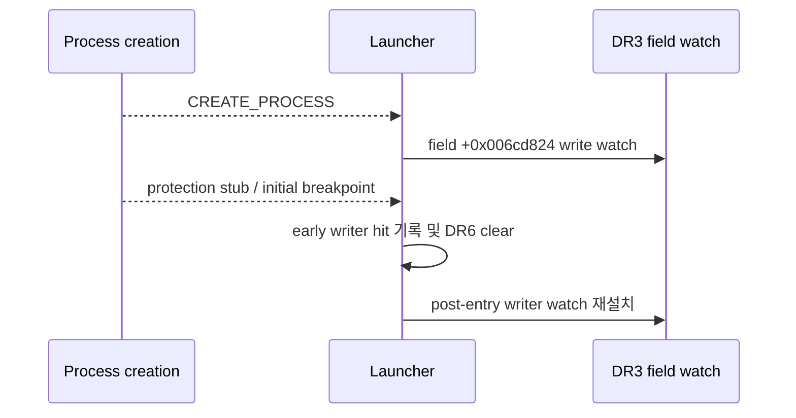

# EZ2DJ 4th entry 전 field writer 추적 설계

## 목적

Task 150에서 상위 객체 pointer가 `[EBP-0x118]`에 공급되는 instruction은 확인했지만 `0x00acd708 + 0x11c` field는 0으로 남았습니다. 기존 field-writer watch는 initial entry breakpoint 이후 설치되므로 보호 stub 또는 초기 진입 과정의 write를 놓칠 수 있습니다. 이번 작업은 process-create debug event부터 `DR3` 4-byte write watch를 설치해 field의 가장 이른 writer를 확인합니다.

## 동작 설계

- 새 옵션 `--null-context-field-writer-early-trace`를 추가합니다.
- CREATE_PROCESS/CREATE_THREAD debug event의 thread context에 field 주소 `image_base + 0x006cd824`를 `DR3` write-only watch로 설정합니다.
- initial breakpoint 대기 루프에서도 `DR6`의 `DR3` status를 처리하고, field 값을 읽어 `null_context_field_writer_early_hit`로 기록한 뒤 status를 지웁니다.
- initial breakpoint 이후에는 기존 field-writer trace를 다시 설치해 이후 실행 구간도 계속 감시합니다.
- 기존 `DR0`/`DR2` object source trace 및 field access trace와 공존합니다.

## 판정

- entry 전에 hit가 발생하면 field가 보호 stub 또는 초기화 경로에서 쓰였다는 실행 증거입니다.
- entry 전후 모두 hit가 없고 field가 0이면 현재 관찰 범위에서 writer가 없거나 다른 주소/접근 경로를 사용한 것으로 분류합니다.
- field 값이나 Hardlock 응답을 직접 변경하지 않습니다.

## 검증 전략

- Windows x86 Debug build 및 전체 unit test.
- 실제 `ez2dj4th` CHD와 기존 IO/VFS/mock 경로.
- early writer trace를 source boundary 및 field access trace와 함께 실행하고 hit 순서를 비교합니다.

---

# EZ2DJ 4th Pre-Entry Field-Writer Trace Design

## Purpose

Task 150 identified the instruction supplying the upper-object pointer to `[EBP-0x118]`, but field `0x00acd708 + 0x11c` remains zero. The existing field-writer watch is installed after the initial-entry breakpoint and may miss writes from the protection stub or early initialization. This task installs a `DR3` four-byte write watch from the process-create debug event to identify the earliest field writer.

## Behavior

- Add `--null-context-field-writer-early-trace`.
- Configure a `DR3` write-only watch for `image_base + 0x006cd824` on CREATE_PROCESS/CREATE_THREAD thread contexts.
- Handle `DR3` status in the initial-breakpoint wait loop, read the field value, record `null_context_field_writer_early_hit`, and clear the status.
- Reinstall the existing field-writer watch after the initial breakpoint so later execution remains covered.
- Coexist with the existing `DR0`/`DR2` object-source trace and field-access trace.

## Classification

- A pre-entry hit is execution evidence that the field was written by the protection stub or early initialization path.
- If there are no hits before or after entry and the field remains zero, classify the current scope as no observed writer or another access path.
- Do not change the field value or Hardlock responses.

## Verification

- Windows x86 Debug build and full unit tests.
- Real `ez2dj4th` CHD with the existing IO/VFS/mock path.
- Run early-writer tracing with source-boundary and field-access tracing and compare hit ordering.
