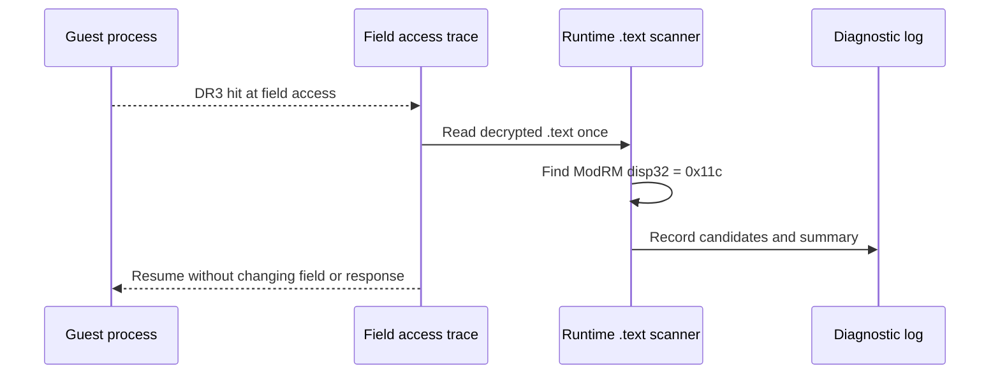

# EZ2DJ 4th 런타임 field 직접 참조 스캔 설계

## 목적

Task 151까지의 실제 CHD 실행에서는 `0x00acd708 + 0x11c` field에 대한 조기·진입 후 write hit가 모두 관찰되지 않았습니다. 그러나 고정 절대주소 스캔은 디스크 이미지의 보호된 코드와 런타임 재배치·복호화 상태를 충분히 반영하지 못할 수 있습니다. 이번 작업은 field offset `0x11c`를 직접 사용하는 x86 명령을 복호화된 런타임 `.text`에서 찾아, 관찰된 read site와 별도의 직접 writer가 존재하는지 확인합니다.

## 확인된 전제

- 확인됨: field read anchor는 image-base 기준 RVA `0x001a699`이며, 실제 실행에서 `mov ECX, [ECX+0x11c]`로 확인되었습니다.
- 확인됨: EZ2DJ 4th 런타임 `.text`는 image-base 기준 RVA `0x001000`, virtual size `0x000db022`입니다.
- 확인됨: 관찰된 object 후보는 `image_base + 0x006cd708`, field 후보는 `image_base + 0x006cd824`입니다.
- 미확정: 런타임 코드 안에 해당 offset을 직접 쓰는 instruction이 존재하는지, 또는 field가 간접 주소 계산·외부 데이터 복사로 설정되는지는 아직 모릅니다.

## 동작 설계

field access trace의 첫 hit 시점에 원격 프로세스의 복호화된 `.text`를 한 번 읽습니다. 다음 형태의 x86 ModRM disp32 명령에서 displacement가 `0x0000011c`인 후보를 기록합니다.

- `8b`: 직접 read 후보
- `89`, `c7`: 직접 write 후보
- 그 밖의 관련 opcode: 기타 직접 displacement 후보

각 후보에는 런타임 주소, image-base 기준 RVA, access 분류, opcode, ModRM, 짧은 opcode window를 기록합니다. 원본 byte dump나 게임 자산은 저장하지 않으며, 기록 개수에는 상한을 둡니다. 전체 스캔 결과는 readable 여부, `.text` 범위, 후보 수와 read/write 분류 수를 요약합니다.

## 판정 기준

- `.text`에서 read site 외 write 후보가 확인되면, 해당 instruction을 다음 단계의 제한된 writer 추적 대상으로 삼습니다.
- read 후보만 확인되고 write 후보가 없으면, 직접 writer가 아니라 간접 주소·복사·다른 section 또는 이미 zero인 정적 상태를 우선 의심합니다.
- 원격 `.text`를 읽지 못하거나 일부만 읽은 경우에는 부재를 결론 내리지 않고 스캔 미확정으로 기록합니다.
- 이 작업에서는 field 값, Hardlock 응답, VFS 동작을 변경하지 않습니다.

## 검증

1. Windows x86 Debug build를 수행합니다.
2. 전체 unit test를 수행합니다.
3. 기존 IO/VFS/mock 경로로 실제 `ez2dj4th` CHD를 실행합니다.
4. `null_context_field_reference` 후보와 `null_context_field_reference_scan` 요약을 작업 로그와 누적 분석 문서에 반영합니다.

---

# EZ2DJ 4th Runtime Direct Field-Reference Scan Design

## Purpose

Through Task 151, real-CHD runs observed no early or post-entry write hit for field `0x00acd708 + 0x11c`. However, the fixed absolute-address scan may not represent the protected on-disk code or the relocated and decrypted runtime state. This task scans the decrypted runtime `.text` for x86 instructions that directly use field displacement `0x11c`, determining whether a direct writer exists separately from the observed read site.

## Confirmed premises

- Confirmed: the field-read anchor is image-base-relative RVA `0x001a699`, and runtime execution identified `mov ECX, [ECX+0x11c]` there.
- Confirmed: the EZ2DJ 4th runtime `.text` starts at image-base-relative RVA `0x001000` and has virtual size `0x000db022`.
- Confirmed: the observed object candidate is `image_base + 0x006cd708`, and the field candidate is `image_base + 0x006cd824`.
- Unresolved: whether runtime code contains an instruction that directly writes this offset, or whether the field is set through indirect address calculation or external-data copying.

## Behavior

On the first field-access hit, read the remote process's decrypted `.text` once. Record candidates where an x86 ModRM disp32 instruction uses displacement `0x0000011c`:

- `8b`: direct read candidate
- `89`, `c7`: direct write candidate
- Other related opcodes: other direct-displacement candidate

Each candidate records its runtime address, image-base-relative RVA, access classification, opcode, ModRM, and a short opcode window. No original byte dump or game asset is stored, and the number of recorded candidates is capped. The scan summary records readability, `.text` bounds, candidate counts, and read/write classifications.

## Classification

- If a write candidate other than the known read site is found, use that instruction as the target for the next bounded writer trace.
- If only read candidates are found, prioritize an indirect address, copy path, another section, or a pre-existing zero static state rather than a direct writer.
- If the remote `.text` cannot be read completely, record the scan as unresolved rather than concluding that no writer exists.
- This task does not change the field value, Hardlock responses, or VFS behavior.

## Verification

1. Build the Windows x86 Debug target.
2. Run the full unit-test suite.
3. Run the real `ez2dj4th` CHD through the existing IO/VFS/mock path.
4. Record `null_context_field_reference` candidates and the `null_context_field_reference_scan` summary in the work log and cumulative analysis.
