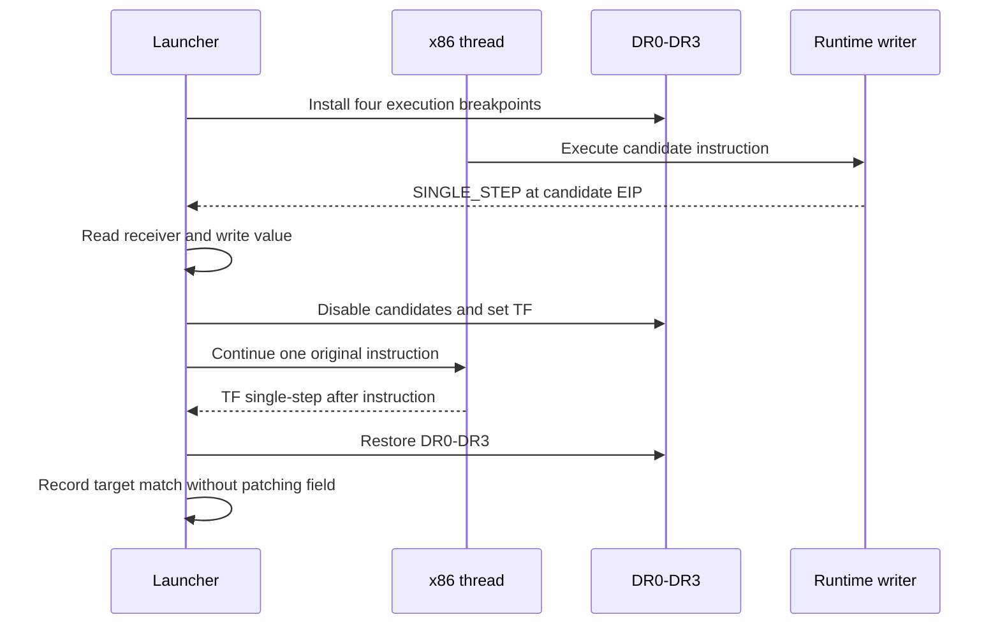

# EZ2DJ 4th 런타임 field writer 실행 추적 설계

## 목적

Task 152에서 복호화된 `ez2dj4th` 런타임 `.text` 안에 `+0x11c` 직접 write 후보 네 개가 존재함을 확인했습니다. 그러나 동일 offset을 사용하는 다른 객체의 writer일 수 있으므로, 정적 후보만으로 `0x00acd708 + 0x11c`의 초기화 경로를 확정할 수 없습니다. 이번 작업은 네 후보 instruction의 실제 실행 hit를 bounded trace로 수집하고, receiver와 계산된 write target을 target field 주소와 비교합니다.

## 확인된 전제

- 확인됨: target object는 image base 기준 RVA `0x006cd708`, target field는 `0x006cd824`입니다.
- 확인됨: 복호화된 런타임 `.text`에서 직접 write 후보는 RVA `0x0000fdbd`, `0x0000fde1`, `0x0001825f`, `0x0001dbd3`입니다.
- 확인됨: 후보 명령은 각각 `mov [ECX+0x11c], EAX`, `mov [ECX+0x11c], imm32`, `mov [EAX+0x11c], imm32`, `mov [EDX+0x11c], ECX` 형태로 분류되었습니다.
- 미확정: 네 후보 중 실제로 target object를 receiver로 사용한 명령이 있는지, 또는 field가 간접 복사·다른 주소·정적 초기화로 결정되는지는 아직 모릅니다.

## 동작 설계

- 새 옵션 `--null-context-field-reference-execution-trace`를 추가합니다.
- `ez2dj4th` initial breakpoint 이후 primary thread의 `DR0`–`DR3`에 네 후보의 image-base-relative 주소를 execution breakpoint로 설치합니다.
- 새 thread가 생성되면 같은 네 breakpoint를 해당 thread context에 설치합니다.
- execution hit에서는 `EIP`, candidate index, receiver register/value, 계산된 `receiver + 0x11c`, target field, write source/value를 기록합니다.
- `C7` 후보의 immediate 값은 원격 instruction의 `EIP + 6`에서 `ReadProcessMemory`로 읽고, 읽기 성공 여부를 별도 기록합니다. 읽기 실패 시에도 field를 변경하지 않고 trace를 계속하지 않습니다.
- hit instruction은 breakpoint를 잠시 끄고 `TF` 단일-step으로 한 번 실행한 뒤, 다음 single-step event에서 `DR0`–`DR3`를 복구합니다. 따라서 원본 명령과 field 값은 변경하지 않습니다.
- trace는 기존 object-source, field-access, field-writer, early-writer 및 slot-writer 하드웨어 추적과 함께 사용할 수 없도록 CLI에서 거부합니다.
- 이벤트 상한은 기존 bounded diagnostic trace의 상한을 재사용하고, child exit·idle timeout·event cap에서 hit/recorded/target-match 결과를 요약합니다.

## 후보와 판정

| index | RVA | instruction form | receiver | write source |
| --- | --- | --- | --- | --- |
| 0 | `0x0000fdbd` | `89 81 disp32` | `ECX` | `EAX` |
| 1 | `0x0000fde1` | `C7 81 disp32 imm32` | `ECX` | immediate |
| 2 | `0x0001825f` | `C7 80 disp32 imm32` | `EAX` | immediate |
| 3 | `0x0001dbd3` | `89 8a disp32` | `EDX` | `ECX` |

`target_matches=true`는 계산된 `receiver + 0x11c`가 현재 image base의 `0x006cd824`와 같다는 뜻입니다. 이 결과만으로 field initializer 또는 HLE 정책을 확정하지 않으며, hit가 없거나 target mismatch인 경우에도 직접 field injection과 Hardlock 응답 변경은 보류합니다.

## 검증 전략

1. Windows x86 Debug build를 수행합니다.
2. 전체 unit test를 수행합니다.
3. 실제 `ez2dj4th` CHD에 기존 VFS, Hardlock, IO mock 경로와 새 옵션을 함께 실행합니다.
4. 네 candidate hit와 summary event에서 target match, immediate readable 상태, child exit 순서를 확인합니다.
5. 원본 CHD/HDD/EXE와 Hardlock secret material은 문서·로그·저장소에 추가하지 않습니다.

---

# EZ2DJ 4th Runtime Field-Writer Execution Trace Design

## Purpose

Task 152 confirmed four direct `+0x11c` write candidates in the decrypted `ez2dj4th` runtime `.text`. Because another object type may use the same offset, static candidates cannot identify the initializer for `0x00acd708 + 0x11c`. This task collects bounded execution hits for all four candidates and compares each receiver and calculated write target with the target field address.

## Confirmed premises

- Confirmed: the target object is image-base-relative RVA `0x006cd708`, and the target field is `0x006cd824`.
- Confirmed: direct write candidates in the decrypted runtime `.text` are RVAs `0x0000fdbd`, `0x0000fde1`, `0x0001825f`, and `0x0001dbd3`.
- Confirmed: the candidates were classified as `mov [ECX+0x11c], EAX`, `mov [ECX+0x11c], imm32`, `mov [EAX+0x11c], imm32`, and `mov [EDX+0x11c], ECX` respectively.
- Unresolved: whether any candidate executes with the target object as its receiver, or whether the field is determined by an indirect copy, another address, or static initialization.

## Behavior

- Add `--null-context-field-reference-execution-trace`.
- After the `ez2dj4th` initial breakpoint, install the four candidate addresses as execution breakpoints in `DR0`–`DR3` on the primary thread.
- Install the same four breakpoints in every newly created thread.
- On an execution hit, record `EIP`, candidate index, receiver register/value, calculated `receiver + 0x11c`, target field, and write source/value.
- Read `C7` immediates safely from the remote instruction at `EIP + 6` and record whether the read succeeded. Do not change the field when the read fails.
- Temporarily disable the candidate breakpoints and use `TF` to execute the original instruction once. Restore `DR0`–`DR3` on the following single-step event. The original instruction and field remain unmodified.
- Reject CLI combinations with the existing object-source, field-access, field-writer, early-writer, or slot-writer hardware traces.
- Reuse the existing bounded diagnostic event cap and record hit/recorded/target-match summaries on child exit, idle timeout, and event cap.

## Candidates and classification

| index | RVA | instruction form | receiver | write source |
| --- | --- | --- | --- | --- |
| 0 | `0x0000fdbd` | `89 81 disp32` | `ECX` | `EAX` |
| 1 | `0x0000fde1` | `C7 81 disp32 imm32` | `ECX` | immediate |
| 2 | `0x0001825f` | `C7 80 disp32 imm32` | `EAX` | immediate |
| 3 | `0x0001dbd3` | `89 8a disp32` | `EDX` | `ECX` |

`target_matches=true` means that calculated `receiver + 0x11c` equals the current image-base-relative `0x006cd824` field address. This result alone does not establish a field initializer or HLE policy. Direct field injection and Hardlock-response changes remain deferred for no-hit and target-mismatch results.

## Verification

1. Run the Windows x86 Debug build.
2. Run the full unit-test suite.
3. Run the real `ez2dj4th` CHD with the existing VFS, Hardlock, and I/O mock path plus the new option.
4. Check candidate-hit and summary events for target matches, immediate readability, and child-exit order.
5. Do not add the original CHD/HDD/EXE or Hardlock secret material to documentation, logs, or the repository.

## 실행 결과 (2026-09-03)

두 번의 실제 CHD 실행에서 후보 hit 6건이 관찰되었고 `target_matches`는 0건이었습니다. 후보 0과 1만 실행됐으며 receiver는 모두 간격 `0x4d0`의 heap 객체로, image-resident `0x00acd708`과 일치하지 않았습니다. 다만 이번 환경에서는 실행이 field read anchor `0x0041a699`까지 진행하지 않고 `idle_timeout`으로 끝났으므로, 이 결과는 관찰된 구간에 한정됩니다. 상세 증거는 [Task 154 작업 로그](../work-logs/20260903-154-ez2dj4th-field-writer-execution-trace.md)와 [4th Hardlock 런타임 분석](../analysis/ez2dj4th-hardlock-runtime.md)에 있습니다.

## Execution result (2026-09-03)

Two real-CHD runs recorded six candidate hits with zero `target_matches`. Only candidates 0 and 1 executed, and every receiver was a heap object spaced `0x4d0` apart rather than the image-resident `0x00acd708`. Execution in this environment ended at `idle_timeout` without reaching field-read anchor `0x0041a699`, so the result is bounded to the observed window. The detailed evidence is in the [Task 154 work log](../work-logs/20260903-154-ez2dj4th-field-writer-execution-trace.md) and the [4th Hardlock runtime analysis](../analysis/ez2dj4th-hardlock-runtime.md).
