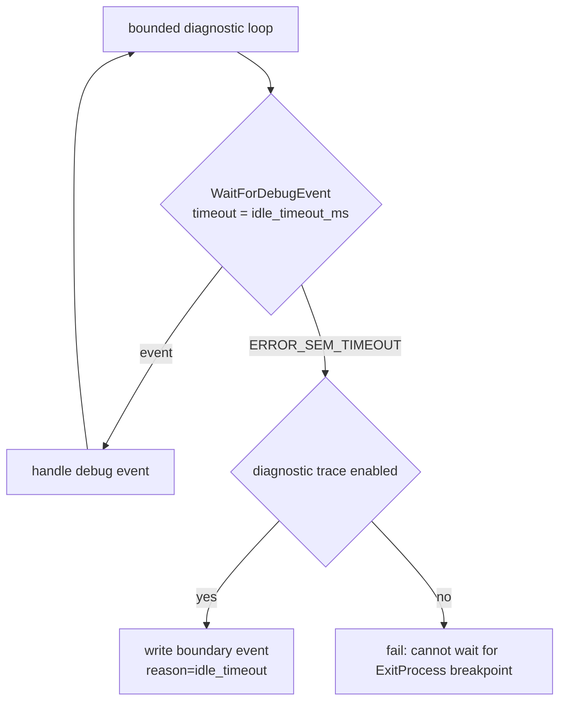

# bounded 진단 idle timeout 설정 설계

## 목적

Task 154에서 `ez2dj4th` 실제 CHD 실행이 Hardlock descriptor IOCTL과 `EZ2DJ.ini` 열기 직후 DirectDraw·DirectSound·window DLL을 적재한 뒤 debug event 없이 조용해졌고, launcher probe의 고정 5초 idle 경계가 관찰을 종료했습니다. 그 결과 이전 세션이 관찰했던 field read anchor `0x0041a699`와 `0x00434137 / 0xc0000005` AV에 도달하기 전에 trace가 끝납니다. 이 작업은 bounded 진단 loop의 idle 경계를 호스트에 맞게 조정할 수 있게 하여, 같은 진단이 느린 호스트에서도 동일 구간을 덮도록 합니다.

## 확인된 전제

- 확인됨: bounded 진단 loop는 `WaitForDebugEvent(&event, 5000)`을 사용하며, `ERROR_SEM_TIMEOUT`이면 진단 trace가 켜져 있을 때만 boundary event를 쓰고 정상 종료합니다.
- 확인됨: `20260903-113127-946.jsonl`, `20260903-113251-040.jsonl`, `20260903-113352-952.jsonl` 세 실행 모두 `reason=idle_timeout`으로 끝났고 `0xc0000005`는 없었습니다.
- 확인됨: `ez2dj4th`는 `--hle-d3d3`와 `--hle-directsound`가 구성되어 있지 않아(`... HLE is not configured for this target`) 그래픽·사운드 경계를 HLE로 우회할 수 없습니다.
- 확인됨: 진단 옵션 없이 실행하면 이 target은 `requested import is not present`로 종료하므로, 관찰 구간 확장은 bounded 진단 loop 안에서만 가능합니다.
- 미확정: child가 5초 이상 조용한 이유가 호스트 그래픽·오디오 장치 초기화 지연인지, 실제 정지인지는 아직 모릅니다.

## 동작 설계

- 새 옵션 `--diagnostic-idle-timeout <milliseconds>`를 추가합니다. 기본값은 현재 동작과 같은 `5000`입니다.
- 허용 범위는 `1000`–`600000`이며, 범위를 벗어나거나 파싱할 수 없으면 usage를 출력하고 실패합니다.
- 값은 `WaitForExitProcessBreakpoint`의 bounded 진단 loop `WaitForDebugEvent` 대기 시간에만 적용합니다. 초기 breakpoint 대기, unload tail 수집 등 다른 대기 경로의 상수는 바꾸지 않습니다.
- 선택한 값을 `launch` 진단 event에 `diagnostic_idle_timeout_ms`로 기록해, 로그만으로 관찰 경계를 재구성할 수 있게 합니다.
- 기본값을 유지하는 실행은 기존 로그와 동일한 경계를 갖습니다. 즉 기존 증거의 해석은 바뀌지 않습니다.

## 비목표

- child를 무한정 실행시키는 것
- field 값 직접 주입 또는 Hardlock 응답 변경
- 다른 대기 경로의 timeout 변경
- `ez2dj4th`용 그래픽·사운드 HLE 신규 구현

## 검증 전략

1. Windows x86 Debug build를 수행합니다.
2. 전체 unit test를 수행합니다.
3. 기본값 실행이 기존과 동일하게 `reason=idle_timeout`으로 끝나는지 확인합니다.
4. 확장된 timeout으로 Task 154의 옵션 조합을 실행해, field read anchor 도달 여부와 fault 유무를 관찰합니다.
5. 원본 CHD/HDD/EXE와 Hardlock secret material은 문서·로그·저장소에 추가하지 않습니다.

---

# Bounded Diagnostic Idle-Timeout Configuration Design

## Purpose

In Task 154, the real-CHD `ez2dj4th` runs loaded DirectDraw, DirectSound, and window DLLs right after the Hardlock descriptor IOCTL and the `EZ2DJ.ini` open, then produced no debug event, and the launcher probe's fixed five-second idle boundary ended the observation. The trace therefore stops before reaching field-read anchor `0x0041a699` and the `0x00434137 / 0xc0000005` AV observed in the previous session. This task makes the bounded diagnostic loop's idle boundary configurable so the same diagnostics cover the same interval on slower hosts.

## Confirmed premises

- Confirmed: the bounded diagnostic loop uses `WaitForDebugEvent(&event, 5000)` and, on `ERROR_SEM_TIMEOUT`, writes boundary events and returns successfully only when a diagnostic trace is enabled.
- Confirmed: all three runs `20260903-113127-946.jsonl`, `20260903-113251-040.jsonl`, and `20260903-113352-952.jsonl` ended with `reason=idle_timeout` and produced no `0xc0000005`.
- Confirmed: `ez2dj4th` has no `--hle-d3d3` or `--hle-directsound` configuration (`... HLE is not configured for this target`), so the graphics and sound boundaries cannot be bypassed through HLE.
- Confirmed: without diagnostic options this target exits with `requested import is not present`, so the observation window can only be extended inside the bounded diagnostic loop.
- Unresolved: whether the child stays quiet for more than five seconds because of host graphics/audio device initialization latency or because it has actually stopped.

## Behavior

- Add `--diagnostic-idle-timeout <milliseconds>`, defaulting to `5000`, which matches current behavior.
- Accept `1000`–`600000`; print usage and fail for unparsable or out-of-range values.
- Apply the value only to the `WaitForDebugEvent` wait in the bounded diagnostic loop of `WaitForExitProcessBreakpoint`. Do not change the constants in the initial-breakpoint wait, unload-tail collection, or other wait paths.
- Record the selected value in the `launch` diagnostic event as `diagnostic_idle_timeout_ms` so the observation boundary can be reconstructed from the log alone.
- Runs that keep the default retain the previous boundary, so existing evidence keeps its interpretation.

## Non-goals

- Letting the child run without bound.
- Direct field injection or Hardlock-response changes.
- Changing other wait-path timeouts.
- Implementing new graphics or sound HLE for `ez2dj4th`.

## Verification

1. Run the Windows x86 Debug build.
2. Run the full unit-test suite.
3. Confirm that a default-value run still ends with `reason=idle_timeout` as before.
4. Run the Task 154 option set with an extended timeout and observe whether the field-read anchor is reached and whether a fault occurs.
5. Do not add the original CHD/HDD/EXE or Hardlock secret material to documentation, logs, or the repository.
