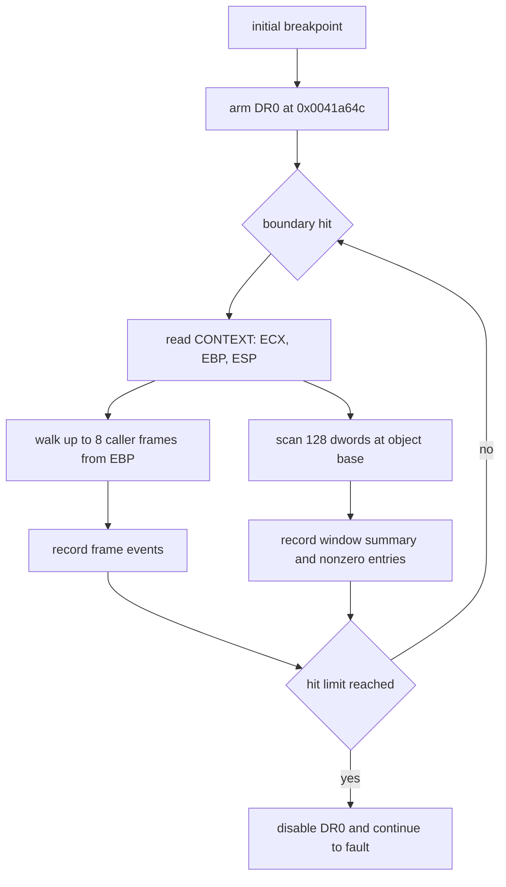

# EZ2DJ 4th null-context 객체 상태·호출자 추적 설계

## 목적

Tasks 146·151·154·155를 거치며 `0x00acd708 + 0x11c`가 사용 시점까지 어떤 관찰된 경로로도 쓰이지 않는다는 것이 확인되었습니다. 따라서 다음 질문은 writer instruction 탐색이 아니라 두 가지입니다.

1. target object `0x00acd708` 전체가 미초기화인가, 아니면 이 field 하나만 비어 있는가.
2. field를 읽는 함수는 어떤 호출자 경로로 진입하며, 그 경로에서 초기화 분기가 어디서 갈라지는가.

이 작업은 field read 직전 경계에서 객체 상태 요약과 호출자 frame chain을 함께 수집합니다.

## 확인된 전제

- 확인됨: target object는 `image_base + 0x006cd708`, target field는 `image_base + 0x006cd824`입니다.
- 확인됨: field를 읽는 함수의 prologue는 `0x0041a649`, prologue 직후 경계는 `0x0041a64c`, field read anchor는 `0x0041a699`입니다.
- 확인됨: 경계 hit 시점에 `ECX = 0x00acd708`이며, 이어지는 field read에서 `ECX = 0`이 되고 `0x00434137`에서 null receiver AV가 발생합니다.
- 확인됨: 경계는 `push ebp; mov ebp, esp` 직후이므로 그 시점의 `[EBP+4]`는 반환 주소, `[EBP]`는 저장된 호출자 `EBP`입니다.
- 확인됨: 진단 실행은 `--diagnostic-idle-timeout`으로 경계를 늘려야 `child_exit`까지 관찰됩니다.
- 미확정: 객체의 다른 field 초기화 상태와 호출자 경로는 아직 관찰되지 않았습니다.

## 동작 설계

- 새 옵션 `--null-context-object-state-trace`를 추가합니다.
- `DR0`에 `image_base + 0x001a64c` execution breakpoint를 설치합니다. primary thread와 CREATE_THREAD로 보고된 thread에 모두 설치합니다.
- hit에서 다음을 기록합니다.
  - thread, `EIP`, `ECX`, `EBP`, `ESP`와 `ECX`가 target object와 같은지 여부
  - `EBP`에서 시작하는 bounded caller frame chain (최대 8 frame). frame마다 저장된 `EBP`, 반환 주소, 반환 주소가 main image 범위 안인지 기록합니다. 읽기 실패하거나 `EBP`가 증가하지 않으면 중단합니다.
  - target object window 요약. 객체 base에서 `0x200`바이트(dword 128개)를 읽고 readable 여부, 검사한 dword 수, 0이 아닌 dword 수, target field offset `0x11c`의 값과 그 dword index를 기록합니다.
  - 0이 아닌 dword는 최대 32개까지 offset, 값, 분류(`image`, `stack`, `other`)를 개별 event로 기록하고 초과분은 `capped`로 표시합니다.
- 첫 기록 hit 이후 지정한 hit 상한(4)에 도달하면 `DR0`를 비활성화하고 실행을 계속합니다. 원본 메모리는 읽기만 하며 어떤 값도 쓰지 않습니다.
- 이 옵션은 기존 slot writer, object source, field access, field writer, early writer, field reference execution 하드웨어 추적과 동시에 사용할 수 없습니다.
- 객체 상태 수집과 frame chain 수집은 `null_context_object_state.h/.cpp`로 분리하고, main.cpp에는 breakpoint 조율과 JSONL 기록만 남깁니다.

## 판정 기준

- 객체 window의 0이 아닌 dword 수가 0에 가까우면 객체 전체가 미초기화라는 근거가 됩니다.
- 다른 field 다수가 채워져 있고 `0x11c`만 0이면, 객체는 초기화되었고 이 field만 별도 경로로 채워져야 한다는 근거가 됩니다.
- 두 경우 모두 이번 결과만으로 HLE 정책을 확정하지 않습니다. field 직접 주입과 Hardlock 응답 변경은 계속 보류합니다.

## 검증 전략

1. Windows x86 Debug build를 수행합니다.
2. 전체 unit test를 수행합니다.
3. 실제 `ez2dj4th` CHD에 기존 VFS·Hardlock·IO mock 경로와 새 옵션, 확장 idle 경계를 함께 실행합니다.
4. boundary reason이 `child_exit`인지, hit·frame·window 요약이 기록되었는지 확인하고 두 번 재현합니다.
5. 원본 CHD/HDD/EXE와 Hardlock secret material은 문서·로그·저장소에 추가하지 않습니다. 객체 window는 구조 요약과 bounded offset/값만 기록하며 전체 메모리를 덤프하지 않습니다.

---

# EZ2DJ 4th Null-Context Object State and Caller Trace Design

## Purpose

Tasks 146, 151, 154, and 155 confirmed that no observed path writes `0x00acd708 + 0x11c` before it is used. The next question is therefore not which instruction writes it, but two others:

1. Is the whole target object `0x00acd708` uninitialized, or is only this field empty?
2. Through which caller path is the field-reading function entered, and where does that path diverge from the initialization branch?

This task collects an object-state summary and a caller frame chain at the boundary immediately preceding the field read.

## Confirmed premises

- Confirmed: the target object is `image_base + 0x006cd708` and the target field is `image_base + 0x006cd824`.
- Confirmed: the field-reading function's prologue is `0x0041a649`, the post-prologue boundary is `0x0041a64c`, and the field-read anchor is `0x0041a699`.
- Confirmed: `ECX = 0x00acd708` at the boundary hit, `ECX = 0` after the field read, and the null-receiver AV occurs at `0x00434137`.
- Confirmed: the boundary follows `push ebp; mov ebp, esp`, so `[EBP+4]` is the return address and `[EBP]` is the saved caller `EBP` at that point.
- Confirmed: diagnostics must widen the boundary with `--diagnostic-idle-timeout` to observe through `child_exit`.
- Unresolved: the initialization state of the object's other fields and the caller path are not yet observed.

## Behavior

- Add `--null-context-object-state-trace`.
- Install an execution breakpoint at `image_base + 0x001a64c` in `DR0`, on the primary thread and on every thread reported by CREATE_THREAD.
- Record the following on a hit:
  - thread, `EIP`, `ECX`, `EBP`, `ESP`, and whether `ECX` equals the target object.
  - A bounded caller frame chain of at most eight frames starting at `EBP`, recording each frame's saved `EBP`, return address, and whether that address lies inside the main image. Stop on a read failure or a non-increasing `EBP`.
  - A target-object window summary: read `0x200` bytes (128 dwords) from the object base and record readability, dwords scanned, nonzero dword count, and the value and dword index at target field offset `0x11c`.
  - Up to 32 nonzero dwords as individual events with offset, value, and classification (`image`, `stack`, `other`); anything beyond is marked `capped`.
- Disable `DR0` and continue once the hit limit of four is reached. The original memory is only read; no value is written.
- The option cannot be combined with the existing slot-writer, object-source, field-access, field-writer, early-writer, or field-reference-execution hardware traces.
- Object-state and frame-chain collection live in `null_context_object_state.h/.cpp`, leaving only breakpoint orchestration and JSONL recording in main.cpp.

## Classification criteria

- A nonzero dword count at or near zero is evidence that the whole object is uninitialized.
- Many populated fields with only `0x11c` zero is evidence that the object is initialized and this field alone requires a separate path.
- Neither outcome establishes HLE policy by itself. Direct field injection and Hardlock-response changes remain deferred.

## Verification

1. Run the Windows x86 Debug build.
2. Run the full unit-test suite.
3. Run the real `ez2dj4th` CHD with the existing VFS, Hardlock, and I/O mock path plus the new option and the extended idle boundary.
4. Confirm that the boundary reason is `child_exit` and that hit, frame, and window summaries were recorded, then reproduce twice.
5. Do not add the original CHD/HDD/EXE or Hardlock secret material to documentation, logs, or the repository. The object window records only a structural summary and bounded offsets and values, never a full memory dump.
