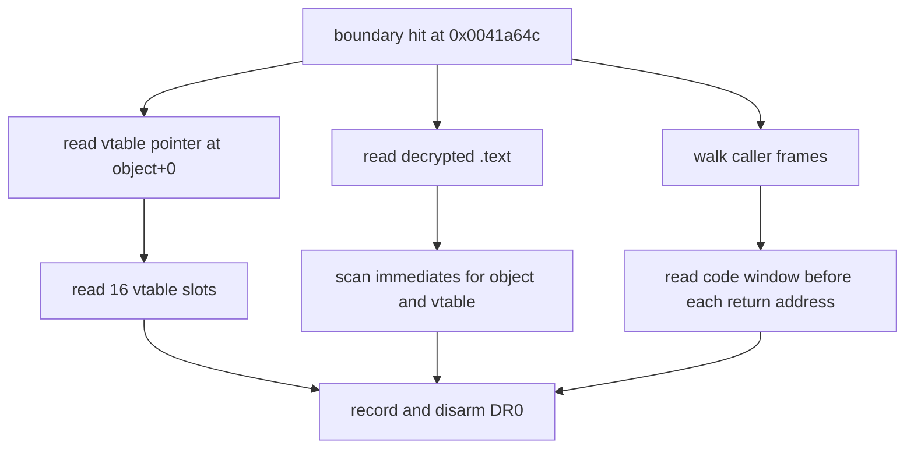

# EZ2DJ 4th null-context 객체 참조 스캔 설계

## 목적

Task 156에서 target object `0x00acd708`이 이미 생성되어 있고 `+0x11c`만 비어 있음을 확인했습니다. 다음으로 필요한 것은 이 객체의 클래스 식별과 이 객체를 다루는 코드 위치입니다. 이 작업은 복호화된 런타임 `.text`에서 객체 주소와 vtable 주소를 32비트 immediate로 참조하는 지점을 수집하고, 호출자 반환 주소 주변 코드 창을 함께 기록합니다.

## 확인된 전제

- 확인됨: 객체 offset `0x00`은 `.rdata` 주소이며 vtable pointer 형태입니다.
- 확인됨: 경계 `0x0041a64c` hit에서 `ECX = 0x00acd708`이고, 호출자 8단계 반환 주소는 모두 `.text`입니다.
- 확인됨: Task 152의 `.text` 스캔은 첫 field access 시점에 성공하므로, 같은 시점에는 보호 stub가 코드를 이미 복호화한 상태입니다.
- 확인됨: Task 146의 절대 주소 스캔은 field 주소 `0x00acd824`에 대해 `matches=0`이었습니다.
- 미확정: 객체 주소 자체를 immediate로 쓰는 지점, vtable을 설치하는 생성자 위치, 호출자 분기 구조는 아직 관찰되지 않았습니다.

## 동작 설계

- 32비트 little-endian immediate 스캔은 플랫폼 독립적인 순수 함수이므로 공용 코어 `re2dj::exe::ScanImmediateReferences`로 둡니다. 명령 디코더 없이 syntactic 후보만 수집하고, 각 match의 offset·값·직전 4바이트를 반환합니다. 상한 초과는 `capped`로 보고합니다.
- launcher probe에 `--null-context-object-reference-scan`을 추가합니다. 경계 `image_base + 0x001a64c`를 `DR0` execution breakpoint로 설치하고, 첫 hit에서 한 번만 수집한 뒤 breakpoint를 해제합니다.
- 첫 hit에서 다음을 기록합니다.
  - 객체 offset `0x00`에서 읽은 vtable pointer와 image 범위 포함 여부
  - vtable slot 16개의 값, 읽기 성공 여부, `.text` 범위 포함 여부, RVA
  - `.text` 전체에서 객체 주소와 vtable 주소를 immediate로 갖는 match의 주소·RVA·값·직전 4바이트
  - caller frame 8개 각각에 대해 반환 주소 앞 24바이트를 포함한 32바이트 코드 창
- guest 메모리는 읽기만 하며 어떤 값도 쓰지 않습니다. 기존 하드웨어 추적 옵션 및 Task 156 옵션과 동시에 사용할 수 없습니다.

## 판정 기준

- 객체 주소 match의 직전 바이트가 `b9`이면 `mov ecx, imm32` 형태이며 thiscall receiver 적재로 읽습니다.
- 직전 바이트가 `c7 05 <disp32>` 형태이면 전역 pointer 변수에 객체 주소를 저장하는 것으로 읽습니다.
- vtable 주소 match의 직전 바이트가 `c7 00`이면 `mov [eax], imm32` 형태이며 생성자의 vtable 설치로 읽습니다.
- 이 분류는 디코더 없는 해석이므로 각 판단을 **확인됨(바이트 열)**과 **추정(의미)**으로 구분해 기록합니다.

## 검증 전략

1. 공용 코어 스캔 함수에 단위 테스트를 추가합니다. 경계 조건은 버퍼 시작 부근 match, 상한 초과, 값 부재, 짧은 버퍼, 빈 값 목록입니다.
2. Windows x86 Debug build와 전체 unit test를 수행합니다.
3. 실제 CHD를 확장 idle 경계와 함께 두 번 실행하고 match 집합의 재현성을 확인합니다.
4. 원본 CHD/HDD/EXE와 Hardlock secret material은 저장하지 않습니다. 코드 창은 진단 목적의 제한된 바이트 열로만 기록합니다.

---

# EZ2DJ 4th Null-Context Object Reference Scan Design

## Purpose

Task 156 confirmed that target object `0x00acd708` is already constructed and that only `+0x11c` is empty. The next requirement is to identify the object's class and the code that handles it. This task collects the sites in the decrypted runtime `.text` that reference the object address and vtable address as 32-bit immediates, together with code windows around the caller return addresses.

## Confirmed premises

- Confirmed: object offset `0x00` holds an `.rdata` address in the shape of a vtable pointer.
- Confirmed: at the boundary hit `0x0041a64c`, `ECX = 0x00acd708`, and all eight caller return addresses lie in `.text`.
- Confirmed: Task 152's `.text` scan succeeds at the first field access, so the protection stub has already decrypted the code at that point.
- Confirmed: Task 146's absolute-address scan reported `matches=0` for field address `0x00acd824`.
- Unresolved: the sites that use the object address as an immediate, the constructor that installs the vtable, and the caller branch structure have not been observed.

## Behavior

- The 32-bit little-endian immediate scan is a platform-neutral pure function and therefore lives in the shared core as `re2dj::exe::ScanImmediateReferences`. It collects syntactic candidates without an instruction decoder and returns each match's offset, value, and preceding four bytes, reporting truncation through `capped`.
- Add `--null-context-object-reference-scan` to the launcher probe. It installs boundary `image_base + 0x001a64c` as a `DR0` execution breakpoint, collects once on the first hit, and releases the breakpoint.
- Record the following on that hit:
  - the vtable pointer read from object offset `0x00` and whether it lies in the image;
  - sixteen vtable slots with value, readability, `.text` membership, and RVA;
  - every `.text` match whose immediate equals the object or vtable address, with address, RVA, value, and preceding four bytes;
  - a 32-byte code window covering the 24 bytes before each of the eight caller return addresses.
- Guest memory is read-only. The option cannot be combined with the existing hardware traces or the Task 156 option.

## Classification criteria

- An object-address match preceded by `b9` reads as `mov ecx, imm32`, a thiscall receiver load.
- A match preceded by a `c7 05 <disp32>` shape reads as storing the object address into a global pointer variable.
- A vtable-address match preceded by `c7 00` reads as `mov [eax], imm32`, the constructor's vtable installation.
- These readings come from bytes without a decoder, so each is recorded as **confirmed (byte sequence)** or **inferred (meaning)**.

## Verification

1. Add unit tests for the shared-core scan function, covering matches near the buffer start, cap truncation, absent values, short buffers, and empty value lists.
2. Run the Windows x86 Debug build and the full unit-test suite.
3. Run the real CHD twice with the extended idle boundary and confirm the match set reproduces.
4. Do not store the original CHD/HDD/EXE or Hardlock secret material. Code windows are recorded only as bounded diagnostic byte sequences.
