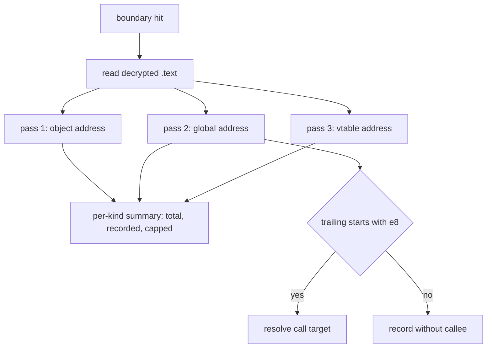

# EZ2DJ 4th singleton 전역 참조 스캔 설계

## 목적

Task 157에서 호출자가 객체 주소가 아니라 전역 pointer `0x00ac29b4`에서 receiver를 읽는다는 것을 확인했습니다. 따라서 `+0x11c`를 채울 수 있는 코드는 그 전역을 거쳐 receiver를 받은 함수 안에만 존재할 수 있습니다. 이 작업은 그 전역을 참조하는 지점을 모두 세고, 각 지점 직후의 `call rel32` 대상을 해석해 이 인스턴스를 receiver로 받는 함수 집합을 만듭니다.

## 확인된 전제

- 확인됨: 전역 `0x00ac29b4`는 경계 hit 시점에 객체 주소 `0x00acd708`을 담고 있습니다.
- 확인됨: 호출자 depth 0은 `mov ecx, [0x00ac29b4]` 직후 `call 0x00401ac3`입니다.
- 확인됨: Task 157의 단일 스캔은 세 값을 한 번에 찾다가 상한 128에서 잘렸고, 그 결과 값별 총계를 알 수 없었습니다.
- 미확정: 전역 참조의 실제 개수, 참조 형태 분포, 호출되는 함수 집합은 아직 관찰되지 않았습니다.

## 동작 설계

- 공용 코어 `ScanImmediateReferences`를 두 가지로 확장합니다.
  - match마다 직전 바이트뿐 아니라 **직후 바이트**도 최대 8바이트 돌려줍니다. 호출자가 다음 명령까지 보고 형태를 판단할 수 있게 하기 위함입니다.
  - 상한을 넘어도 스캔을 멈추지 않고 계속 세어 `total_matches`로 총계를 돌려줍니다. 상한은 기록량만 제한하고 통계는 온전하게 유지합니다.
- launcher probe의 참조 스캔은 값마다 한 번씩 별도 pass로 수행합니다. 한 값이 상한을 소진해 다른 값의 총계를 가리지 못하게 하기 위함입니다. pass마다 `kind`, 값, 총계, 기록 수, 상한 도달 여부를 요약 이벤트로 남깁니다.
- match 직후 바이트가 `e8`로 시작하면 `call rel32`로 보고 대상 주소를 계산해 기록합니다. 계산식은 `다음 명령 주소 + 5 + rel32`이며, `e8`이 아닌 경우에는 대상을 기록하지 않습니다.
- 스캔 대상 값은 객체 주소, 전역 주소, vtable 주소 셋입니다. guest 메모리는 계속 읽기만 합니다.

## 판정 기준

- 직전 두 바이트가 `8b 0d`이면 `mov ecx, [global]`이며 thiscall receiver 적재로 읽습니다. `8b 15`는 `mov edx`, `a1`은 `mov eax`입니다.
- 해석된 call 대상이 모두 `.text` 앞부분의 좁은 구간에 몰리면 incremental-link thunk 표를 거치는 호출로 읽습니다.
- 참조 개수가 크면 이 객체는 광범위하게 사용되는 subsystem singleton으로 분류합니다. 이 분류만으로 `+0x11c`의 의미를 확정하지 않습니다.

## 검증 전략

1. 확장된 스캔 함수의 단위 테스트를 갱신합니다. 직후 바이트 개수, 버퍼 끝 부근의 짧은 창, 상한 초과 시 총계 유지를 확인합니다.
2. Windows x86 Debug build와 전체 unit test를 수행합니다.
3. 실제 CHD를 확장 idle 경계와 함께 실행하고 값별 총계와 callee 집합을 확인합니다.
4. 원본 CHD/HDD/EXE와 Hardlock secret material은 저장하지 않습니다.

---

# EZ2DJ 4th Singleton Global Reference Scan Design

## Purpose

Task 157 confirmed that callers load the receiver from the global pointer `0x00ac29b4` rather than from the object address, so any code that could fill `+0x11c` must live in a function that received the receiver through that global. This task counts every reference to that global and resolves the `call rel32` that follows each one, producing the set of functions that take this instance as a receiver.

## Confirmed premises

- Confirmed: the global `0x00ac29b4` holds the object address `0x00acd708` at the boundary hit.
- Confirmed: caller depth 0 is `mov ecx, [0x00ac29b4]` immediately followed by `call 0x00401ac3`.
- Confirmed: Task 157's single scan searched all three values at once and truncated at the cap of 128, leaving the per-value totals unknown.
- Unresolved: the real number of global references, the distribution of reference forms, and the set of called functions have not been observed.

## Behavior

- Extend the shared-core `ScanImmediateReferences` in two ways.
  - Return up to eight **following** bytes for each match in addition to the preceding ones, so callers can judge the form from the next instruction.
  - Keep scanning past the cap and return the full count through `total_matches`, so the cap limits only how much is recorded and never the statistics.
- Run the launcher probe's reference scan as a separate pass per value, so one value cannot exhaust the cap and hide another's total. Each pass emits a summary event with `kind`, the value, the total, the recorded count, and whether the cap was reached.
- When the bytes after a match begin with `e8`, treat it as `call rel32`, compute the target as `next instruction address + 5 + rel32`, and record it. No target is recorded for any other following byte.
- The scanned values are the object address, the global address, and the vtable address. Guest memory remains read-only.

## Classification criteria

- Preceding bytes `8b 0d` read as `mov ecx, [global]`, a thiscall receiver load; `8b 15` is `mov edx` and `a1` is `mov eax`.
- Resolved call targets clustered in a narrow low region of `.text` read as calls routed through an incremental-link thunk table.
- A large reference count classifies the object as a widely used subsystem singleton. That classification alone does not establish the meaning of `+0x11c`.

## Verification

1. Update the scan function's unit tests for the trailing-byte count, short windows near the buffer end, and total preservation past the cap.
2. Run the Windows x86 Debug build and the full unit-test suite.
3. Run the real CHD with the extended idle boundary and check the per-value totals and callee set.
4. Do not store the original CHD/HDD/EXE or Hardlock secret material.
