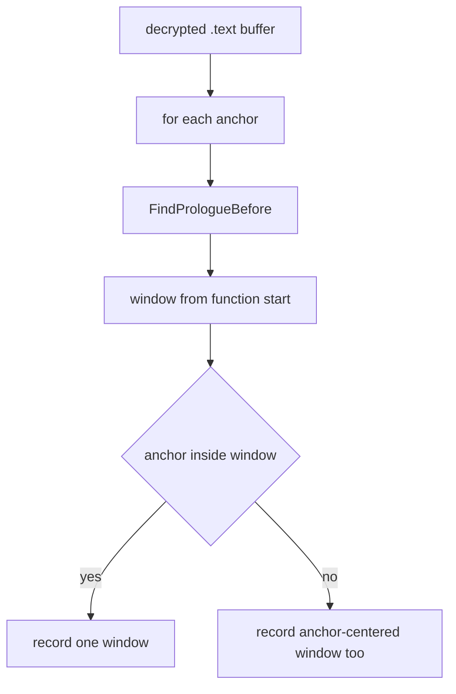

# EZ2DJ 4th 코드 영역 스캔 설계

## 목적

Task 158에서 `+0x11c`를 채우는 코드가 singleton을 receiver로 받은 함수 안에만 있을 수 있음을 확정했습니다. 다음으로 확인할 것은 두 가지입니다.

1. field를 읽는 함수가 읽기 전에 초기화 여부를 검사하는가.
2. 실제로 실행되는 두 `+0x11c` write 후보가 어떤 함수에 속하고 어떤 객체를 대상으로 하는가.

이 작업은 이미 읽어 둔 복호화 `.text` 버퍼에서 관심 지점의 함수 시작을 찾아 코드 영역을 기록합니다. 추가 원격 읽기는 하지 않습니다.

## 확인된 전제

- 확인됨: field read anchor는 RVA `0x0001a699`, 그 함수의 prologue는 `0x0001a649`입니다.
- 확인됨: 실행되는 write 후보는 RVA `0x0000fdbd`와 `0x0000fde1`이고, 실행되지 않는 후보는 `0x0001825f`와 `0x0001dbd3`입니다.
- 확인됨: vtable 설치 지점은 RVA `0x00010381`과 `0x000104a1`입니다.
- 확인됨: 참조 스캔 시점에 `.text` 전체가 복호화되어 읽힙니다.
- 미확정: 각 지점의 함수 경계와 본문 구조는 아직 관찰되지 않았습니다.

## 동작 설계

- 공용 코어에 `re2dj::exe::FindPrologueBefore`를 추가합니다. 바이트 버퍼에서 anchor 앞쪽으로 최대 N바이트를 거슬러 `55 8b ec`를 찾는 순수 함수이며, anchor 자신은 제외해 함수 시작이 길이 0으로 보고되지 않게 합니다. syntactic 검색이므로 결과는 후보입니다.
- launcher probe의 참조 스캔이 끝난 뒤, 고정된 anchor 목록에 대해 함수 시작을 찾고 코드 영역을 기록합니다. anchor는 field read, write 후보 두 개, vtable 설치 두 개입니다.
- 각 anchor마다 함수 시작부터 최대 `0xc0`바이트를 기록합니다. anchor가 그 창 밖으로 밀리면 anchor를 중심으로 앞 `0x20`, 뒤 `0x10`바이트의 두 번째 창을 추가로 기록해, 관심 명령이 빠지지 않게 합니다.
- 창은 이미 읽어 둔 `.text` 복사본에서 잘라내므로 guest 메모리를 다시 읽지 않습니다.

## 판정 기준

- field read 직전에 `[this+0x11c]`를 0과 비교하는 분기가 없다면, 코드는 이 field가 항상 유효하다고 가정한다는 뜻입니다.
- write 후보 함수가 배열 원소 주소를 계산해 memset한다면, 그 후보는 singleton이 아니라 그 배열의 원소를 초기화하는 코드입니다.
- 바이트 열 디코드는 **확인됨**, 그 의미 해석은 **추정**으로 구분해 기록합니다.

## 검증 전략

1. `FindPrologueBefore`의 단위 테스트를 추가합니다. 함수 내부 anchor, prologue 위 anchor, 검색 범위 초과, 경계 입력을 확인합니다.
2. Windows x86 Debug build와 전체 unit test를 수행합니다.
3. 실제 CHD를 확장 idle 경계와 함께 실행하고 각 anchor의 함수 시작과 창을 확인합니다.
4. 원본 CHD/HDD/EXE와 Hardlock secret material은 저장하지 않습니다. 코드 창은 판정에 필요한 범위로 제한합니다.

---

# EZ2DJ 4th Code Region Scan Design

## Purpose

Task 158 established that code filling `+0x11c` can only live in a function that received the singleton as its receiver. Two questions follow.

1. Does the function that reads the field check whether it is initialized first?
2. Which function contains the two `+0x11c` write candidates that actually execute, and which object do they target?

This task locates the function starts of the points of interest inside the already-read decrypted `.text` buffer and records their code regions, without any additional remote reads.

## Confirmed premises

- Confirmed: the field-read anchor is RVA `0x0001a699` and its function prologue is `0x0001a649`.
- Confirmed: the executing write candidates are RVAs `0x0000fdbd` and `0x0000fde1`; the non-executing ones are `0x0001825f` and `0x0001dbd3`.
- Confirmed: the vtable installation sites are RVAs `0x00010381` and `0x000104a1`.
- Confirmed: the whole `.text` is decrypted and readable at the reference-scan point.
- Unresolved: the function bounds and body structure at each point have not been observed.

## Behavior

- Add `re2dj::exe::FindPrologueBefore` to the shared core: a pure function that searches a byte buffer backward from an anchor for `55 8b ec` within a limit, excluding the anchor itself so a function start is never reported with zero length. The search is syntactic, so results are candidates.
- After the launcher probe's reference scan, locate the function start for a fixed anchor list and record the code region. The anchors are the field read, the two write candidates, and the two vtable installations.
- Record up to `0xc0` bytes from each function start. When the anchor falls outside that window, record a second window centered on the anchor covering `0x20` bytes before and `0x10` after, so the instruction of interest is never missing.
- Windows are cut from the already-read `.text` copy, so guest memory is not read again.

## Classification criteria

- No branch comparing `[this+0x11c]` against zero before the field read means the code assumes the field is always valid.
- A write-candidate function that computes an array element address and memsets it is initializing elements of that array rather than the singleton.
- Byte decoding is recorded as **confirmed** and its meaning as **inferred**.

## Verification

1. Add unit tests for `FindPrologueBefore` covering an anchor inside a function, an anchor sitting on a prologue, an exceeded search range, and boundary inputs.
2. Run the Windows x86 Debug build and the full unit-test suite.
3. Run the real CHD with the extended idle boundary and check each anchor's function start and windows.
4. Do not store the original CHD/HDD/EXE or Hardlock secret material. Code windows stay bounded to what the classification needs.
