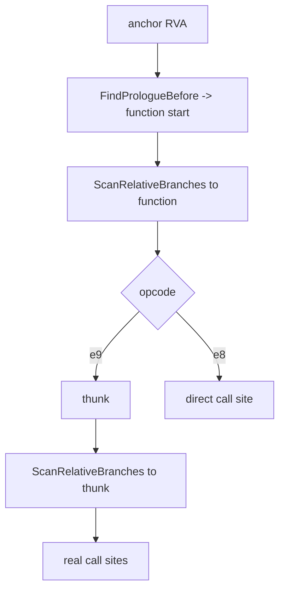

# EZ2DJ 4th field initializer 호출 체인 설계

## 목적

Task 159에서 실행되는 두 write 후보가 다른 클래스의 배열 원소 초기화 코드임을 확인했습니다. 남은 후보는 관찰 구간에서 한 번도 실행되지 않은 `0x0001825f`와 `0x0001dbd3`입니다. 이 작업은 두 후보의 함수와 그 함수를 호출하는 경로를 정적으로 추적해, singleton의 `+0x11c`를 채울 수 있는 유일한 경로를 확정합니다.

## 확인된 전제

- 확인됨: 호출은 대개 `.text` 앞부분의 `jmp rel32` thunk를 거칩니다. field read 함수 `0x0041a649`도 thunk `0x00401ac3`을 통해 불립니다.
- 확인됨: singleton의 vtable slot 0–3은 `0x0000111d`, `0x00002603`, `0x00001046`, `0x00002126`입니다.
- 확인됨: singleton은 전역 `0x00ac29b4`를 통해 1210회 참조됩니다.
- 미확정: 후보 2·3의 함수 경계, 그 함수의 write receiver, 호출 경로는 아직 관찰되지 않았습니다.

## 동작 설계

- 공용 코어 `code_scan`에 `ScanRelativeBranches`를 추가합니다. 버퍼 안의 `call rel32`와 `jmp rel32` 중 계산된 목적지가 지정 주소와 같은 것을 모두 찾는 순수 함수이며, 목적지 계산은 32비트 wrap을 그대로 따릅니다. 기록 상한을 넘어도 계속 세어 `total_sites`를 유지합니다.
- launcher probe는 각 anchor의 함수 시작을 찾은 뒤 두 단계로 분기를 추적합니다.
  1. 함수 시작을 목적지로 하는 분기를 찾습니다. `jmp`는 thunk, `call`은 직접 호출입니다.
  2. 찾은 thunk 각각을 목적지로 하는 분기를 다시 찾습니다. 이것이 실제 호출 지점입니다.
- anchor 목록에 후보 2·3과, 1단계 결과로 드러난 후보 2의 유일한 호출 지점을 추가합니다.
- prologue 역방향 검색 범위를 `0x2000`으로 넓혀 큰 함수의 시작도 찾습니다.
- 모든 창은 이미 읽어 둔 `.text` 복사본에서 잘라내며 guest 메모리는 읽기만 합니다.

## 판정 기준

- 후보의 write receiver가 함수의 `this`이면 그 함수는 임의 객체의 field를 채울 수 있습니다. 고정 주소이면 그 후보는 특정 정적 객체 전용입니다.
- 함수 시작을 목적지로 하는 분기가 하나도 없으면, 그 함수는 rel32로 불리지 않으며 간접 호출 대상이거나 함수 시작 추정이 틀린 것입니다.
- thunk 주소가 singleton vtable slot과 같으면 그 함수는 singleton 클래스의 가상 메서드입니다.

## 검증 전략

1. `ScanRelativeBranches`의 단위 테스트를 추가합니다. `call`과 `jmp` 양쪽, 상한 초과 시 총계 유지, 32비트 wrap 역방향 분기, 짧은 버퍼와 null 입력을 확인합니다.
2. 기존에 확인된 관계를 자기 검증으로 씁니다. field read 함수는 thunk `0x00401ac3` 하나만 가리켜야 합니다.
3. Windows x86 Debug build와 전체 unit test를 수행합니다.
4. 실제 CHD를 확장 idle 경계와 함께 실행하고 체인을 확인합니다.
5. 원본 CHD/HDD/EXE와 Hardlock secret material은 저장하지 않습니다.

---

# EZ2DJ 4th Field-Initializer Call Chain Design

## Purpose

Task 159 confirmed that the two executing write candidates are element-initialization code for a different class. The remaining candidates, `0x0001825f` and `0x0001dbd3`, never executed in the observed window. This task statically traces both candidates' functions and the paths that call them, to establish the one route that can fill the singleton's `+0x11c`.

## Confirmed premises

- Confirmed: calls usually pass through a `jmp rel32` thunk at the front of `.text`; the field-read function `0x0041a649` is reached through thunk `0x00401ac3`.
- Confirmed: the singleton's vtable slots 0–3 are `0x0000111d`, `0x00002603`, `0x00001046`, and `0x00002126`.
- Confirmed: the singleton is referenced 1210 times through the global `0x00ac29b4`.
- Unresolved: the function bounds of candidates 2 and 3, their write receivers, and their call paths have not been observed.

## Behavior

- Add `ScanRelativeBranches` to the shared-core `code_scan`: a pure function that finds every `call rel32` and `jmp rel32` in a buffer whose computed destination equals a given address, following 32-bit wrap as the CPU does. It keeps counting past the record cap so `total_sites` stays complete.
- The launcher probe traces branches in two stages after locating each anchor's function start.
  1. Find branches whose destination is the function start; `jmp` is a thunk and `call` is a direct call.
  2. Find branches whose destination is each thunk found; those are the real call sites.
- Add candidates 2 and 3 to the anchor list, together with the single call site of candidate 2's function revealed by stage one.
- Widen the backward prologue search to `0x2000` so large functions' starts are still found.
- All windows are cut from the already-read `.text` copy, and guest memory is only read.

## Classification criteria

- A candidate whose write receiver is the function's `this` can fill the field of any object; a fixed address means that candidate serves one specific static object.
- A function start with no branches to it is not called through rel32 and is either an indirect-call target or a wrong function-start guess.
- A thunk address equal to a singleton vtable slot means the function is a virtual method of the singleton's class.

## Verification

1. Add unit tests for `ScanRelativeBranches` covering both `call` and `jmp`, total preservation past the cap, a backward branch through the 32-bit wrap, short buffers, and null input.
2. Use the already-established relationship as a self-check: the field-read function must resolve to exactly the one thunk `0x00401ac3`.
3. Run the Windows x86 Debug build and the full unit-test suite.
4. Run the real CHD with the extended idle boundary and check the chain.
5. Do not store the original CHD/HDD/EXE or Hardlock secret material.
