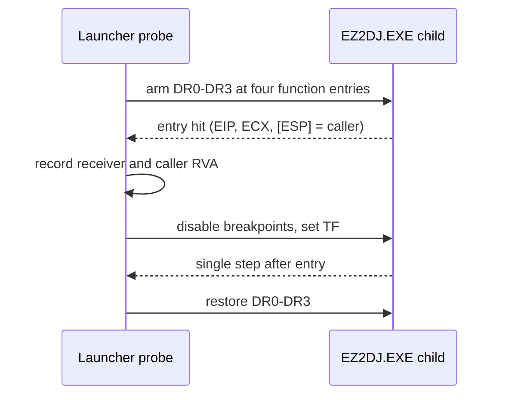

# EZ2DJ 4th initializer 진입 추적 설계

## 목적

Task 160에서 singleton `+0x11c`를 채우는 유일한 경로가 vtable slot 2 → 함수 `0x000116c8` → 함수 `0x00018234`임을 정적으로 확정했습니다. 이 작업은 그 체인의 각 지점이 실제 실행에서 진입되는지, 어떤 receiver로 진입하는지, 그리고 어느 지점에서 끊기는지를 실행 증거로 판정합니다.

## 확인된 전제

- 확인됨: 체인은 생성자 `0x00010366`, vtable slot 2 메서드 `0x000116c8`, field initializer `0x00018234`, field reader `0x0001a649` 순서입니다.
- 확인됨: 관찰된 실행에서 write 후보 2(`0x0001825f`)는 한 번도 실행되지 않았습니다.
- 확인됨: 확장 idle 경계를 쓰면 실행이 `child_exit`까지 관찰됩니다.
- 미확정: slot 2 메서드 자체가 호출되는지, 호출된다면 어디까지 진행하는지는 아직 관찰되지 않았습니다.

## 동작 설계

- 새 옵션 `--null-context-entry-trace`를 추가합니다.
- 네 함수 진입 주소를 `DR0`–`DR3` execution breakpoint로 설치하고, 새 thread에도 설치합니다.
- breakpoint는 함수의 첫 바이트, 즉 `push ebp` 이전에 걸리므로 `[ESP]`가 호출자 반환 주소입니다. hit에서 thread, 진입 이름·RVA, `EIP`, `ECX`, singleton 일치 여부, `ESP`, 반환 주소와 그 RVA를 기록합니다.
- 진입마다 기록 상한을 두고, 초과분은 `capped`로 표시합니다.
- hit 후에는 breakpoint를 잠시 끄고 `TF` 단일-step으로 한 번 통과한 뒤 다음 single-step event에서 복구합니다. 원본 명령과 데이터는 바꾸지 않습니다.
- 기존 하드웨어 추적 옵션과 동시에 사용할 수 없으며 `ez2dj4th` 외 target은 거부합니다.

## 판정 기준

- 체인 상의 함수가 hit되지 않으면 그 앞 단계에서 경로가 끊긴 것입니다.
- slot 2 메서드가 hit되는데 initializer가 hit되지 않으면, 메서드 내부의 분기나 조기 반환이 원인입니다.
- 모든 hit의 `ECX`가 singleton과 같은지로 receiver 전달이 정상인지 확인합니다.

## 검증 전략

1. Windows x86 Debug build와 전체 unit test를 수행합니다.
2. 실제 CHD를 확장 idle 경계와 함께 두 번 실행하고 hit 집합의 재현성을 확인합니다.
3. `child_exit` 종료 코드가 기존과 같은지로 진단이 실행을 바꾸지 않았음을 확인합니다.
4. 원본 CHD/HDD/EXE와 Hardlock secret material은 저장하지 않습니다.

---

# EZ2DJ 4th Initializer Entry Trace Design

## Purpose

Task 160 statically established that the only route filling the singleton's `+0x11c` is vtable slot 2 → function `0x000116c8` → function `0x00018234`. This task determines by execution evidence which points of that chain are actually entered, with which receiver, and where the chain breaks.

## Confirmed premises

- Confirmed: the chain is constructor `0x00010366`, vtable slot 2 method `0x000116c8`, field initializer `0x00018234`, and field reader `0x0001a649`.
- Confirmed: write candidate 2 (`0x0001825f`) never executed in the observed runs.
- Confirmed: the extended idle boundary lets execution be observed through `child_exit`.
- Unresolved: whether the slot 2 method is called at all, and how far it proceeds if it is.

## Behavior

- Add the `--null-context-entry-trace` option.
- Install the four function entry addresses as `DR0`–`DR3` execution breakpoints, including on new threads.
- The breakpoint fires on the function's first byte, before `push ebp`, so `[ESP]` holds the caller's return address. Each hit records the thread, entry name and RVA, `EIP`, `ECX`, singleton equality, `ESP`, and the return address with its RVA.
- Each entry has its own record limit, and overflow is reported through `capped`.
- After a hit the breakpoints are disabled, `TF` steps once past the entry, and they are restored on the following single-step event. Original instructions and data are unchanged.
- The option cannot be combined with the existing hardware traces and refuses targets other than `ez2dj4th`.

## Classification criteria

- A chain function with no hit means the path broke at an earlier stage.
- If the slot 2 method is hit but the initializer is not, a branch or early return inside that method is responsible.
- Comparing every hit's `ECX` against the singleton confirms whether the receiver is passed correctly.

## Verification

1. Run the Windows x86 Debug build and the full unit-test suite.
2. Run the real CHD twice with the extended idle boundary and confirm the hit set reproduces.
3. Confirm the `child_exit` code matches previous runs, showing the diagnostic did not change execution.
4. Do not store the original CHD/HDD/EXE or Hardlock secret material.
