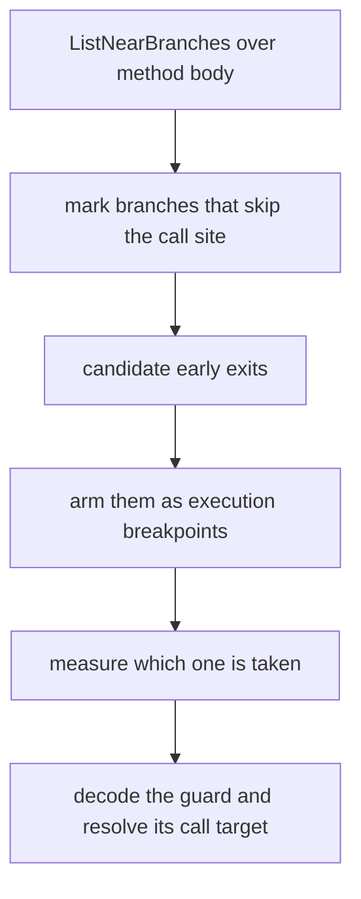

# EZ2DJ 4th slot 2 메서드 조기 이탈 분석 설계

## 목적

Task 161에서 vtable slot 2 메서드가 singleton을 receiver로 실행되지만 내부의 field initializer 호출(`RVA 0x00011c23`)에 도달하지 못한다는 것이 확인됐습니다. 이 작업은 그 메서드 본문의 분기 구조를 구조화해 조기 이탈 지점을 찾고, 실제로 어느 지점이 선택되는지 실행으로 판정합니다.

## 확인된 전제

- 확인됨: 메서드는 `RVA 0x000116c8`에서 시작하고 초기화 호출은 `RVA 0x00011c23`입니다.
- 확인됨: 메서드는 실행되지만 초기화 함수 `0x00018234`는 진입하지 않습니다.
- 확인됨: 진단 시점에 복호화된 `.text` 전체를 읽을 수 있습니다.
- 미확정: 본문의 분기 구조와 실제로 선택되는 이탈 경로는 아직 관찰되지 않았습니다.

## 동작 설계

- 공용 코어 `code_scan`에 `ListNearBranches`를 추가합니다. 지정 범위 안의 `call rel32`, `jmp rel32/rel8`, `jcc rel8`, 두 바이트 `0f 8x jcc rel32`를 선형으로 훑어 목적지까지 계산해 돌려주는 순수 함수입니다. 명령 길이를 디코드하지 않는 선형 스캔이므로 결과는 후보이며, 다른 명령 내부의 바이트 패턴이 섞일 수 있습니다.
- launcher probe는 메서드 범위에 대해 이 목록을 기록하고, 각 분기가 초기화 호출 지점을 건너뛰는지(`skips_call`) 표시합니다. 판정 기준은 "호출 지점보다 앞에 있고 목적지가 호출 지점보다 뒤"입니다.
- 이탈 후보가 좁혀지면 그 주소들을 진입 추적의 `DR0`–`DR3` 대상으로 바꿔, 실제로 어느 분기가 실행되는지 측정합니다. 이때 `EAX`와 `EDX`도 함께 기록해 직전 호출의 반환값을 남깁니다.
- 이탈 지점 주변과 thunk 대상은 코드 영역 및 분기 목록으로 해석합니다.

## 판정 기준

- `cmp <result>, 0` 뒤의 `jge`와 이어지는 `jmp`는 실패 시 반환하는 HRESULT 형태의 guard로 읽습니다.
- 실행 breakpoint가 그 `jmp`에서 걸리면 그 guard가 실패한 것입니다.
- 선형 스캔 결과는 raw 코드 창과 대조해 검증합니다. 초기화 호출 지점이 목록에서 `call`로 나타나는지가 자기 검증입니다.

## 검증 전략

1. `ListNearBranches`의 단위 테스트를 추가합니다. `jcc rel8`의 음수 변위, `call`·`jmp rel32`, 두 바이트 `jcc`, 범위 제한, 상한 초과 총계, 경계 입력을 확인합니다.
2. Windows x86 Debug build와 전체 unit test를 수행합니다.
3. 실제 CHD를 확장 idle 경계와 함께 실행해 분기 목록과 실행된 이탈 지점을 확인합니다.
4. 원본 CHD/HDD/EXE와 Hardlock secret material은 저장하지 않습니다.

---

# EZ2DJ 4th Slot 2 Method Early-Exit Analysis Design

## Purpose

Task 161 confirmed that the vtable slot 2 method runs with the singleton as receiver but never reaches the field-initializer call at `RVA 0x00011c23`. This task structures the method body's branch layout to find the early-exit points and measures which one is actually taken.

## Confirmed premises

- Confirmed: the method starts at `RVA 0x000116c8` and the initializer call is at `RVA 0x00011c23`.
- Confirmed: the method runs but the initializer function `0x00018234` is never entered.
- Confirmed: the complete decrypted `.text` is readable at the diagnostic point.
- Unresolved: the body's branch structure and the exit path actually taken have not been observed.

## Behavior

- Add `ListNearBranches` to the shared-core `code_scan`: a pure function that linearly walks a range for `call rel32`, `jmp rel32/rel8`, `jcc rel8`, and the two-byte `0f 8x jcc rel32`, resolving each destination. It does not decode instruction lengths, so results are candidates and byte patterns inside other instructions can appear.
- The launcher probe records this listing for the method range and marks whether each branch skips the initializer call site (`skips_call`), defined as sitting before the call site and targeting past it.
- Once the exit candidates are narrowed, they become the `DR0`–`DR3` targets of the entry trace, measuring which branch actually executes. `EAX` and `EDX` are recorded there as well to capture the preceding call's return value.
- The area around the exit and the thunk targets are interpreted from code regions and branch listings.

## Classification criteria

- A `cmp <result>, 0` followed by `jge` and then a `jmp` reads as an HRESULT-style guard that returns on failure.
- An execution breakpoint hit on that `jmp` means that guard failed.
- The linear-scan results are validated against the raw code window; the initializer call site appearing as a `call` in the listing is the self-check.

## Verification

1. Add unit tests for `ListNearBranches` covering a negative `jcc rel8` displacement, `call`/`jmp rel32`, two-byte `jcc`, range limiting, totals past the cap, and boundary inputs.
2. Run the Windows x86 Debug build and the full unit-test suite.
3. Run the real CHD with the extended idle boundary and check the branch listing and the exit taken.
4. Do not store the original CHD/HDD/EXE or Hardlock secret material.
