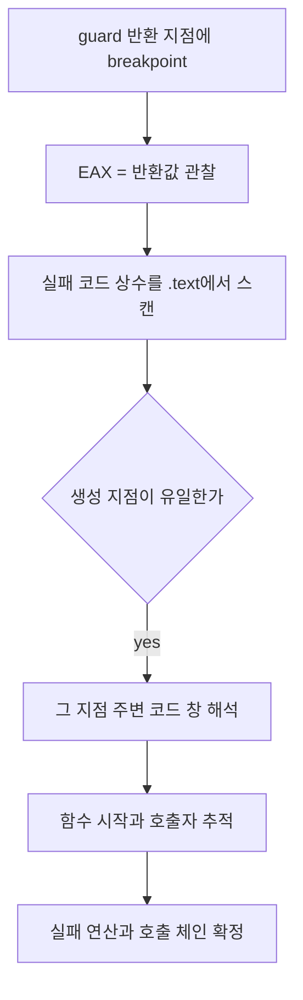

# EZ2DJ 4th guard 실패 원인 추적 설계

## 목적

Task 162에서 slot 2 메서드가 세 번째 guard에서 이탈하며, 그 직전 호출 대상이 `RVA 0x000106d2`임을 확인했습니다. 이 작업은 세 guard의 실제 반환값을 관찰하고, 실패 코드가 생성되는 지점을 찾아 실패의 직접 원인이 되는 연산을 특정합니다.

## 확인된 전제

- 확인됨: guard 2의 `jmp`(`RVA 0x00011838`)만 실행되며 초기화 호출에 도달하지 못합니다.
- 확인됨: guard 2의 호출은 thunk `0x0000317f`를 거쳐 `RVA 0x000106d2`로 갑니다.
- 확인됨: `call rel32`는 다음 명령 주소가 반환 지점이므로, 그 주소에 breakpoint를 걸면 `EAX`에 반환값이 남아 있습니다.
- 확인됨: `ScanImmediateReferences`로 임의의 32비트 값을 `.text` 전체에서 셀 수 있습니다.
- 미확정: 각 guard의 반환값, 실패 코드의 생성 지점, 실패하는 연산은 아직 관찰되지 않았습니다.

## 동작 설계

- 진입 추적의 `DR0`–`DR3` 대상을 세 guard의 **호출 반환 지점**(`0x00011706`, `0x0001172a`, `0x00011828`)과 guard 2 대상 함수의 진입(`0x000106d2`)으로 바꿉니다. 반환 지점에서는 `EAX`가 guard가 비교할 값 그대로입니다.
- 관찰된 실패 코드를 참조 스캔의 값 목록에 추가해, `.text` 안에서 그 상수를 만드는 지점을 모두 셉니다. 유일하면 실패 지점이 하나로 특정됩니다.
- 실패 지점 주변을 anchor 코드 창으로 읽어 앞선 연산과 guard 형태를 해석하고, 함수 시작과 호출자를 두 단계 분기 추적으로 확인해 호출 체인을 잇습니다.
- 모든 관찰은 읽기 전용이며 원본 명령과 데이터를 바꾸지 않습니다.

## 판정 기준

- 반환값이 0 이상이면 그 guard는 통과한 것이고, 음수이면 그 guard가 이탈 원인입니다.
- 실패 코드 상수의 생성 지점이 `.text`에서 유일하면, 그 지점이 실패의 유일한 발생 위치입니다.
- 실패 지점 직전의 `test`·`jge` 앞 호출이 실제 실패한 연산입니다. 그 호출이 간접 형태이면 대상은 실행 중 값에 의존하므로 정적으로는 확정하지 않습니다.

## 검증 전략

1. Windows x86 Debug build와 전체 unit test를 수행합니다.
2. 실제 CHD를 확장 idle 경계와 함께 실행해 세 반환값과 실패 코드 스캔 결과를 확인합니다.
3. 실패 함수의 호출자가 guard 2 대상 함수 안에 있는지로 체인을 자기 검증합니다.
4. 원본 CHD/HDD/EXE와 Hardlock secret material은 저장하지 않습니다. 오류 메시지 문자열 내용은 기록하지 않고 포인터 존재만 남깁니다.

---

# EZ2DJ 4th Guard Failure Source Design

## Purpose

Task 162 confirmed that the slot 2 method exits at its third guard and that the call before it targets `RVA 0x000106d2`. This task observes the actual return values of all three guards and locates where the failure code is produced, identifying the operation that directly causes the failure.

## Confirmed premises

- Confirmed: only guard 2's `jmp` (`RVA 0x00011838`) executes, and the initializer call is never reached.
- Confirmed: guard 2's call goes through thunk `0x0000317f` to `RVA 0x000106d2`.
- Confirmed: for a `call rel32` the following instruction is the return point, so a breakpoint there still sees the return value in `EAX`.
- Confirmed: `ScanImmediateReferences` can count any 32-bit value across the whole `.text`.
- Unresolved: each guard's return value, where the failure code is produced, and which operation fails.

## Behavior

- Point the entry trace's `DR0`–`DR3` at the three guards' **call return points** (`0x00011706`, `0x0001172a`, `0x00011828`) and at the entry of guard 2's callee (`0x000106d2`). At a return point `EAX` still holds exactly the value the guard compares.
- Add the observed failure code to the reference scan's value list to count every site in `.text` that produces that constant. A unique site pins the failure to one place.
- Read the area around that site as an anchor code window to interpret the preceding operation and the guard shape, and connect the call chain by tracing the function start and its callers in two stages.
- All observation is read-only and leaves original instructions and data unchanged.

## Classification criteria

- A return value of zero or more means the guard passed; a negative value means that guard caused the exit.
- If the failure constant has a unique producing site in `.text`, that site is the only place the failure originates.
- The call before the `test` and `jge` preceding the failure block is the operation that actually failed. When that call is indirect, its target depends on runtime values and is not fixed statically.

## Verification

1. Run the Windows x86 Debug build and the full unit-test suite.
2. Run the real CHD with the extended idle boundary and check the three return values and the failure-code scan.
3. Self-check the chain by confirming the failing function's caller lies inside guard 2's callee.
4. Do not store the original CHD/HDD/EXE or Hardlock secret material. Record only that a message pointer exists, never the message text.
