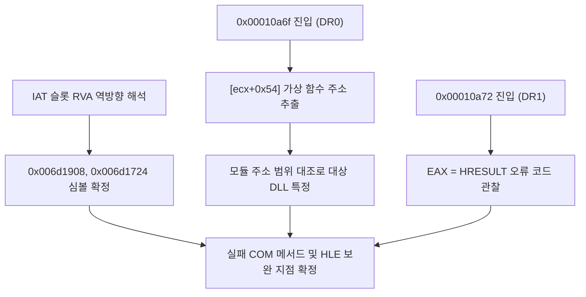
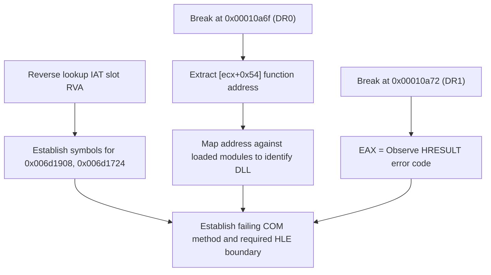

# EZ2DJ 4th 실패 가상 호출 대상 특정 설계

## 목적

Task 163에서 EZ2DJ 4th 초기화 중단 및 null receiver 접근 위반의 직접 원인이 `RVA 0x00010a6f`의 가상 호출 `call dword ptr [ecx+0x54]` 실패(반환값 `< 0`)로 인해 `0x8200000A`가 반환되어 guard 2에서 조기 이탈하는 것임을 확인했습니다.
이 작업은:
1. 실패 함수 및 선행 함수에서 호출하는 IAT 슬롯 `0x00ad1908`과 `0x00ad1724`(image_base 기준 RVA `0x006d1908`, `0x006d1724`)를 모듈 및 함수명으로 해석합니다.
2. 가상 호출 호출 지점(`0x00010a6f`)과 반환 지점(`0x00010a72`)에서 하드웨어 중단점을 설정하여, 호출되는 가상 함수의 실제 주소, 인터페이스 포인터, 전달 인자, 그리고 반환값을 관찰합니다.
3. 대상 함수 주소가 어떤 모듈(예: ddraw.dll, dsound.dll, dinput.dll 등)에 속하는지 식별하여 실패하는 COM 인터페이스 메서드와 실패 원인을 규명합니다.

## 확인된 전제

- 확인됨: guard 2는 `0x000106d2` -> `0x000107d9` -> `0x00010975` 호출 체인을 거치며 `0x00010a8a`에서 `0x8200000A`를 반환받아 이탈합니다.
- 확인됨: 실패 코드 `0x8200000A`는 `0x00010a6f`의 `call dword ptr [ecx+0x54]` 직후 `test eax, eax` / `jge` 실패 시에만 생성됩니다.
- 확인됨: `[ecx+0x54]`는 객체 vtable의 21번째 엔트리(0x54 / 4 = 21, 즉 22번째 함수)입니다.
- 확인됨: 주소 `0x00ad1908` 및 `0x00ad1724`는 `.idata` (IAT) 범위 내에 위치합니다.
- 미확정: 가상 호출이 가리키는 실제 COM 인터페이스 및 함수 포인터 주소, 그리고 반환된 구체적인 HRESULT 값.
- 미확정: IAT 슬롯 `0x006d1908` 및 `0x006d1724`가 가리키는 외부 API 심볼 이름.

## 동작 설계

- `iat_verifier`에 `ResolveIatSlot` 유틸리티를 추가하여, IAT slot RVA를 해당 모듈명 및 API 함수명(또는 ordinal)으로 역방향 해석할 수 있도록 합니다.
- launcher probe 실행 시 `0x006d1908`과 `0x006d1724` 슬롯을 해석하여 진단 로그에 기록합니다.
- launcher probe의 하드웨어 중단점(`DR0`–`DR3`) 대상을 다음 네 곳으로 변경합니다:
  1. `0x00010a6f`: 가상 호출 직전 (`virtual_call_site`). `ecx` (vtable), `edx` (인터페이스 포인터), `[ecx+0x54]` (가상 함수 주소), `[esp]` (인자).
  2. `0x00010a72`: 가상 호출 직후 (`virtual_call_return`). `eax` (가상 호출 반환 코드).
  3. `0x00010975`: 실패 함수 진입부 (`failing_func_entry`).
  4. `0x000107d9`: 실패 함수 호출 지점 (`guard2_call_site`).
- 가상 함수 주소(`[ecx+0x54]`)가 획득되면, 프로세스에 로드된 모듈 목록과 주소 범위를 대조하여 소속 모듈과 RVA를 판정합니다.

## 판정 기준

- IAT 슬롯이 유효한 외부 DLL 및 API 이름으로 해석되면 확인됨으로 판정합니다.
- 가상 호출 대상 주소가 시스템 DLL 또는 HLE 런타임 주소 공간 내에 매핑되면 해당 COM 인터페이스로 확정합니다.
- 가상 호출 직후 `EAX`에 남은 값이 표준 Windows HRESULT(음수)이면 해당 오류 원인을 분석합니다.

## 검증 전략

1. 단위 테스트: `ResolveIatSlot` 함수에 대한 단위 테스트를 실행합니다.
2. Windows x86 Debug 빌드 및 전체 단위 테스트 실행.
3. 실제 4th CHD를 확장 idle 경계와 함께 실행하여 진단 로그를 확인합니다.
4. 원본 바이너리 자산 내용이나 보안 문자열은 기록하지 않습니다.

---

# EZ2DJ 4th Failing Virtual Call Target Design

## Purpose

Task 163 confirmed that the direct cause of EZ2DJ 4th halting initialization and faulting with a null receiver is the failure of the virtual call `call dword ptr [ecx+0x54]` at `RVA 0x00010a6f` (returning `< 0`), which causes `0x8200000A` to be returned and triggers an early exit from guard 2.
This task:
1. Resolves IAT slots `0x00ad1908` and `0x00ad1724` (RVAs `0x006d1908` and `0x006d1724`) used by the failing and preceding functions to their imported module and function names.
2. Sets hardware breakpoints at the virtual call site (`0x00010a6f`) and its return site (`0x00010a72`) to observe the virtual function target address, interface pointer, argument, and return value.
3. Maps the target function address against loaded modules (e.g. ddraw.dll, dsound.dll, dinput.dll) to determine which COM interface method fails and why.

## Confirmed Premises

- Confirmed: guard 2 follows the call chain `0x000106d2` -> `0x000107d9` -> `0x00010975`, receiving `0x8200000A` from `0x00010a8a` and exiting early.
- Confirmed: failure constant `0x8200000A` is produced only when `test eax, eax` / `jge` fails immediately after `call dword ptr [ecx+0x54]` at `0x00010a6f`.
- Confirmed: `[ecx+0x54]` is the 21st vtable entry (0x54 / 4 = 21, the 22nd function) of the object.
- Confirmed: addresses `0x00ad1908` and `0x00ad1724` reside inside the `.idata` (IAT) range.
- Unresolved: the actual COM interface and function pointer address invoked by the virtual call, and the exact returned HRESULT value.
- Unresolved: the imported API symbol names for IAT slots `0x006d1908` and `0x006d1724`.

## Behavior

- Add `ResolveIatSlot` utility to `iat_verifier` to reverse-lookup an IAT slot RVA to its imported module name and function name or ordinal.
- Resolve slots `0x006d1908` and `0x006d1724` on probe startup and emit them as diagnostic events.
- Point the launcher probe's hardware breakpoints (`DR0`–`DR3`) to the four sites:
  1. `0x00010a6f`: Virtual call site (`virtual_call_site`). Read `ecx` (vtable), `edx` (interface ptr), `[ecx+0x54]` (virtual function target), `[esp]` (argument).
  2. `0x00010a72`: Virtual call return (`virtual_call_return`). Read `eax` (return code / HRESULT).
  3. `0x00010975`: Failing function entry (`failing_func_entry`).
  4. `0x000107d9`: Guard 2 caller site (`guard2_call_site`).
- When the target address `[ecx+0x54]` is captured, correlate it with loaded modules in the process to identify the target DLL and offset.

## Classification Criteria

- An IAT slot resolving to a valid external DLL and API symbol is marked as confirmed.
- When the virtual call target address maps within a loaded system DLL or HLE runtime, mark the COM interface as confirmed.
- When `EAX` on return contains a negative value, identify the corresponding HRESULT error code.

## Verification

1. Unit tests: run unit tests for `ResolveIatSlot`.
2. Windows x86 Debug build and full unit test suite.
3. Run with the real 4th CHD using the extended idle boundary and inspect diagnostic logs.
4. No original binary assets or proprietary strings will be stored.
