# Task 165: EZ2DJ 4th DirectDraw/Direct3D3 HLE 연결 및 IDirectDraw4::SetDisplayMode 동작 검증 설계

## 1. 개요 (Overview)

Task 164를 통해 EZ2DJ 4th가 초기화 과정에서 호출하는 `RVA 0x00010a6f` 가상 호출이 `IDirectDraw4::SetDisplayMode`이며, 현대 Windows의 시스템 `DDRAW.dll`이 `E_NOTIMPL` (`0x80004001`)을 반환하여 에러 코드 `0x8200000A`와 함께 guard 2에서 조기 이탈함으로써 널 포인터 크래시(`0x00434137`)가 발생함을 규명했습니다.

re2DJ 플랫폼 계층(`src/platform/windows/direct3d3_com_facade.cpp`)에는 이미 `IDirectDraw4` 및 `RootSetDisplayMode` 대체 구현이 마련되어 있으며, 640x480 16bpp 모드에 대해 `DD_OK`를 반환하도록 구현되어 있습니다.

본 태스크의 목표는 다음과 같습니다:
1. `ez2dj4th` 대상에 `--hle-d3d3` 적용을 허용하고, 원본 바이너리가 DirectDraw 인터페이스를 획득하는 경로(정적 IAT 슬롯 vs 동적 `GetProcAddress` vs 언패킹 IAT)를 규명합니다.
2. HLE DirectDraw가 주입되어 `IDirectDraw4::SetDisplayMode` 호출 시 re2DJ의 `RootSetDisplayMode`가 호출되어 `DD_OK` (`0`)를 반환하는지 검증합니다.
3. 반환값 정상화 후 guard 2 조기 이탈이 방지되고 필드 초기화기(`0x00018234`)에 진입하여 `+0x11c` 필드가 유효한 값으로 채워지는지 확인합니다.

---

This design describes Task 165: wiring DirectDraw/Direct3D3 HLE for EZ2DJ 4th and verifying the execution of the `IDirectDraw4::SetDisplayMode` replacement facade (`RootSetDisplayMode`).

---

## 2. 조사 및 아키텍처 분석 (Investigation and Architectural Analysis)

```mermaid
flowchart TD
    subgraph Current["현재 상태 (Task 164)"]
        A1["EZ2DJ.EXE"] -->|"DirectDrawCreate"| B1["시스템 DDRAW.dll"]
        B1 -->|"SetDisplayMode(640,480,16)"| C1["E_NOTIMPL (0x80004001)"]
        C1 --> D1["0x8200000A 에러 생성 및 guard 2 조기 이탈"]
        D1 --> E1["필드 초기화기 누락 -> Null Pointer Dereference Crash"]
    end

    subgraph Target["목표 상태 (Task 165)"]
        A2["EZ2DJ.EXE"] -->|"DirectDrawCreate Hook"| B2["re2DJ injected runtime Re2djHleDirectDrawCreate"]
        B2 -->|"IDirectDraw4 Facade 반환"| C2["re2DJ RootSetDisplayMode"]
        C2 -->|"640x480 16bpp 지원"| D2["DD_OK (0) 반환"]
        D2 --> E2["guard 2 통과! -> 0x00018234 필드 초기화기 실행"]
        E2 --> F2["+0x11c 필드 유효 포인터 등록 -> Null Crash 해소"]
    end
```

### 2.1 DirectDraw 생성 획득 경로 분석
- `ez2dj4th`의 `EZ2DJ.EXE`가 `DirectDrawCreate`를 어떻게 호출하는지 확인해야 합니다:
  1. **정적 IAT 확인**: `FindIatSlotByName(info, file, "DDRAW.dll", "DirectDrawCreate")`가 성공하는지 확인.
  2. **동적 획득 확인**: 만약 패커나 런타임 코드가 `GetProcAddress(hDDraw, "DirectDrawCreate")`를 사용한다면, `injected_runtime`의 `_Re2djHleGetProcAddress`에서 `"DirectDrawCreate"` 요청에 대해 `_Re2djHleDirectDrawCreate` 주소를 반환하도록 지원해야 합니다.
  3. **런타임 언패킹 IAT 패치**: 만약 정적 PE 헤더가 아닌 복구된 IAT에 있다면 엔트리 도달 후 런타임 IAT 슬롯을 교체해야 합니다.

### 2.2 ez2dj4th 타겟 프로파일 HLE 설정
- `src/target/target_profile.cpp`에서 `ez2dj4th`의 `run_defaults.hle_d3d3 = true` 지원 또는 launcher probe의 허용 검사 완화.
- launcher probe에서 `--hle-d3d3` 옵션이 주어졌을 때 `ez2dj4th`에 대한 D3D3/DirectDraw HLE runtime hook이 정상 주입되도록 보장.

---

## 3. 검증 전략 (Verification Strategy)

1. **단위 테스트**:
   - 기존 단위 테스트 1,253건 통과 유지.
2. **런타임 진단 실행 (`launcher_probe`)**:
   - `ez2dj4th` 대상에 `--hle-d3d3`를 적용하여 launcher probe 구동.
   - `null_context_entry_trace`를 통해:
     * `virtual_call_site` (`0x00010a6f`): 가상 함수 대상이 re2DJ의 `RootSetDisplayMode`로 교체되었는지 확인.
     * `virtual_call_return` (`0x00010a72`): 반환값 `EAX`가 `0` (`DD_OK`)인지 확인.
     * `guard2_call_site` (`0x000107d9`): 반환값 `EAX`가 `0`인지 확인.
     * 필드 초기화기 (`0x00018234`): 진입 성공 여부 및 `+0x11c` 필드 값 변화 관찰.
