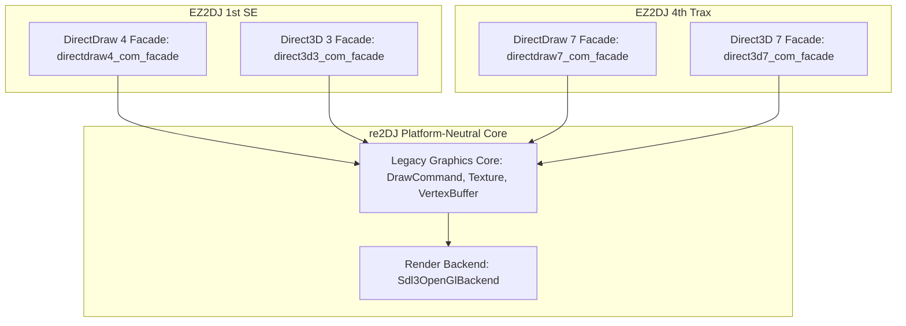

# 20260904-166 IDirect3D7 / IDirectDraw7 COM Facade 분리 설계
# 20260904-166 IDirect3D7 / IDirectDraw7 COM Facade Separation Design

## 1. 배경 및 목적 (Background & Objectives)

EZ2DJ 4th Trax 실행 분석(Task 165)을 통해 게스트가 런타임에 동적으로 `DirectDrawCreateEx`를 호출하여 `IID_IDirectDraw7` (`15e65ec0-3b9c-11d2-b92f-00609797ea5b`)을 생성한 후, `QueryInterface(IID_IDirect3D7)` (`f5049e77-4861-11d2-a407-00a0c90629a8`) 및 `IDirectDraw4/7::GetCaps`를 거쳐 3D 디바이스 초기화 루틴으로 진입함을 확인하였다.

기존 re2DJ의 그래픽 HLE는 DirectX 6 기반의 `direct3d3_com_facade.cpp` 파일 하나에 `IDirectDraw4`, `IDirect3D3`, `IDirect3DDevice3`, `IDirectDrawSurface4` 등이 하나로 결합되어 있었다. 그러나 DirectX 7은 `IDirect3D7` 및 `IDirect3DDevice7`의 vtable 구조가 DirectX 6(`IDirect3D3`/`IDirect3DDevice3`)과 상이하며, DirectDraw와 Direct3D의 책임 범위도 다르다.

따라서 사용자의 요구사항에 따라 **DirectDraw와 Direct3D의 인터페이스를 버전별로 독립된 파일로 분리**하고, EZ2DJ 4th Trax가 요구하는 **`IDirect3D7` 및 `IDirectDraw7` 전용 COM Facade**를 체계적으로 설계·구현한다.

Through the EZ2DJ 4th Trax runtime analysis (Task 165), it was confirmed that the guest dynamically calls `DirectDrawCreateEx` at runtime to create `IID_IDirectDraw7` (`15e65ec0-3b9c-11d2-b92f-00609797ea5b`), queries `QueryInterface(IID_IDirect3D7)` (`f5049e77-4861-11d2-a407-00a0c90629a8`), calls `IDirectDraw4/7::GetCaps`, and proceeds into 3D device initialization.

re2DJ's previous graphics HLE coupled `IDirectDraw4`, `IDirect3D3`, `IDirect3DDevice3`, and `IDirectDrawSurface4` within a single file (`direct3d3_com_facade.cpp`). However, DirectX 7 features a distinct vtable layout for `IDirect3D7` and `IDirect3DDevice7` compared to DirectX 6, and the responsibilities of DirectDraw versus Direct3D diverge.

Therefore, according to the user request, we **separate DirectDraw and Direct3D interfaces into version-distinct dedicated files**, and systematically design and implement dedicated **`IDirect3D7` and `IDirectDraw7` COM Facades** required by EZ2DJ 4th Trax.

---

## 2. 아키텍처 및 파일 구조 분리 설계 (Architecture & File Separation Design)

### 파일 분리 구조 (Target File Structure)

1. **DirectDraw 4 & Direct3D 3 (기존 DirectX 6 경로 보존)**:
   - `src/platform/windows/directdraw4_com_facade.h` / `.cpp`: `IDirectDraw4`, `IDirectDrawSurface4` vtable 및 2D 표면 관리.
   - `src/platform/windows/direct3d3_com_facade.h` / `.cpp`: `IDirect3D3`, `IDirect3DDevice3`, `IDirect3DViewport3`, `IDirect3DVertexBuffer` vtable.
   *(기존 호환성을 해치지 않도록 단계적으로 분리하거나 adapter 연결)*

2. **DirectDraw 7 & Direct3D 7 (신규 DirectX 7 경로)**:
   - `src/platform/windows/directdraw7_com_facade.h` / `.cpp`: `IDirectDraw7`, `IDirectDrawSurface7` vtable, `DirectDrawCreateEx` 진입점, 모드 설정(`SetDisplayMode`, `SetCooperativeLevel`).
   - `src/platform/windows/direct3d7_com_facade.h` / `.cpp`: `IDirect3D7`, `IDirect3DDevice7`, `IDirect3DVertexBuffer7` vtable.

3. **공통 상태 및 어댑터 (Shared COM Context)**:
   - `src/platform/windows/directdraw_com_context.h`: Facade 인스턴스 간(Root, Surface, Device) 공통 데이터(`HWND`, width, height, bpp, render backend 포인터, diagnostic sequence 등)를 정의하여 버전별 facade 파일들이 깔끔하게 공유.

---

## 3. IDirect3D7 및 IDirectDraw7 vtable 명세 (Interface Specifications)

### 3.1 IDirect3D7 Vtable Layout
DirectX 7 SDK 공식 COM 바이너리 레이아웃:
1. `QueryInterface` (`HRESULT(REFIID, void**)`)
2. `AddRef` (`ULONG()`)
3. `Release` (`ULONG()`)
4. `EnumDevices` (`HRESULT(LPD3DENUMDEVICESCALLBACK7, void*)`)
5. `CreateDevice` (`HRESULT(REFCLSID, IDirectDrawSurface7*, IDirect3DDevice7**)`)
6. `CreateVertexBuffer` (`HRESULT(D3DVERTEXBUFFERDESC7*, IDirect3DVertexBuffer7**, DWORD)`)
7. `EnumZBufferFormats` (`HRESULT(REFCLSID, LPD3DENUMZBUFFERFORMATSCALLBACK, void*)`)
8. `EvictManagedTextures` (`HRESULT()`)

### 3.2 IDirect3DDevice7 Vtable Layout
DirectX 7 디바이스 vtable (Viewport, Light, Transform 등이 디바이스에 직접 통합):
- `TestCooperativeLevel`, `GetCaps`, `BeginScene`, `EndScene`
- `SetRenderTarget`, `GetRenderTarget`, `Clear`
- `SetTransform`, `GetTransform`, `MultiplyTransform`
- `SetViewport`, `GetViewport`
- `SetRenderState`, `GetRenderState`, `SetTexture`, `GetTexture`, `SetTextureStageState`
- `DrawPrimitive`, `DrawIndexedPrimitive`, `DrawPrimitiveVB`, `DrawIndexedPrimitiveVB`

### 3.3 IDirectDraw7 Vtable Layout
- 인덱스 20 (`0x50`): `SetCooperativeLevel(HWND, DWORD)`
- 인덱스 21 (`0x54`): `SetDisplayMode(DWORD width, DWORD height, DWORD bpp, DWORD refresh_rate, DWORD flags)` -> Task 164에서 발견된 호출 목표 지점!
- 인덱스 6 (`0x18`): `CreateSurface(DDSURFACEDESC2*, IDirectDrawSurface7**, IUnknown*)`

---

## 4. 단계별 구현 및 검증 계획 (Implementation & Verification Plan)

1. **공통 COM 컨텍스트 추출 (`directdraw_com_context.h`)**:
   - 기존 `direct3d3_com_facade.cpp` 내부의 `RootFacade` 공통 상태 필드들을 독립 헤더로 정의.
2. **신규 `direct3d7_com_facade.h/.cpp` 구현**:
   - `IDirect3D7` 및 `IDirect3DDevice7` vtable 구현.
   - `EnumDevices` 및 `CreateDevice`를 통해 공용 legacy 렌더러에 바인딩.
3. **신규 `directdraw7_com_facade.h/.cpp` 구현**:
   - `Re2djHleDirectDrawCreateEx` 진입점 제공.
   - `IDirectDraw7` 인터페이스 구현 (`SetDisplayMode`가 `DD_OK` 반환).
   - `QueryInterface`에서 `IID_IDirect3D7` 요청 시 `direct3d7_com_facade`의 인스턴스 반환.
4. **빌드 및 런타임 검증**:
   - `re2dj_unit_tests.exe` 통과 확인.
   - `re2dj_windows_x86_launcher_probe.exe`를 통해 EZ2DJ 4th에서 `DirectDrawCreateEx` -> `QueryInterface(IDirect3D7)` -> `IDirect3D7::EnumDevices/CreateDevice` -> `IDirectDraw7::SetDisplayMode` (`0x00010a6f`) 정상 도달 및 `DD_OK` 반환 검증.
