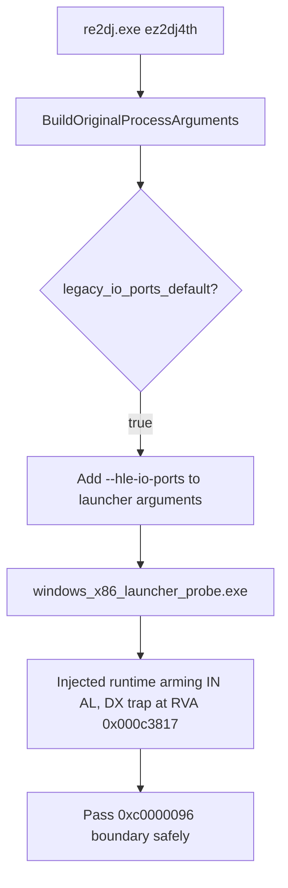

# 20260904-167 EZ2DJ 4th hle-io-ports 기본 활성화 설계
# 20260904-167 EZ2DJ 4th Enable hle-io-ports by Default Design

## 1. 배경 및 목적 (Background & Objectives)

EZ2DJ 4th Trax 실행 시, `re2dj.exe ez2dj4th` (제품 기본 실행) 명령어를 사용했을 때 `0xc0000096` (`STATUS_PRIVILEGED_INSTRUCTION`) 예외가 발생하며 프로세스가 조기 종료되었다. 이는 `EZ2DJ.EXE`의 RVA `0x000c3817` (`0x004c3817`)에서 실행되는 하드웨어 I/O 포트(`0x0103`) 입력 명령어(`IN AL, DX`)가 HLE 포트 트랩 없이 실행되었기 때문이다.

이전에는 4th의 raw I/O 계약이 미확정 상태였기 때문에 opt-in(`legacy_io_ports_default = false`)으로 유지되었으나, 사용자의 명시적 요청에 따라 `ez2dj4th` 타겟 프로파일의 `run_defaults.lptdi.legacy_io_ports_default`를 `true`로 승격하여 기본 실행 시에도 `--hle-io-ports`가 자동으로 전달되도록 한다.

When running `re2dj.exe ez2dj4th` (standard product execution), the process terminated prematurely with exception `0xc0000096` (`STATUS_PRIVILEGED_INSTRUCTION`). This occurred because the hardware I/O port (`0x0103`) input instruction (`IN AL, DX`) executed at RVA `0x000c3817` (`0x004c3817`) in `EZ2DJ.EXE` without the HLE port trap active.

Previously, because 4th's raw I/O contract was unconfirmed, it was kept opt-in (`legacy_io_ports_default = false`). Following the user's explicit request, we promote `run_defaults.lptdi.legacy_io_ports_default` to `true` in the `ez2dj4th` target profile so that `--hle-io-ports` is automatically passed during default execution.

---

## 2. 변경 대상 (Modifications)

1. **`src/target/target_profile.cpp`**:
   - `ez2dj4th` 프로파일 정의에서 `entry.profile.run_defaults.lptdi.legacy_io_ports_default = true;` 설정 추가.
2. **`src/tools/windows_product_loader_probe/main.cpp`**:
   - `chd_handoff` 검증에서 `arguments.size() == 17` 기대값 및 `--hle-io-ports` 포함 검증 갱신.
   - `fourth_profile->profile.run_defaults.lptdi.legacy_io_ports_default` 기대값 `true` 반영.
