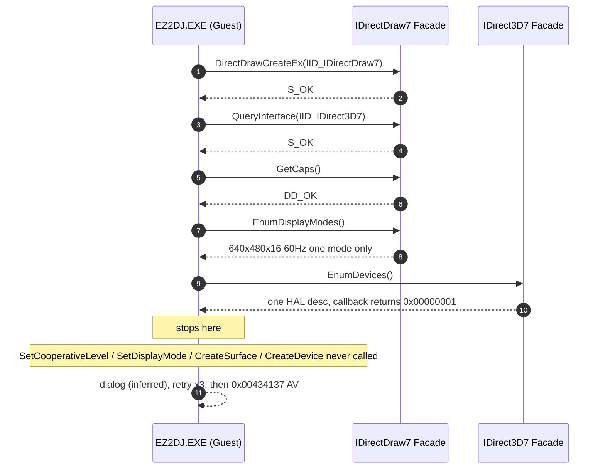
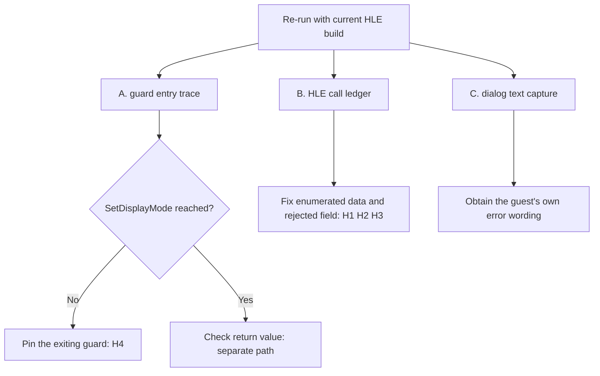

# 20260904-168 EZ2DJ 4th D3D7 초기화 조기 중단 지점 특정 설계
# 20260904-168 EZ2DJ 4th D3D7 Initialization Early-Abort Localization Design

## 1. 배경 및 목적 (Background & Objectives)

Task 167로 `--hle-io-ports`가 기본 인자에 포함되면서 `re2dj.exe ez2dj4th` 제품 실행은 `0xc0000096`(`STATUS_PRIVILEGED_INSTRUCTION`) 경계를 넘었고, 종료 코드가 `0xc0000005`로 바뀌었다. 즉 남은 정지 지점은 그래픽 초기화 경로 하나다.

Task 163·164에서 확정한 원래 실패 경로는 guard 2(`RVA 0x00011838`) 조기 이탈이었고, 그 직접 원인은 `RVA 0x00010a6f`의 `call dword ptr [ecx+0x54]`(`IDirectDraw7::SetDisplayMode`)가 순정 `DDRAW.dll`에서 `0x80004001`(`E_NOTIMPL`)을 반환한 것이었다.

Task 165·166으로 `IDirectDraw7` / `IDirect3D7` HLE facade를 붙인 뒤에는 **`SetDisplayMode` 호출 자체가 관측되지 않는다.** 즉 실패 지점이 guard 2보다 **앞으로 이동**했다. 본 설계의 목적은 그 이동한 중단 지점을 실행 증거로 특정하는 것이다.

After Task 167 promoted `--hle-io-ports` into the default arguments, the `re2dj.exe ez2dj4th` product run cleared the `0xc0000096` (`STATUS_PRIVILEGED_INSTRUCTION`) boundary and its exit code changed to `0xc0000005`. The single remaining stop is therefore in the graphics initialization path.

The failure path confirmed in Tasks 163 and 164 was the early exit at guard 2 (`RVA 0x00011838`), directly caused by `call dword ptr [ecx+0x54]` at `RVA 0x00010a6f` (`IDirectDraw7::SetDisplayMode`) returning `0x80004001` (`E_NOTIMPL`) from the stock `DDRAW.dll`.

After Tasks 165 and 166 attached the `IDirectDraw7` / `IDirect3D7` HLE facades, **the `SetDisplayMode` call is no longer observed at all.** The failure point has moved **earlier** than guard 2. This design localizes that moved abort point with execution evidence.

---

## 2. 현재까지 확인된 사실 (Facts Established So Far)

`20260904-005052-508.jsonl`(attached, `hle_io_ports=true`, `run_detached=false`)과 사용자 제품 실행 로그 `20260904-010601-836.jsonl`(detached)에서 확인한 내용이다.

- **확인됨 — HLE facade가 호출된 메서드 목록.** 한 번의 초기화 시도마다 `DirectDrawCreateEx` → `IDirectDraw7::QueryInterface(IID_IDirectDraw7)` → `QueryInterface(IID_IDirect3D7)` → `IDirectDraw7::GetCaps` → `IDirectDraw7::EnumDisplayModes` → `IDirect3D7::EnumDevices` 순서로 6개 메서드만 호출된다.
- **확인됨 — 게스트 콜백은 `0x00000001`(`D3DENUMRET_OK`)을 반환한다.** 열거를 계속하라는 값이며, 장치 선택 완료(`D3DENUMRET_CANCEL`)가 아니다.
- **확인됨 — 같은 시퀀스가 3회 반복된다.** 매 회 `DirectDrawCreateEx`부터 다시 시작한다.
- **확인됨 — AV 지점은 이전과 동일하다.** thread 34048에서 `0x00434137`, `mov ecx,[eax+0x14]`, `EAX=ECX=0`, 참조 주소 `0x00000014`. 호출자 `0x00417dc2`가 이미 null receiver를 전달한다.
- **추정 — `SetDisplayMode`·`SetCooperativeLevel`·`CreateSurface`·`CreateDevice`는 실행되지 않았다.** 네 메서드 모두 진입 즉시 `OutputDebugStringA`를 남기는데 캡처된 스트림에 나타나지 않는다. 부재 기반 판단이므로 진입 추적으로 확인이 필요하다.
- **추정 — 3회 반복 사이에 모달 대화상자가 표시된다.** `comctl32`(WinSxS v6), `dui70.dll`, `duser.dll`, `InputSwitch.dll`, `DWrite.dll`, `d3d11.dll`, `dcomp.dll`이 두 차례 무리지어 적재된다. 이는 현대 Windows의 대화상자·IME 스택 형태다. 문자열 증거는 아직 없다.
- **확인됨 — 제품(detached) 실행에는 그래픽 HLE 증거가 전혀 남지 않는다.** DX7 facade는 `OutputDebugStringA`만 사용하고, 디버거가 붙지 않은 제품 실행에서는 그 출력이 수집되지 않는다. `graphics_trace` 이벤트가 가리키는 `.ddraw.log`는 생성되지 않았다.

These come from `20260904-005052-508.jsonl` (attached, `hle_io_ports=true`, `run_detached=false`) and the user's product run log `20260904-010601-836.jsonl` (detached).

* **Confirmed — the list of HLE facade methods actually called.** Each initialization attempt calls exactly six methods, in order: `DirectDrawCreateEx` → `IDirectDraw7::QueryInterface(IID_IDirectDraw7)` → `QueryInterface(IID_IDirect3D7)` → `IDirectDraw7::GetCaps` → `IDirectDraw7::EnumDisplayModes` → `IDirect3D7::EnumDevices`.
* **Confirmed — the guest callback returns `0x00000001` (`D3DENUMRET_OK`).** That value asks enumeration to continue; it is not the device-selected (`D3DENUMRET_CANCEL`) answer.
* **Confirmed — the same sequence repeats three times,** restarting from `DirectDrawCreateEx` each time.
* **Confirmed — the access violation site is unchanged.** Thread 34048 faults at `0x00434137` on `mov ecx,[eax+0x14]` with `EAX=ECX=0`, referencing `0x00000014`. Caller `0x00417dc2` already passes a null receiver.
* **Inferred — `SetDisplayMode`, `SetCooperativeLevel`, `CreateSurface`, and `CreateDevice` never executed.** All four emit `OutputDebugStringA` on entry, and none appear in the captured stream. This is absence-based reasoning and needs entry-trace confirmation.
* **Inferred — a modal dialog is shown between the three attempts.** `comctl32` (WinSxS v6), `dui70.dll`, `duser.dll`, `InputSwitch.dll`, `DWrite.dll`, `d3d11.dll`, and `dcomp.dll` load in two bursts, which is the modern Windows dialog/IME stack. No string evidence exists yet.
* **Confirmed — the product (detached) run leaves no graphics HLE evidence at all.** The DX7 facades use only `OutputDebugStringA`, which nothing collects without an attached debugger, and the `.ddraw.log` named by the `graphics_trace` event was never created.

---

## 3. 실행 흐름 현황 (Current Execution Flow)

---

## 4. 가설 (Hypotheses)

| # | 가설 (Hypothesis) | 판별 방법 (How to decide) |
| - | - | - |
| H1 | 게스트가 `D3DDEVICEDESC7` 내용을 보고 장치를 거부한다. 현재 desc는 `dwDevCaps` 2비트와 텍스처 한계값만 채우고 `dpcTriCaps`·`dpcLineCaps`·`dwTextureOpCaps`·`wMaxSimultaneousTextures`가 전부 0이다. | `EnumDevices` 콜백 복귀 지점부터 분기 추적으로 어떤 필드 오프셋을 읽고 비교하는지 관측 |
| H2 | 게스트가 요구하는 디스플레이 모드가 목록에 없다. 현재 `EnumDisplayModes`는 640x480x16 60Hz 하나만 열거한다. | 콜백에 전달한 `DDSURFACEDESC2` 값과 게스트 콜백 반환값을 모두 기록 |
| H3 | `deviceGUID`가 기대와 다르다. 현재 `IID_IDirect3DHALDevice`에 `D3DDEVCAPS_HWTRANSFORMANDLIGHT`를 함께 세워 T&L HAL(`IID_IDirect3DTnLHalDevice`)과 조합이 어긋난다. | 열거 장치를 RGB·HAL·TnLHAL로 늘렸을 때 게스트 반응 변화 관측 |
| H4 | 중단 판정이 guard 2가 아니라 그보다 앞선 guard 0(`0x00011714`) 또는 guard 1(`0x00011738`)로 이동했다. | Task 162·163의 guard 진입 추적을 현재 빌드에서 재실행 |

H1–H3은 서로 배타적이지 않으며, H4는 나머지와 독립적으로 중단 위치를 좁힌다.

H1 through H3 are not mutually exclusive, and H4 narrows the abort location independently of the others.

---

## 5. 진단 설계 (Diagnostic Design)

세 갈래 증거를 같은 실행에서 모은다.

Three evidence streams are collected from the same run.

### A. guard 진입 추적 재실행 (Guard entry-trace re-run)

`kNullContextEntryPoints`의 앵커(`0x00010a6f` virtual_call_site, `0x00010a72` virtual_call_return, `0x00010975` failing_func_entry, `0x000107d9` guard2_call_site)와 Task 162의 guard 이탈 앵커(`0x00011714`, `0x00011738`, `0x00011838`, `0x000106d2`)를 현재 HLE 빌드에서 다시 관측한다. 새 코드를 쓰기보다 기존 앵커 테이블을 이번 질문에 맞게 재조준하는 것이 우선이다.

Re-observe the existing anchors in `kNullContextEntryPoints` (`0x00010a6f` virtual_call_site, `0x00010a72` virtual_call_return, `0x00010975` failing_func_entry, `0x000107d9` guard2_call_site) together with Task 162's guard exit anchors (`0x00011714`, `0x00011738`, `0x00011838`, `0x000106d2`) under the current HLE build. Retargeting the existing anchor table at this question comes before writing new instrumentation.

### B. HLE 호출 원장 (HLE call ledger)

DX7 facade의 진단을 `OutputDebugStringA`에서 `g_re2dj_graphics_trace_path`(`.ddraw.log`) 기록으로 옮긴다. `direct3d3_com_facade.cpp`가 이미 같은 전역을 쓰므로 새 메커니즘이 아니라 기존 경로의 재사용이다. 이렇게 하면 detached 제품 실행에서도 같은 증거가 남는다.

기록 항목은 다음과 같다.

1. 호출된 모든 vtable 메서드의 이름, 주요 인자, 반환 `HRESULT`.
2. `EnumDisplayModes`가 콜백에 넘긴 각 `DDSURFACEDESC2`의 width·height·bpp·refresh와 게스트 콜백 반환값.
3. `EnumDevices`가 콜백에 넘긴 `D3DDEVICEDESC7`의 `deviceGUID`·`dwDevCaps`·주요 caps 필드와 게스트 콜백 반환값.

Move the DX7 facades' diagnostics from `OutputDebugStringA` to the `g_re2dj_graphics_trace_path` (`.ddraw.log`) sink. `direct3d3_com_facade.cpp` already writes to the same global, so this reuses an existing path rather than introducing a mechanism. It also makes the evidence survive a detached product run.

The ledger records: every called vtable method's name, key arguments, and returned `HRESULT`; each `DDSURFACEDESC2` handed to the `EnumDisplayModes` callback with the guest's return value; and the `D3DDEVICEDESC7` handed to the `EnumDevices` callback with the guest's return value.

### C. 대화상자 문자열 포착 (Dialog text capture)

`MessageBoxA` / `MessageBoxW` 경계를 추가해 caption과 text를 진단 로그에 남기고 기본 응답을 즉시 반환한다. 게스트가 스스로 출력하는 오류 문구는 실패 단계를 가장 직접적으로 지목한다.

Task 163은 "오류 메시지 문자열 내용 기록"을 명시적으로 비범위로 두었다. 그 판단은 그 작업의 범위 한정이었고 원본 자산 내용 유출 방지 규칙과는 별개이므로, 본 작업에서 되살리려면 사용자 승인이 필요하다. 기록 대상은 게스트가 화면에 띄우려던 오류 문구에 한정하고, 원본 자산 내용이나 Hardlock secret은 기록하지 않는다.

Add a `MessageBoxA` / `MessageBoxW` boundary that records the caption and text into the diagnostic log and returns a default answer immediately. The error text the guest tries to display names the failing step more directly than any other signal.

Task 163 explicitly placed "recording the error message text" out of scope. That was a scope limit for that task rather than an asset-handling rule, so reviving it here needs the user's approval. Recording stays limited to the error text the guest itself was about to display; original asset contents and Hardlock secrets are never recorded.

---

## 6. 판정 기준 (Decision Criteria)

- A에서 `0x00010a6f` hit가 0건이면 `SetDisplayMode` 미도달이 부재 추정이 아니라 확인 사실이 되고, 어느 guard가 이탈했는지로 중단 위치가 확정된다.
- A에서 `0x00010a6f` hit가 있고 반환값이 `DD_OK`이면 중단은 그 이후이며, 조사 대상이 field initializer(`0x00018234`) 경로로 이동한다.
- B에서 `EnumDevices` 이후 호출된 메서드가 하나도 없으면 거부 판정은 열거 데이터 자체에 있다(H1·H2·H3).
- C에서 문구를 얻으면 어느 단계(DirectDraw / Direct3D / 디스플레이 모드)의 실패인지 게스트 표현으로 확정된다.

* If A records zero hits at `0x00010a6f`, the non-arrival at `SetDisplayMode` becomes a confirmed fact rather than an absence inference, and the exiting guard pins the abort location.
* If A records a hit at `0x00010a6f` returning `DD_OK`, the abort lies after it and the investigation moves to the field-initializer (`0x00018234`) path.
* If B shows no method called after `EnumDevices`, the rejection lives in the enumerated data itself (H1, H2, H3).
* If C yields the text, the guest's own wording fixes which stage — DirectDraw, Direct3D, or display mode — failed.

---

## 7. 범위 확정 (Scope Decision)

사용자가 진단과 열거 데이터 확장을 한 작업에서 함께 수행하기로 결정했고, 대화상자 문구 기록도 승인했다. 따라서 5절의 A·B·C 세 갈래와 열거 데이터 확장을 같은 실행에서 관측한다. 확장이 통과시키더라도 어느 속성이 원인이었는지 남기기 위해 B의 원장은 확장 전후 모두 같은 형식으로 기록한다.

The user decided to run the diagnosis and the enumeration expansion in one task, and approved the dialog-text capture. All three streams in section 5 plus the enumeration expansion are therefore observed in the same run. The section B ledger records the same format before and after the expansion so the responsible attribute stays visible even if the expansion makes the guest proceed.

---

## 8. 비범위 (Out of Scope)

- `0x00acd708 + 0x11c` field 직접 주입 또는 게스트 코드 patch.
- Hardlock 응답 material 변경.
- Linux · Web 호스트 경로 변경.

* Direct injection into `0x00acd708 + 0x11c`, or patching guest code.
* Changing Hardlock response material.
* Changing the Linux or Web host paths.
