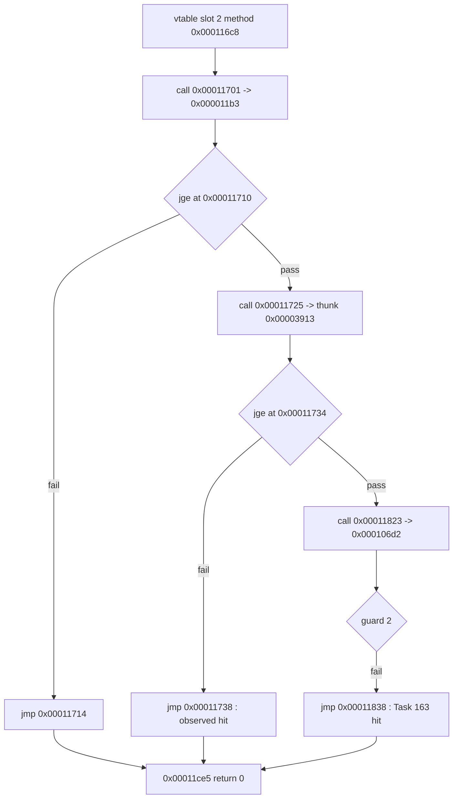
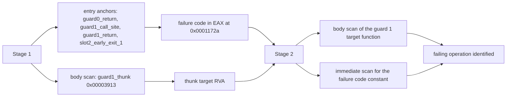

# 20260904-169 EZ2DJ 4th guard 1 실패 원인 추적 설계
# 20260904-169 EZ2DJ 4th Guard 1 Failure Source Design

## 1. 배경 및 목적 (Background & Objectives)

Task 168에서 DirectX 7 HLE facade 연결 후의 중단 지점이 guard 2가 아니라 **guard 1**(`RVA 0x00011738`)임을 실행 증거로 확정했다. 같은 작업에서 디스플레이 모드 15개·장치 3개로 열거를 확장하고 `D3DDEVICEDESC7` caps를 채웠으나 동작은 변하지 않았으므로, 열거 데이터는 원인이 아니다.

본 설계의 목적은 Task 163이 guard 2에 대해 수행한 절차를 guard 1에 그대로 적용해, guard 1의 호출이 반환하는 실패 코드와 그 코드가 생성되는 지점을 확정하는 것이다.

Task 168 established with execution evidence that the abort under the DirectX 7 HLE facades is at **guard 1** (`RVA 0x00011738`), not guard 2. The same task expanded enumeration to 15 display modes and three devices and filled the `D3DDEVICEDESC7` caps without changing the behavior, so the enumerated data is not the cause.

This design applies the procedure Task 163 used for guard 2 to guard 1, establishing the failure code guard 1's call returns and where that code is produced.

---

## 2. 확인된 정적 구조 (Confirmed Static Structure)

`20260904-014116-832.jsonl`의 `vtable_slot2_method` 분기 목록(범위 `0x000116c8`–`0x00011c48`, 110건, `capped=false`)에서 확인했다. 이 목록은 런타임에 언패킹된 `.text`를 읽어 만든 것이다. 디스크의 `.text`는 암호화되어 있어 정적 디스어셈블로는 같은 결과를 얻을 수 없다.

Confirmed from the `vtable_slot2_method` branch listing in `20260904-014116-832.jsonl` (range `0x000116c8`–`0x00011c48`, 110 entries, `capped=false`). The listing is built from the runtime-unpacked `.text`; the on-disk `.text` is encrypted, so static disassembly cannot reproduce it.

| guard | call site | call target | return site | 성공 분기 (pass branch) | 실패 이탈 (failure exit) |
| - | - | - | - | - | - |
| 0 | `0x00011701` | `0x000011b3` | `0x00011706` | `jge` `0x00011710` → `0x00011719` | `jmp` `0x00011714` → `0x00011ce5` |
| 1 | `0x00011725` | `0x00003913` (thunk) | `0x0001172a` | `jge` `0x00011734` → `0x0001173d` | `jmp` `0x00011738` → `0x00011ce5` |
| 2 | `0x00011823` | `0x0000317f` (thunk) → `0x000106d2` | `0x00011828` | — | `jmp` `0x00011838` → `0x00011ce5` |

guard 2 행은 Task 162·163에서 확정한 값이다. 세 guard 모두 실패 시 `xor eax, eax` 후 같은 `0x00011ce5`로 합류한다.

The guard 2 row comes from Tasks 162 and 163. All three guards perform `xor eax, eax` on failure and converge on the same `0x00011ce5`.

---

## 3. 미확정 항목 (Open Questions)

1. guard 1 호출의 반환값. `0x0001172a`에서의 `EAX`는 아직 관측되지 않았다.
2. thunk `0x00003913`의 최종 대상 함수 RVA.
3. 그 함수에서 실패 코드가 생성되는 지점과, 실패로 판정되는 연산.

1. The return value of guard 1's call. `EAX` at `0x0001172a` has not been observed.
2. The final target function RVA behind thunk `0x00003913`.
3. Where the failure code is produced inside that function, and which operation is judged to have failed.

---

## 4. 진단 설계 (Diagnostic Design)

Task 163과 같은 2단계 구성이다. 1단계 결과가 2단계의 앵커를 정하므로 빌드는 두 번 필요하다.

Two stages, as in Task 163. The first stage's result supplies the second stage's anchors, so two builds are required.

### 4.1 1단계 (Stage 1)

- `kNullContextEntryPoints`를 `guard0_return`(`0x00011706`), `guard1_call_site`(`0x00011725`), `guard1_return`(`0x0001172a`), `slot2_early_exit_1`(`0x00011738`) 네 개로 재조준한다. 하드웨어 debug register가 4개이므로 이 조합이 상한이다.
- `guard0_return`의 `EAX`로 guard 0이 실제로 통과하는지 자기 검증하고, `guard1_return`의 `EAX`로 실패 코드를 얻는다.
- 참조 스캔의 `bodies` 목록에 `{"guard1_thunk", 0x00003913, 0x00000008, 0}`을 추가해 thunk의 `jmp` 대상을 한 번의 실행으로 함께 얻는다.

### 4.2 2단계 (Stage 2)

- 1단계에서 얻은 대상 함수 RVA를 `bodies`에 `guard1_target`으로 추가해 분기 목록을 수집한다.
- 1단계에서 얻은 실패 코드를 참조 스캔 값 목록에 추가해 `.text`에서 그 상수를 만드는 지점을 모두 찾는다. Task 163에서 `0x8200000a`의 생성 지점이 `.text` 전체에 하나뿐이었던 것처럼, 유일성 자체가 판정 근거가 된다.
- 생성 지점 주변을 앵커로 추가해 코드 창을 수집하고, 그 직전 연산이 무엇인지 확인한다.

---

## 5. 판정 기준 (Decision Criteria)

- `guard0_return`의 `EAX`가 0 이상이고 `guard1_return`의 `EAX`가 음수이면, 이탈 위치가 guard 1이라는 Task 168 결론이 반환값 수준에서 재확인된다.
- 실패 코드가 `0x8200000N` 계열이면 Task 163에서 확인한 프로그램 정의 오류 계열과 같은 종류이므로, 생성 지점을 `.text` 스캔으로 특정할 수 있다.
- 실패 코드가 `HRESULT` 형태의 시스템 값이면 원인은 HLE facade가 반환한 값 자체이므로, 호출 원장(`.ddraw.log`)의 어느 항목과 대응하는지로 좁힌다.

* If `EAX` at `guard0_return` is non-negative and `EAX` at `guard1_return` is negative, Task 168's conclusion is reconfirmed at the return-value level.
* If the failure code is in the `0x8200000N` family, it is the same application-defined class Task 163 confirmed, and its origin can be pinned by scanning `.text`.
* If the failure code is a system `HRESULT`, the cause is a value the HLE facade itself returned, and the call ledger in `.ddraw.log` narrows which call it came from.

---

## 6. 비범위 (Out of Scope)

- 실패하는 연산의 동작 변경. 본 작업은 원인 특정까지이며, 수정은 원인이 확정된 뒤 다룬다.
- `0x00acd708 + 0x11c` field 직접 주입 또는 게스트 코드 patch.
- Hardlock 응답 material 변경.
- 열거 데이터의 추가 확장. Task 168에서 원인이 아님이 확인되었다.
- `direct3d3_com_facade`(DirectX 6 경로) 변경.

* Changing the behavior of the failing operation. This task ends at cause localization.
* Direct injection into `0x00acd708 + 0x11c`, or patching guest code.
* Changing Hardlock response material.
* Further enumeration expansion, which Task 168 ruled out as the cause.
* Changing `direct3d3_com_facade` (the DirectX 6 path).
