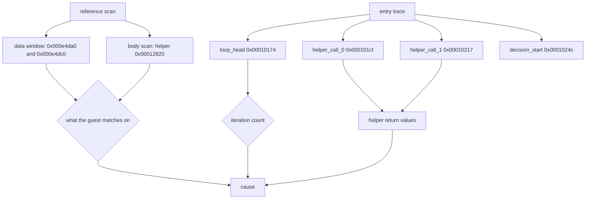

# 20260904-170 EZ2DJ 4th 장치 선택 입력 관측 설계
# 20260904-170 EZ2DJ 4th Device Selection Input Observation Design

## 1. 배경 및 목적 (Background & Objectives)

Task 169에서 guard 1의 호출 대상 `RVA 0x0001010f`가 후보 슬롯 4개를 모두 0으로 두고 `0x81000004`를 반환한다는 것을 확정했다. 남은 질문은 그 앞의 루프가 0회 도는지, 돌지만 후보를 채우지 못하는지였다.

Task 169가 수집한 코드 창을 다시 읽어 루프 본문의 구조가 드러났다. 루프는 레코드의 `+0x28` 필드를 인자로 helper를 부르고, 두 개의 `.rdata` 상수와 비교한다.

```
0x000101b9  push 0x004e4da0                 ; 비교 대상 1
0x000101be  mov  edx, [ebp-0x0c]            ; 인덱스
0x000101c1  imul edx, edx, 0x4d0
0x000101c7  mov  eax, [ebp-0x14]            ; base
0x000101ca  mov  ecx, [eax+edx+0x28]        ; 레코드의 +0x28 필드
0x000101ce  push ecx
0x000101cf  call 0x00012820                 ; helper(record+0x28, 상수)
0x000101d4  add  esp, 8                     ; cdecl 2인자
0x000101d7  test eax, eax
0x000101d9  je   0x000101ee                 ; 0이면 불일치

0x00010201  push 0x004e4dc0                 ; 비교 대상 2
0x00010217  call 0x00012820                 ; 같은 helper
0x00010221  je   0x00010236                 ; 0이면 불일치
```

즉 루프는 **레코드의 `+0x28` 포인터를 두 개의 프로그램 상수와 비교**하며, 일치할 때만 후보 슬롯을 채운다. 본 설계의 목적은 그 두 상수의 내용과 루프의 실제 반복 횟수·helper 반환값을 관측하는 것이다.

Task 169 confirmed that guard 1's callee at `RVA 0x0001010f` returns `0x81000004` with all four candidate slots left at zero. The remaining question was whether the preceding loop iterates zero times or iterates without filling a candidate.

Re-reading the code windows Task 169 already collected reveals the loop body: it calls a helper with the record's `+0x28` field and compares against two `.rdata` constants, filling a candidate slot only on a match. This design observes the content of those two constants together with the loop's actual iteration count and the helper's return values.

---

## 2. `.rdata`가 디스크에서 암호화되어 있다는 제약 (The `.rdata` Encryption Constraint)

`.rdata`는 RVA `0x000dd000`에서 시작하고 raw offset이 RVA와 같지만, 파일에서 `0x000e4da0`을 읽으면 고엔트로피 바이트가 나온다. Task 169에서 `.text`에 대해 확인한 것과 같은 상황이다. 따라서 두 상수는 **패커가 언패킹한 뒤의 자식 프로세스 메모리에서만** 읽을 수 있다.

기존 참조 스캔은 `.text`만 읽는다. 같은 진단 안에서 지정한 `.rdata` 주소의 바이트 창을 함께 읽는 최소한의 확장이 필요하다.

`.rdata` begins at RVA `0x000dd000` with a raw offset equal to the RVA, but reading `0x000e4da0` from the file yields high-entropy bytes, the same situation Task 169 confirmed for `.text`. The two constants are therefore readable only from the child's memory after the packer has unpacked the image. The existing reference scan reads only `.text`, so it needs a minimal extension that also reads byte windows at named `.rdata` addresses.

---

## 3. 관측 설계 (Observation Design)



1. **데이터 창.** `0x000e4da0`과 `0x000e4dc0`의 바이트를 자식 메모리에서 읽어 16진수와 출력 가능 문자로 기록한다. 두 상수가 32바이트 간격이므로 각각 그 길이를 넘지 않게 읽는다.
2. **helper 본문.** `0x00012820`을 `bodies` 목록에 추가해 분기 목록으로 성격을 확인한다.
3. **진입 추적.** 앵커 네 개를 루프 머리(`0x00010174`), 두 helper 호출 지점(`0x000101cf`, `0x00010217`), 결정 시작(`0x0001024c`)에 둔다. 앵커별 기록 상한은 8이므로 세 개 장치를 여는 루프는 잘리지 않는다.

- `loop_head` hit 수가 0이면 배열이 비어 있고, 열거 결과를 저장하는 단계가 실패한 것이다.
- hit 수가 열거한 장치 수와 같으면 루프는 정상이고 helper 비교가 실패하는 것이다.
- `helper_call_*` 진입 시 `stack_arg0`으로 넘어가는 포인터 값 자체도 함께 기록되므로, 그 포인터가 유효한지도 같은 실행에서 드러난다.

---

## 4. 선행 가설 (Leading Hypothesis)

현재 `IDirect3D7::EnumDevices` 구현은 장치 이름과 설명을 **스택 지역 배열**로 만들어 콜백에 넘긴다.

```cpp
char description[128] = {};
char name[64] = {};
...
const HRESULT callback_result = callback(description, name, &desc, arg);
```

게스트가 그 포인터를 레코드의 `+0x28`에 **복사가 아니라 포인터로** 보관하면, 열거가 끝나 스택 프레임이 사라진 뒤의 선택 루틴은 이미 무효해진 메모리를 비교하게 된다. 실제 `DDRAW.dll`은 프로세스 수명을 가진 문자열을 넘기므로 이 차이는 HLE 쪽 결함이다.

이 가설은 관측으로 판별한다. `helper_call_*`의 `stack_arg0`이 스택 영역 주소이면 가설이 성립하고, 유효한 문자열을 가리키는데도 비교가 실패하면 원인은 이름 자체의 불일치다.

The current `IDirect3D7::EnumDevices` hands the callback **stack-local** buffers for the device name and description. If the guest keeps those pointers at record `+0x28` rather than copying the text, the selection routine compares memory that is already invalid once enumeration returns. The real `DDRAW.dll` passes strings with process lifetime, so this difference is a defect on the HLE side.

The observation decides it: if `stack_arg0` at the helper call sites points into the stack region, the hypothesis holds; if it points at valid text and the comparison still fails, the cause is a name mismatch instead.

---

## 5. 판정 기준 (Decision Criteria)

- `loop_head` hit 수 = 0 → 원인은 열거 결과 저장 단계. 조사 대상이 게스트 콜백(`RVA 0x0000fc57`)으로 이동한다.
- hit 수 > 0 이고 helper 반환값이 모두 0 → 원인은 `+0x28` 비교. 데이터 창의 두 상수와 `stack_arg0`이 그 이유를 가른다.
- helper 반환값 중 하나라도 0이 아닌데 후보가 비어 있으면 저장 경로에 별도 조건이 있는 것이므로, 그 분기를 추가로 관측한다.

* `loop_head` hit count of 0 means the cause is the step that stores the enumeration result, moving the investigation to the guest callback at `RVA 0x0000fc57`.
* A non-zero hit count with all helper returns zero means the cause is the `+0x28` comparison, and the data windows plus `stack_arg0` separate a lifetime problem from a name mismatch.
* If any helper return is non-zero while the candidates stay empty, a further condition guards the store, and that branch needs its own observation.

---

## 6. 비범위 (Out of Scope)

- 관측 전 HLE facade 수정. 가설이 관측으로 확정되기 전에는 고치지 않는다.
- `0x00acd708 + 0x11c` field 직접 주입 또는 게스트 코드 patch.
- Hardlock 응답 material 변경.
- `direct3d3_com_facade`(DirectX 6 경로) 변경.
- 새 CLI 옵션 추가.

* Changing the HLE facade before the observation. The hypothesis is not acted on until the run confirms it.
* Direct injection into `0x00acd708 + 0x11c`, or patching guest code.
* Changing Hardlock response material.
* Changing `direct3d3_com_facade` (the DirectX 6 path).
* Adding a new CLI option.
