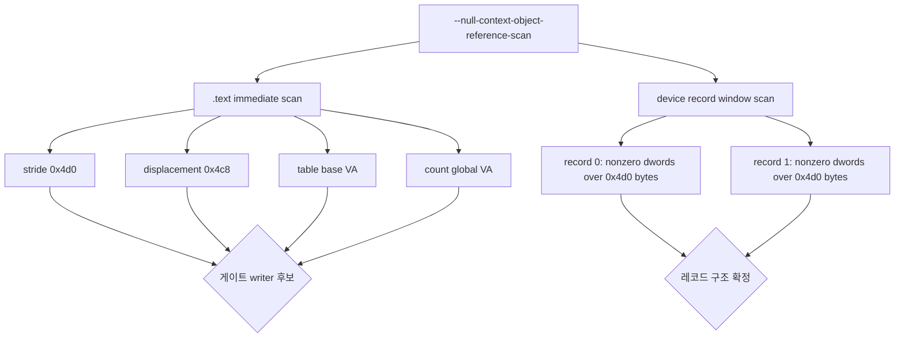

# 20260904-171 EZ2DJ 4th 장치 레코드 게이트 writer 추적 설계
# 20260904-171 EZ2DJ 4th Device Record Gate Writer Tracing Design

## 1. 배경 및 목적 (Background & Objectives)

Task 170에서 guard 1의 선택 루틴이 실패하는 지점을 한 필드로 좁혔다. 선택 루프는 장치 레코드 9개를 모두 순회하지만, 매 반복에서 `record + 0x4c8`이 0이라 GUID 비교 전에 레코드를 버린다.

```
0x00010189  imul ecx, [ebp-0x0c], 0x4d0     ; index * stride
0x00010195  cmp  dword [edx+ecx+0x4c8], 0   ; gate
0x0001019d  je   0x00010247                 ; 0이면 이 레코드를 건너뜀
```

레코드 자체는 정상이다. `+0x00`에는 우리 facade가 넘긴 장치 이름이 복사되어 있고, `+0x2c`부터는 `D3DDEVICEDESC7`이 놓여 있으며 `+0x2c`의 `dwDevCaps`는 `FillDeviceDescription`이 채운 값과 정확히 같다. 즉 열거 데이터는 전달되었고, **게이트 하나만 채워지지 않았다.**

이 작업의 목적은 그 게이트를 채우는 코드 경로를 특정하는 것이다.

Task 170 narrowed guard 1's failure to a single field: the selection loop walks all nine device records but discards each one before the GUID comparison because `record + 0x4c8` is zero. The records themselves are well formed — the device names our facade passed are copied into `+0x00`, a `D3DDEVICEDESC7` sits at `+0x2c`, and the `dwDevCaps` there matches exactly what `FillDeviceDescription` wrote. The enumeration data arrived; only the gate is missing. This task identifies the code path that fills that gate.

---

## 2. 관측 대상 (What Must Be Observed)

| 질문 | 필요한 관측 |
| - | - |
| 게이트를 쓰는 명령이 존재하는가 | `.text`에서 변위 `0x4c8` 접근 지점 |
| 그 명령이 레코드 배열을 대상으로 하는가 | 같은 함수 안에서 stride `0x4d0` 또는 테이블 base 참조 |
| 레코드의 어느 필드까지 채워졌는가 | 레코드 0·1의 0이 아닌 dword 전체 |

세 가지 모두 이미 실행 중인 자식 프로세스의 `.text`와 `.data`를 읽으면 얻을 수 있다. 새 실행 제어(브레이크포인트)는 필요하지 않다.

All three questions are answerable by reading the running child's `.text` and `.data`; no new execution control is required.

---

## 3. 디스크 이미지를 쓸 수 없는 제약 (The Packed Image Constraint)

`.text`와 `.rdata`는 디스크에서 암호화되어 있다. Task 169와 Task 170이 확인한 대로, 코드와 상수는 패커가 언패킹한 뒤 **자식 프로세스 메모리에서만** 읽을 수 있다. 따라서 정적 스캔도 실행 중 진단 안에서 수행해야 하며, 기존 `--null-context-object-reference-scan`이 그 자리다. 이 진단은 이미 자식의 `.text` 전체를 읽어 4바이트 상수를 스캔하고 있다.

`.text` and `.rdata` are encrypted on disk, so even a "static" scan must run inside a live diagnostic. The existing `--null-context-object-reference-scan` already reads the child's whole `.text` and scans it for four-byte constants, so it is the natural host for this work.

---

## 4. 관측 설계 (Observation Design)



### 4.1 상수 스캔 확장 (Immediate Scan Extension)

`scans[]` 표에 네 값을 추가한다. 스캔은 명령어 디코더 없이 바이트 일치만 보므로 결과는 후보이지, 확정된 피연산자가 아니다.

| kind | 값 | 의미 |
| - | - | - |
| `device_table_base` | `image_base + 0x00546d50` | 레코드 배열의 절대 주소 |
| `device_count_global` | `image_base + 0x0054cd9c` | 레코드 개수 전역 |
| `device_record_stride` | `0x000004d0` | `imul reg, reg, 0x4d0` 형태의 인덱싱 |
| `device_gate_displacement` | `0x000004c8` | `[reg+0x4c8]` 형태의 게이트 접근 |

`device_gate_displacement`가 `device_record_stride`와 같은 함수 안에 나타나면 그 함수가 게이트 writer 후보다. 기존 스캔 출력은 각 일치의 앞뒤 8바이트를 함께 기록하므로, 접근이 읽기인지 쓰기인지도 그 바이트로 구분한다.

### 4.2 레코드 창 스캔 (Record Window Scan)

`ScanObjectWindow`로 레코드 0과 1의 `0x4d0` 바이트를 훑어 0이 아닌 dword를 offset과 함께 기록한다. 이미 `null_context_object_state`에 있는 헬퍼를 그대로 쓴다.

이 결과는 두 가지를 준다. 첫째, 열거 콜백이 실제로 채운 필드 집합. 둘째, `+0x4c8` 주변에 다른 채워진 필드가 있는지 — 있으면 게이트만 조건부로 남은 것이고, 없으면 레코드 후반부 전체를 채우는 단계 자체가 실행되지 않은 것이다.

---

## 5. 판정 기준 (Decision Criteria)

| 관측 | 결론 |
| - | - |
| `0x4c8` 접근이 stride `0x4d0`을 쓰는 함수 안에 있다 | 그 함수가 게이트 writer다. Task 172에서 진입 앵커로 실행 여부를 확인한다 |
| `0x4c8` 접근이 없다 | 게이트는 레코드 base를 이미 더한 포인터로 접근된다. 테이블 base 참조를 기준으로 다시 좁힌다 |
| 레코드 후반부에 0이 아닌 dword가 있다 | 후반부를 채우는 단계는 실행되었고 게이트만 조건부다 |
| 레코드 후반부가 전부 0이다 | 후반부를 채우는 단계 자체가 실행되지 않았다 |

---

## 6. 비목표 (Non-Goals)

- 게이트 필드 직접 주입이나 게스트 코드 patch.
- 관측 전 HLE facade 수정.
- 새 CLI 옵션 추가.
- `direct3d3_com_facade`(DirectX 6 경로) 변경.

---

# 20260904-171 EZ2DJ 4th Device Record Gate Writer Tracing Design (English)

## 1. Background

Guard 1's selection loop discards every device record at `cmp dword [edx+ecx+0x4c8], 0`. The records hold our enumerated names and `D3DDEVICEDESC7` contents, so the enumeration path works and only this gate is unset. This task locates the code that fills it.

## 2. Observation Targets

Three questions — does a write to displacement `0x4c8` exist, does it target this record array, and how much of a record is filled — are all answerable by reading the running child's `.text` and `.data`.

## 3. Packed Image Constraint

`.text` and `.rdata` are encrypted on disk, so the scan must run inside the live `--null-context-object-reference-scan` diagnostic, which already reads the child's `.text`.

## 4. Design

Add four values to the existing immediate scan (`device_table_base`, `device_count_global`, `device_record_stride` `0x4d0`, `device_gate_displacement` `0x4c8`) and a nonzero-dword window scan over records 0 and 1 using the existing `ScanObjectWindow` helper. The scan is syntactic, so every hit is a candidate rather than a confirmed operand.

## 5. Decision Criteria

A `0x4c8` access inside a function that also indexes with stride `0x4d0` identifies the gate writer, to be confirmed by an entry anchor in the following task. No `0x4c8` access means the gate is reached through a pointer that already includes the record base. A record whose tail is entirely zero means the stage that fills the tail never ran.

## 6. Non-Goals

No gate injection, no guest patching, no HLE facade change before observation, no new CLI option, and no change to the DirectX 6 path.
