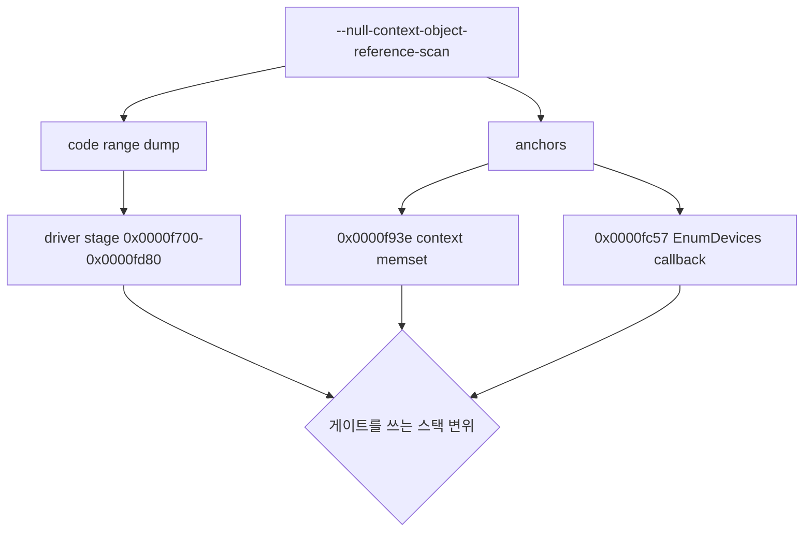

# 20260904-172 EZ2DJ 4th 드라이버 단계 게이트 조건 관측 설계
# 20260904-172 EZ2DJ 4th Driver Stage Gate Condition Observation Design

## 1. 배경 및 목적 (Background & Objectives)

Task 171에서 게이트의 출처를 확정했다. `EnumDevices` 콜백(`RVA 0x0000fc57`)은 `context+0x4c8`을 `record+0x4c8`로 조건 없이 복사할 뿐이므로, 게이트가 0인 원인은 그 컨텍스트를 만드는 드라이버 단계에 있다.

컨텍스트는 스택 지역으로 보인다. `0x0000f93e`에서 `push 0x4d0; push 0; lea eax, [ebp-0x4d4]`가 관측되었고, 그 경우 게이트는 `[ebp-0x0c]`으로 접근되어 변위 스캔에 잡히지 않는다. 남은 방법은 그 구간의 코드를 그대로 읽는 것이다.

Task 171 established that the `EnumDevices` callback copies `context+0x4c8` into the record unconditionally, so the zero gate originates in the driver stage that builds the context. The context appears to be a stack local — `0x0000f93e` shows `push 0x4d0; push 0; lea eax, [ebp-0x4d4]` — in which case the gate is written as `[ebp-0x0c]` and no displacement scan can see it. Reading that code region directly is what remains.

---

## 2. 드라이버 열거는 HLE 경계를 지나지 않는다 (확인된 제약)

`injected_runtime`의 동적 resolver는 `DirectDrawCreate`와 `DirectDrawCreateEx`만 대체한다. `DirectDrawEnumerateExA`는 호스트의 실제 `ddraw.dll`로 간다. 따라서 게스트가 보는 드라이버 목록과 각 드라이버 GUID는 호스트 상태에 따라 달라지며, 이는 Task 171에서 관측한 드라이버 수 변동(3 → 2)과 일치한다.

드라이버 단계 코드가 드라이버 GUID나 호스트 표시 모드를 조건으로 쓴다면, 그 조건은 우리 HLE가 아직 통제하지 못하는 입력에 걸려 있다는 뜻이다. 이 작업은 그 조건이 무엇인지 먼저 읽는다.

The dynamic resolver replaces only `DirectDrawCreate` and `DirectDrawCreateEx`; `DirectDrawEnumerateExA` reaches the host's real `ddraw.dll`. The driver list the guest sees therefore depends on host state, which matches the driver count moving from three to two between runs. If the driver stage gates on a driver GUID or on the host display mode, it gates on an input re2DJ does not yet control — so this task reads the condition before changing anything.

---

## 3. 관측 설계 (Observation Design)

참조 스캔은 이미 자식의 `.text` 전체를 읽어 버퍼에 담고 있다. 지정한 RVA 범위를 그 버퍼에서 64바이트 단위로 잘라 기록하는 블록을 추가한다. 새 메모리 읽기도, 새 CLI 옵션도 필요하지 않다.

앵커 표에는 `driver_stage_context_zero`(`0x0000f93e`)와 `device_enum_callback`(`0x0000fc57`)을 추가한다. 앵커 처리에 이미 붙어 있는 prologue 탐색과 분기 스캔이 두 함수의 시작 주소와 호출자를 함께 준다.

The reference scan already holds the child's whole `.text` in a buffer, so a block that slices a requested RVA range out of it in 64-byte chunks needs no new memory read and no new CLI option. Two anchors are added so the existing prologue search and branch scan also report where each function starts and who calls it.

---

## 4. 판정 기준 (Decision Criteria)

| 관측 | 결론 |
| - | - |
| `mov dword [ebp-0x0c], 1` 형태가 조건 분기 뒤에 있다 | 그 분기의 입력이 게이트 조건이다 |
| 그 조건이 드라이버 GUID 검사다 | `DirectDrawEnumerateEx`까지 HLE 경계를 넓히는 것이 다음 단계다 |
| 그 조건이 caps 또는 표시 모드 질의 결과다 | 해당 facade 응답을 고치는 것이 다음 단계다 |
| 게이트 쓰기가 아예 없다 | 컨텍스트는 스택 지역이 아니다. 컨텍스트 포인터를 런타임에서 다시 확인한다 |

---

## 5. 비목표 (Non-Goals)

- 관측 전 HLE facade 수정.
- 게이트 필드 직접 주입 또는 게스트 코드 patch.
- 새 CLI 옵션 추가.
- `direct3d3_com_facade`(DirectX 6 경로) 변경.

No HLE facade change before observation, no gate injection or guest patching, no new CLI option, and no change to the DirectX 6 path.
