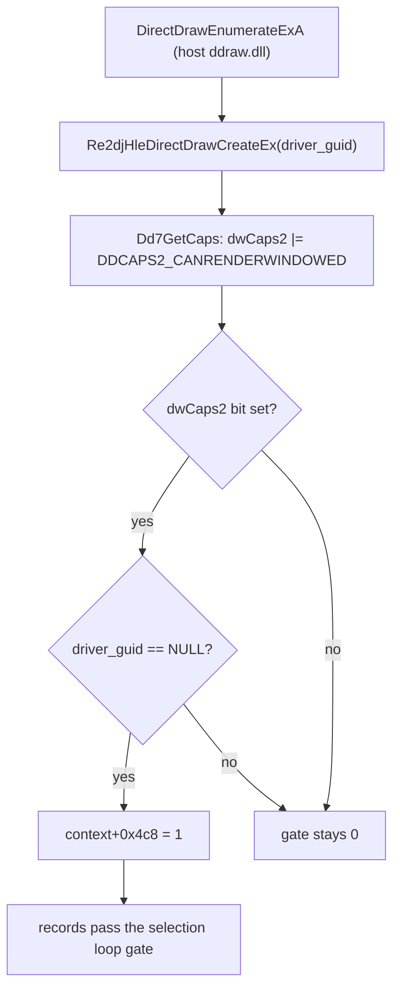

# 20260904-173 EZ2DJ 4th `DDCAPS2` 보고 설계
# 20260904-173 EZ2DJ 4th `DDCAPS2` Reporting Design

## 1. 배경 및 목적 (Background & Objectives)

Task 172에서 guard 1 실패의 근본 원인을 확정했다. 드라이버 단계(`RVA 0x0000f880`)는 다음 조건에서만 컨텍스트 게이트를 1로 쓴다.

```
driver DDCAPS.dwCaps2 & DDCAPS2_CANRENDERWINDOWED  그리고  드라이버 GUID 포인터 == NULL
```

re2DJ의 `Dd7GetCaps`는 `dwSize`, `dwCaps`, `ddsCaps.dwCaps`만 채우고 `dwCaps2`를 0으로 남긴다. 그래서 게이트가 모든 드라이버에서 0이 되고, 열거된 장치 레코드 전부가 선택 루프에서 걸러진다.

이 작업은 `Dd7GetCaps`가 `dwCaps2`를 보고하도록 고친다.

Task 172 established the root cause: the driver stage sets the context gate only when the driver `DDCAPS.dwCaps2` carries `DDCAPS2_CANRENDERWINDOWED` and the driver GUID pointer is NULL. `Dd7GetCaps` leaves `dwCaps2` at zero, so every enumerated device record is filtered out. This task makes `Dd7GetCaps` report `dwCaps2`.

---

## 2. 무엇을 보고할 것인가 (What To Report)

`dwCaps2`는 드라이버의 2차 능력 집합이다. re2DJ facade가 실제로 감당할 수 있는 항목만 보고한다.

| 비트 | 값 | 보고 근거 |
| - | - | - |
| `DDCAPS2_CANRENDERWINDOWED` | `0x00080000` | 게스트가 창 모드 렌더링 가능 여부로 장치를 거른다. facade는 표시 대상을 스스로 관리하므로 창 모드를 막을 이유가 없다 |
| `DDCAPS2_CERTIFIED` | `0x00000001` | HLE 드라이버는 자신의 동작을 스스로 보증한다 |
| `DDCAPS2_NOPAGELOCKREQUIRED` | `0x00000800` | facade의 surface는 호스트 메모리에 있고 page lock 개념이 없다 |
| `DDCAPS2_WIDESURFACES` | `0x00001000` | facade는 화면보다 넓은 surface를 거부하지 않는다 |

`dwCaps`는 그대로 둔다. 게스트가 검사하는 것은 `dwCaps2`이며, `dwCaps`를 함께 바꾸면 이번 변경의 인과를 관측에서 분리할 수 없다.

Only bits the facade can actually honor are reported, and `dwCaps` is left untouched so this change's effect stays isolated in the observation.

---

## 3. 조건의 두 번째 항 (The Condition's Second Term)

게이트는 드라이버 GUID 포인터가 NULL일 때만 세워진다. 드라이버 열거는 아직 HLE 경계 밖이라 이 값은 호스트가 정한다. 관례상 주 표시 드라이버는 NULL GUID로 열거되지만, 이 실행에서 실제로 그런지는 확인하지 않았다.

따라서 같은 작업에서 `Re2djHleDirectDrawCreateEx`가 받은 `driver_guid`를 그래픽 추적에 남긴다. 이 한 줄이 두 번째 항을 관측 가능하게 만들고, 게이트가 여전히 0이면 원인이 caps인지 GUID인지 즉시 구분해 준다.

The gate also requires a NULL driver GUID, which the host decides because driver enumeration is still outside the HLE boundary. Logging the `driver_guid` that reaches `Re2djHleDirectDrawCreateEx` makes that term observable and separates the two possible causes if the gate stays zero.



---

## 4. 판정 기준 (Decision Criteria)

| 관측 | 결론 |
| - | - |
| 레코드의 `+0x4c8`이 1이고 `guard1_helper_call_*`이 기록된다 | 게이트가 열렸고 GUID 비교까지 도달했다 |
| 게이트가 여전히 0이고 추적의 `driver_guid`가 모두 non-NULL이다 | 두 번째 항이 원인이다. `DirectDrawEnumerateEx`까지 HLE 경계를 넓히는 것이 다음 단계다 |
| 게이트는 열렸는데 guard 1이 계속 실패한다 | GUID 비교 또는 그 뒤 단계가 새 원인이다 |

---

## 5. 비목표 (Non-Goals)

- `DirectDrawEnumerateEx` HLE 도입. 관측 결과가 필요하다고 말할 때 별도 작업으로 다룬다.
- 게스트 코드 patch 또는 게이트 필드 직접 주입.
- `direct3d3_com_facade`(DirectX 6 경로) 변경.
- `dwCaps` 또는 `ddsCaps` 변경.

No `DirectDrawEnumerateEx` HLE yet, no guest patching or gate injection, no DirectX 6 path change, and no `dwCaps` or `ddsCaps` change.
