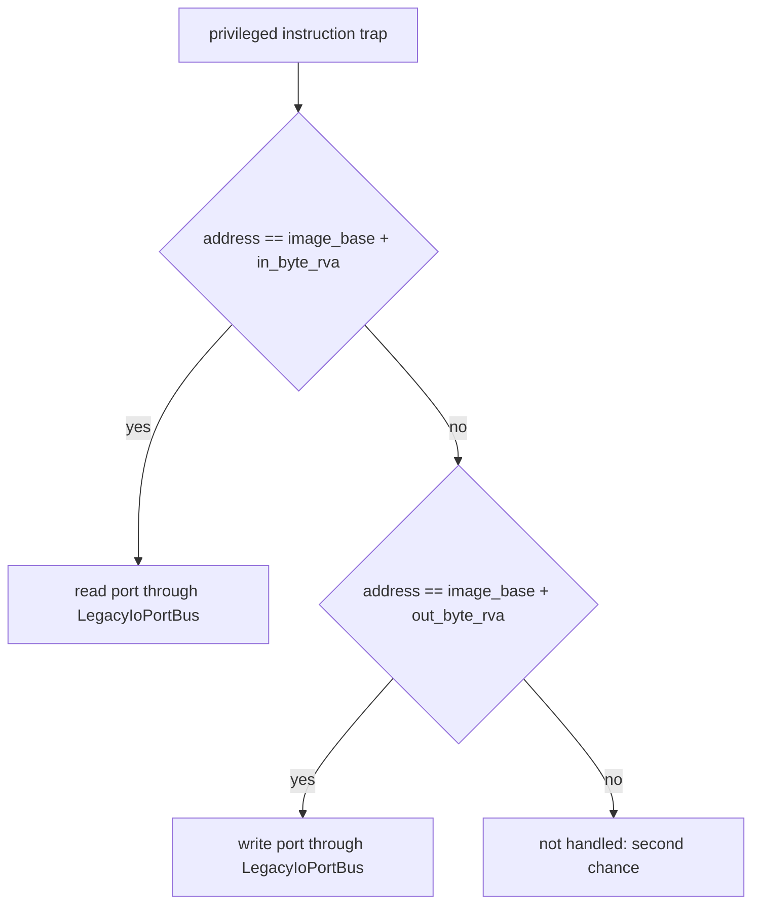

# 20260904-174 EZ2DJ 4th I/O out helper 트랩 설계
# 20260904-174 EZ2DJ 4th I/O Out Helper Trap Design

## 1. 배경 및 목적 (Background & Objectives)

Task 173에서 D3D7 초기화가 장치와 surface 생성까지 진행한 뒤, `RVA 0x000c384b`의 `out dx, al`이 처리되지 않아 프로세스가 `0xc0000096`(`STATUS_PRIVILEGED_INSTRUCTION`)으로 종료하는 것을 관측했다.

원인은 프로필 설정이다. `src/target/target_profile.cpp`의 ez2dj4th 항목은 `legacy_io_in_byte_rva = 0x000c3817`만 설정하고 `legacy_io_out_byte_rva`를 비워 두었다. `LegacyIoTrapPolicy`는 in helper와 out helper의 주소를 각각 비교하므로, 비어 있는 쪽은 트랩되지 않고 두 번째 기회 예외로 넘어간다.

Task 173 observed the process dying at an untrapped `out dx, al` at `RVA 0x000c384b`. The cause is configuration: the ez2dj4th profile names only the in helper, and `LegacyIoTrapPolicy` compares the in and out helper addresses separately, so the unnamed side falls through to a second-chance exception.

---

## 2. out helper RVA의 근거 (Evidence For The Out Helper RVA)

Task 173의 진단이 예외 주소와 명령 바이트를 함께 기록했다.

```
address 0x004c384b, image base 0x00400000 → RVA 0x000c384b
bytes   ee c3 66 8b 54 24 04 66 8b 44 24 08 66 ef c3
```

- `ee` `c3` — `out dx, al; ret`. 바이트 폭 helper의 마지막 두 명령이다.
- `66 8b 54 24 04` — `mov dx, [esp+4]`. 다음 helper의 시작이다.
- `66 8b 44 24 08` — `mov ax, [esp+8]`.
- `66 ef` `c3` — `out dx, ax; ret`. 워드 폭 helper다.

같은 실행에서 `RVA 0x000c3817`의 `in al, dx`는 정상 처리되었고, 그 뒤에도 같은 형태로 워드 폭과 dword 폭 in helper가 이어진다. 두 RVA는 같은 CRT helper 묶음의 바이트 폭 진입점이다.

The diagnostic recorded both the faulting address and the instruction bytes, which decode as the byte-width `out dx, al; ret` followed by the word-width helper — the same shape as the already-trapped in helper at `RVA 0x000c3817`.

---

## 3. 변경 설계 (Change Design)



ez2dj4th 프로필에 `legacy_io_out_byte_rva = 0x000c384b`를 설정한다. 트랩 정책과 주입 런타임은 이미 두 RVA를 모두 다루므로 그 밖의 코드 변경은 없다.

`src/tools/windows_product_loader_probe/main.cpp`의 프로필 기대값도 함께 고친다. 지금은 out RVA가 0임을 단언하고 있어 그대로 두면 검증이 실패한다.

Set `legacy_io_out_byte_rva = 0x000c384b` in the ez2dj4th profile. The trap policy and the injected runtime already handle both RVAs, so nothing else changes except the product loader probe's expectation, which currently asserts the out RVA is zero.

---

## 4. 판정 기준 (Decision Criteria)

| 관측 | 결론 |
| - | - |
| `out_dx_al` 항목이 first chance로만 나타나고 프로세스가 계속된다 | out 경로가 트랩된다 |
| 실행이 `0xc0000096` 없이 더 진행한다 | 이 중단 지점이 해소되었다 |
| 여전히 second chance가 남는다 | 다른 주소의 helper가 더 있다. 그 주소를 다음 작업에서 다룬다 |

---

## 5. 비목표 (Non-Goals)

- 워드 폭과 dword 폭 helper 트랩 추가. 관측에서 필요해질 때 다룬다.
- 포트 응답 모델 변경. 이 작업은 트랩 경로만 연결한다.
- `direct3d3_com_facade`(DirectX 6 경로) 변경.

No word-width or dword-width helper traps yet, no change to the port response model, and no DirectX 6 path change.
